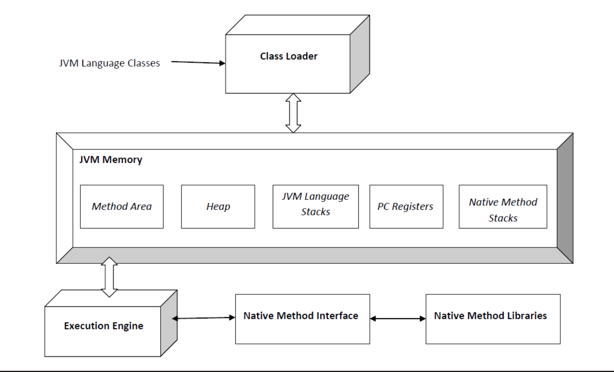
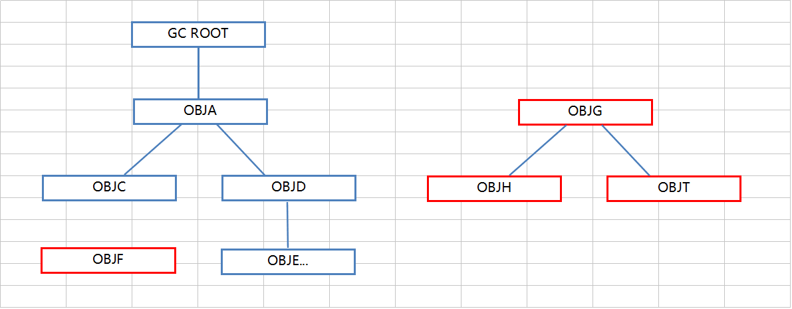
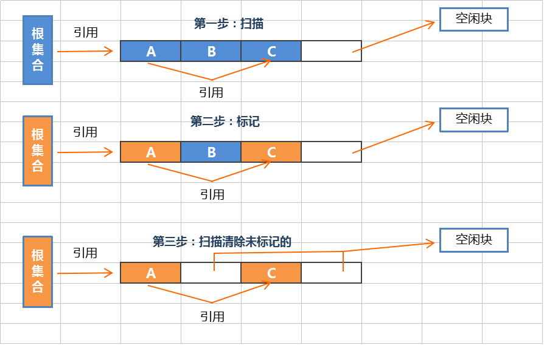
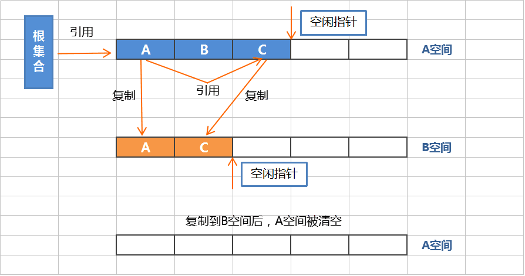
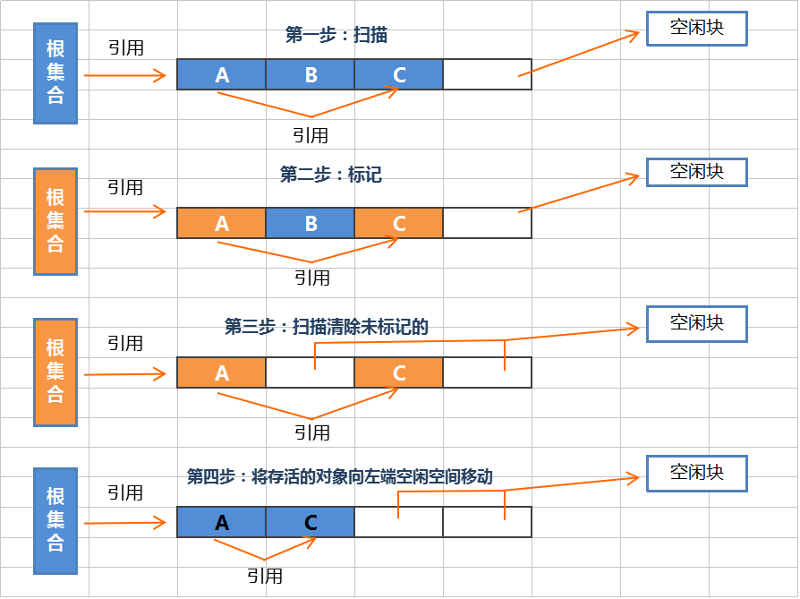

[TOC]

# JVM
## JVM 内存模型
根据java虚拟机规范，jvm内存区域分为5大区域，如下图所示

如上图所示:
虚拟机栈,本地方法栈, 程序计数器,堆区,方法区(常量池);具体这些区域可以划分两大类

### 线程私有区域
就是每个线程都有的，其他线程不能访问的区域

#### 虚拟机栈:
  虚拟机栈里面主要是有栈帧组成，我们常说的栈区，就是指的这里；一个线程对应一个栈，一个方法对应一个栈帧
- 栈帧:
 栈帧包含，局部变量表，操作数栈，动态链接，方法出口
局部变量表: 保存当前函数的局部变量，8大基本数据类型和引用
操作数栈: 存储操作时产生的临时变量
动态链接: 保证多态特性得以正确执行，也就是运行的时候能正确找到对应的方法；还有能正确找到so库中的方法去执行
函数出口: 即函数返回的地址
#### 本地方法栈:
保存的是native的方法信息，在ART虚拟机和hotspot虚拟机中这个栈和线程栈用的是同一个

#### 程序计数器:
记录程序执行的位置，为了线程下一次运行的时候能从上次的位置继续执行

### 线程共享区域
线程共享的区域包含堆区和方法区
#### 堆区：
存放对象的实例，比如我们new的对象

#### 方法区(常量池):
方法区里面，存放JVM加载的类信息，方法信息，元数据，常量，以及静态变量，类信息

- 元数据
  java中元数据就是 注释和注解
  - 元数据的作用
    - 编写文档:根据元数据可以生成文档
    - 代码分析:通过代码里标识的元数据对代码进行分析，如配置管理，框架，代码生成
    - 编译检查: 编译检查，如overwrride，deprecation，SuppressWarnings

### 永久区域(PermGen)vs元数据区(meta-space)
jdk1.7及之前，jvm还包含永久区域
jdk1.8开始，将永久区域移除，加入了元数据区，存储在native heap中

### 本地堆(Native Heap)
本地堆也是隶属于jvm中的一部分内存区域，其对内存的管理与java堆不同，需要自己申请和释放，理论上系统内存多大，native就有多大

- 存储什么
  - 管理java heap的状态数据（用于GC）;
  - JNI调用，也就是Native Stack;
  - JIT（即使编译器）编译时使用Native Memory，并且JIT的输入（Java字节码）和输出（可执行代码）也都是保存在Native Memory；
  - NIO direct buffer。对于IBM JVM和Hotspot，都可以通过-XX:MaxDirectMemorySize来设置nio直接缓冲区的最大值。默认是64M。超过这个时，会按照32M自动增大。
  - 对于IBM的JVM某些版本实现，类加载器和类信息都是保存在Native Memory中的

优点: 不在出现OOM的Error
缺点: 使用不当容易出现堆外内存泄漏，比如gzip忘记close，DirectBuffer的引用是直接分配在堆得Old区的，因此其回收时机是在FullGC时。频繁的分配DirectBuffer很容易导致Native Memory溢出

## GC
垃圾回收器，java语言的特性，平常在编写代码的时候，不需要考虑对象的内存释放，不像c++那样需要程序员去管理内存的释放，
java语言会在特定的时刻(内存不足的时候)进行内存回收，清理掉无用的对象;

提到GC，我们需要知道一个词STW（stop-the-world）,即在发生GC的时候，jvm会停止调目前正在做的一切事情，即线程会进入等待状态
直到GC完成才恢复，这对于android app上看到的现象就是卡顿

GC回收的内存区域主要是java的堆和方法区内的对象，堆中存放着所有对象的实例，方法区中也有部分对象；
jvm规范中，java堆主要由新生代， 老年代， 永久代组成
- 新生代
  包含Eden区域， from Survivor区 to Survivor区
  绝大多数最新创建的对象都会分配到这里，一段时间很多对象不可达时(没有被引用)，Minor GC会回收这些对象占用的内存，这个过程称为Minor GC
- 老生代
  新生代中对象经过几个周期存活下来(没有被回收)，会进入老年代，老年代空间不足时，会触发Full GC

默认新生代和老年代空间占比为(1:2),这个区域会动态调整

JVM什么时候发生GC
eden区域空间不够存放新的对象时，执行Minor GC
从eden到老年代的对象占用空间大于老年代可用空间的时候触发 Full GC

### 可达性分析
根搜索算法，原理是从节点GC-Root开始，寻找当前节点的引用节点，直到找到没有引用的节点为止，有点类似树的查找过程
找完之后，剩余的节点就是没有被引用的节点

GC Roots 对象
在Java体系中，固定可作为GC Roots的对象包括以下几种：
- 在虚拟机栈（栈帧中的本地变量表）中引用的对象，比如各个线程被调用的方法堆栈中使用到的参数、局部变量、临时变量等。
- 方法区中类静态属性引用的对象，比如java类的引用类型静态变量。
- 方法区中常量引用的对象，如字符串常量池中的引用。
- 本地方法栈中引用的对象。
- Java虚拟机内部的引用，如基本类型对应的Class对象，一些异常对象等（NullPointException、OutOfMemoryError）等，以及系统类加载器。
- 同步锁持有的对象
- 本地代码缓存等。
那么上面这些作为GC Roots对象集合，为什么他们可以是GC Roots对象呢？
GC管理的主要区域是Java堆，一般情况下只针对堆内存进行垃圾回收。而方法区、栈跟本地方法不被GC所管理，所以选择这些内存区域的对象作为GC Roots。

### 垃圾收集算法
1. 标记/清除算法

优点: 高效，不需要复制移动对象，新生代对象回收采用
缺点: 导致内存碎片，由于只清除为标记的内存块，不会移动标记的对象
2. 复制算法

优点: 效率高，没有内存碎片问题
缺点: 牺牲一半内存，因为需要两块内存来做复制的操作
3. 标记/整理算法

优点: 不会产生内存碎片，但是整理需要花费时间，长用于老年代回收
缺点:

JVM采用`分代收集算法`对不同区域采用不同的回收算法
新生代: 复制算法，因为新生代中存活的对象相对较少，采用复制算法可以高效的回收和利用内存，GC发生频率较多
老年代: 标记/整理 老年代存活的对象相对较多，虽然采用标记整理算法成本高，但是解决了内存碎片问题

#### 为什么survivor区是两块内存空间
  主要是提升GC的效率 因为新生代发生GC的次数较多，为了提升效率采用复制算法，第一次minor gc后 eden的没被回收的对像会进入survivor区，而在survivor区域内存够用的情况下
  并不会马上进入老年代，而是要达到一定年龄(minor gc的次数,可以设置)，如果只有一个survivor区，进入survivor的对象在下一次minor gc到来时，只能进入老年区，这样老年区很快
  就会达到满的状态；将survivor分为两个大小一样的区A,B，发生第一次GC时候，将存活的对象拷贝到A区，第二次GC之后存活的对象拷贝到B区，同时把A区的对象拷贝B区，然后清空A区回收内存；
  第三次gc，存活的对象拷贝到A区，把B区对象复制到A区，然后这样来回交替，这样可以记录对象经历了多少次GC，比如15次，达到15次之后在进入老年代，就可以延缓老年代内存满的时间，即减少
  Full GC的次数，从而达到了提升效率

### 垃圾收集器
垃圾收集器是具体的收集算法的实现，包括
年轻代收集器
Serial、ParNew、Parallel Scavenge
老年代收集器
Serial Old、Parallel Old、CMS收集器
特殊收集器
G1收集器[新型，不在年轻、老年代范畴内]
#### Serial
采用复制算法，串行收集器，jdk1.3之前使用的，主要为单核处理器使用
#### Serial Old
采用标记-整理算法， 单线程串行收集器，两大用途
1.jdk5前和Parallel Scavenge搭配使用，jdk5前也只有这个老年代收集器可以和它搭配。
2.作为CMS收集器的后备，CMS出现Concurrent Mode Failure之后使用
#### ParNew
采用复制算法，多线程方式处理，可以和CMS搭配使用
#### Parallel Scavenge
采用复制算法，与ParNew类似，也称"吞吐量优先" 收集器
吞吐量 = 代码运行时间 / (代码运行时间 + 垃圾收集时间) 虚拟机总共运行了100分钟，其中垃圾收集花了1分钟，那么吞吐量就是99%
#### Parallel Old
采用标记-整理算法，是一个多线程收集，老年代收集器
jdk1.6之后才出现，搭配Parallel Scavenge使用才做到了真正的吞吐量优先
#### CMS
采用标记-清理算法，是老年代收集器，全称Concurrent Mark Sweep,jdk1.4之后出现的，
特点，对于时间的重要性需求大于吞吐量
1.初始标记:标记一下GC Roots能直接关联到的对象，速度很快
2.并发标记:GC Roots Tarcing过程，即可达性分析
3.重新标记:为了修正因并发标记期间用户程序运作而产生变动的那一部分对象的标记记录，会有些许停顿，时间上一般 初始标记 < 重新标记 < 并发标记
4.并发清除
以上初始标记和重新标记需要stw(停掉其它运行java线程)
之所以说CMS的用户体验好，是因为CMS收集器的内存回收工作是可以和用户线程一起并发执行。
缺点: 内存碎片，耗CPU，需要更大的堆空间
#### G1
这是一个新的垃圾回收器，既可以回收新生代也可以回收老年代，SunHotSpot1.6u14以上EarlyAccess版本加入了这个回收器，Sun公司预期SunHotSpot1.7发布正式版本。通过重新划分内存区域，整合优化CMS，同时注重吞吐量和响应时间。杯具的是Oracle收购这个收集器之后将其用于商用收费版收集器，使用的较少

### GC分类
Minor GC、Major GC、FULL GC、mixed gc
- Minor GC
在年轻代Young space(包括Eden区和Survivor区)中的垃圾回收称之为 Minor GC,Minor GC只会清理年轻代.
- Major GC
Major GC清理老年代(old GC)，但是通常也可以指和Full GC是等价，因为收集老年代的时候往往也会伴随着升级年轻代，收集整个Java堆。所以有人问的时候需问清楚它指的是full GC还是old GC。
- Full GC
full gc是对新生代、老年代、永久代【jdk1.8后没有这个概念了】统一的回收。
【知乎R大的回答:收集整个堆，包括young gen、old gen、perm gen（如果存在的话)、元空间(1.8及以上)等所有部分的模式】
- mixed GC【g1特有】
混合GC
收集整个young gen以及部分old gen的GC。只有G1有这个模式

## 插桩技术
android上指的是字节码插桩，原理就是通过修改字节码，是的程序能够按照我们的需求去执行特殊的代码，而不必
修改原有java代码，用的比较多的就是目前的热修复，插件化

插桩是需要修改字节码，但是有专门工具插件 ASM，里面特有的api可以帮组我们实现java字节码的编写
ASM还能直接查看java文件对应的字节码文件 [看这里](https://www.jianshu.com/p/16ed4d233fd1)

