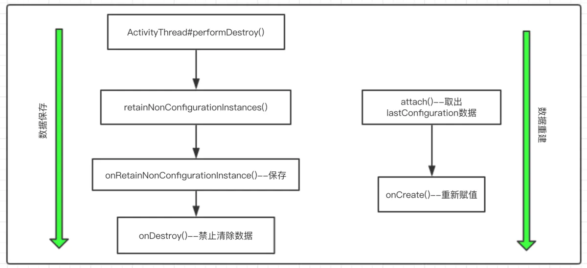

# androidX

## ViewModel
理解videoModel，参考[这里](https://www.jianshu.com/p/ebdf656b6dd4)

androidx中的 Fragment 和 FragmentActivity (确切的说是 ComponentActivity )中持有 ViewModelStore 的引用，在 OnDestroy 的时候会自动调用 ViewModelStore->clear()函数，ViewModelStore 中有一个 HashMap<String, ViewModel> 来保存 viewModel ,其中key为fragment或者FragmentActivity对象，value就是viewModel; viewModel 是一个抽象类，包含抽象方法 onCleared() ;所以 Fragment 和 FragmentActivity 最终在onDestroy的时候会调用 onCleared(); 这就将 viewModel 和 Fragment 和 FragmentActivity 的生命周期绑定在了一起，这样可以保证资源得以释放

### FragmentActivity和Fragment以及fragment与fragment 之间传递数据
上面已经说到 FragmentActivity 和Fragment 中都含有 viewModelStore的引用，这样FragmentActivity和Fragment传递数据的时候就可以传入同一个 对象即FragmentActivity作为key即可得到同一个viewModel;
Fragment之间同理，如果Fragment间同层级，可以统一通过 FragmentActivity 或共同的parentFragment(如果有)获取VM；如果有嵌套关系，可以使用parentFragment对象获取VM

### Activity因配置发生重建时ViewModel的保存与恢复

从上面的流程可以看出viewModel在Activity因配置变化导致重建时会被保留，然后在onAttach的时候会被恢复，从生命周期的角度来说，ViewModel的生命周期可能会长于Activity的生命周期 **因此在使用ViewModel时一定要注意，不能让其引用Activity或View，否则可能导致内存泄漏**。

因此可以在 viewModel中 管理数据，viewModel一般与LiveData搭配使用

## LiveData vs MutableLiveData
liveData 是一个抽象类，liveData监听了lifecycle的状态变化，lifeCycle监听Activity和Fragment的生命周期变化，只在OnStart或 OnResume 的时候才会接收消息; 并且提供了观察者模式，当数据发生变化时通知监听者

### MutableLiveData
MutableLiveData 是可以修改的 LiveData,继承了 LiveData, 通过 postValue 和 setValue 修改 liveData，这样在 Activity和Fragement 状态为 Active的时候，就可以获取最新的值 postValue 和 setValue 的区别在于 postValue是可以在任意线程调用，setValu需要在在UI线程调用

