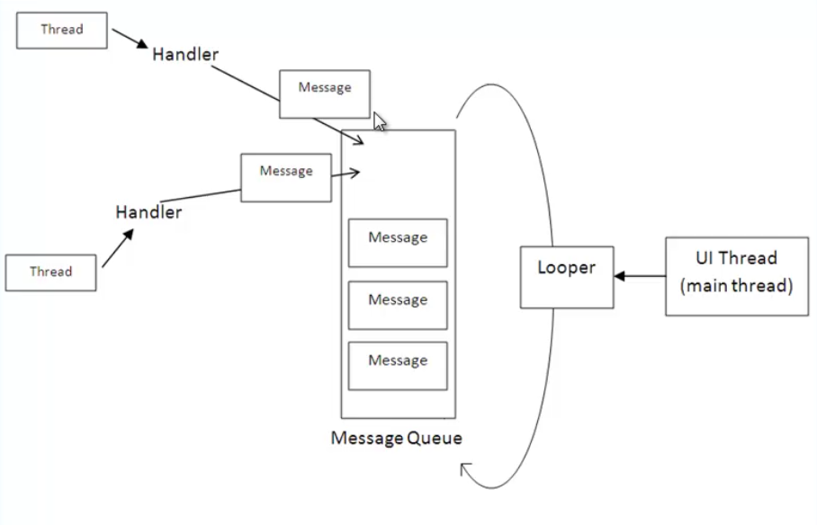
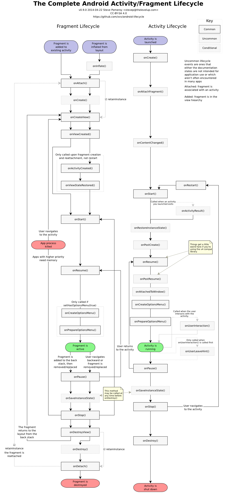
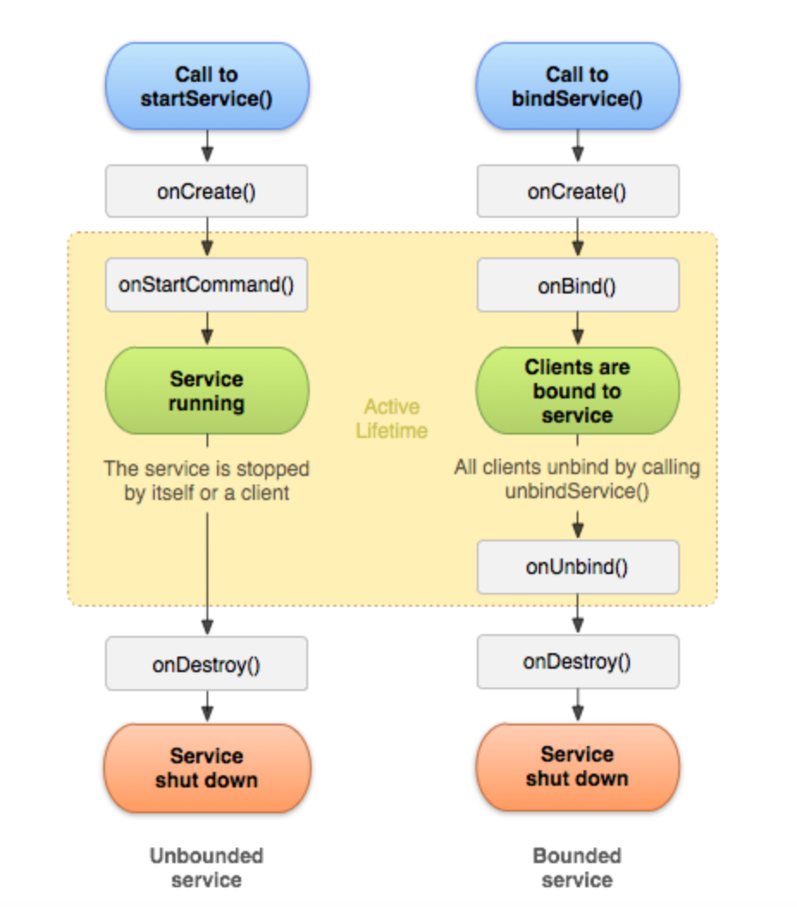
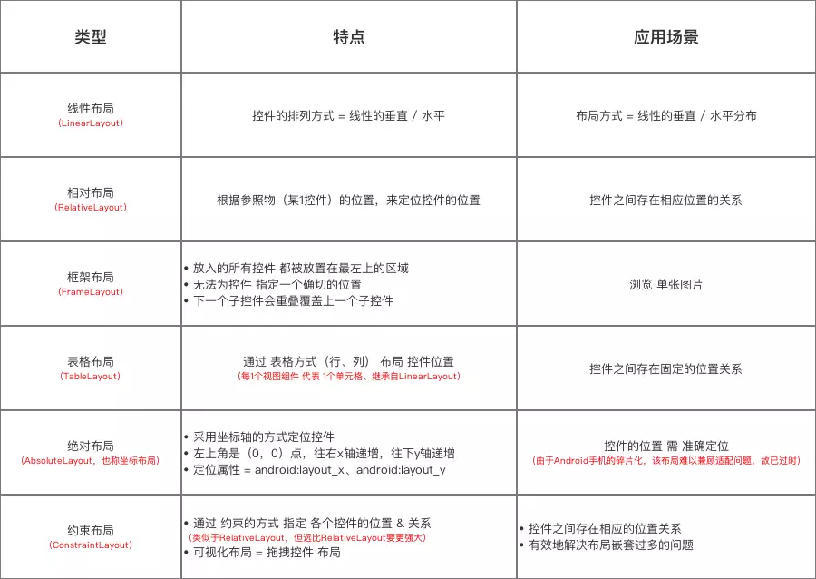

# Android application development
据网上消息称：2019年Android系统将占据全球82.6%的移动市场份额
可见android系统已经很受到广大群众的喜爱，本篇文章会简要介绍android app的开发，以及android app的一些常用组件，内部机制

## Environment
1. 工具下载[jdk和android studio]
2. jdk安装
3. 环境变量配置
4. android studio安装
5. android studio配置

[网上的例子](https://www.jianshu.com/p/aaff8bb91f69)

## Introduce
### Handler
1. handler是什么？
android中handler用作跨线程间通信，最常见的比如子线程要更新UI，可以通过handler想主线程(UI线程)发送消息间接的去更新UI，因为android规定只能在主线程更新UI，否则会报异常；

2. handler怎么用？
    - post(Runnable); 
    Runnable是一个interface接口，里面有个run方法作为回调
    - postDelayed(Runnable ,long);
    - sentMessage
    - sentMessageDelayed


3. handler机制


### 四大组件
android的四大组件为Activity，Service，Content Provider， Broadcast receiver，日常应用都是由这些组件组合而成
1. activity
Activity作为android最常用的组件，只要是与用户有交互操作的应用都会用到这个组件，Activity中包含很多UI组件，UI组件都是基于事件驱动的，比如用户点击了某个按钮，那么这按钮的点击事件(OnClickListener接口会被回调)，这样程序可以根据用户的操作做出响应；同样Activity也是基于事件驱动，其生命周期包含很多回调函数，具体如下如：

[Activity生命周期介绍](http://c074e03f.wiz03.com/share/s/30te0_1DPkLN24-EsW3loU2738BcDm1R8Jwz2hg_x01jtCk0)

2. service
Service 是一个可以在后台执行长时间运行操作而不提供用户界面的应用组件。服务可由其他应用组件启动，而且即使用户切换到其他应用，服务仍将在后台继续运行。 此外，组件可以绑定到服务，以与之进行交互，甚至是执行进程间通信 (IPC)。 例如，服务可以处理网络事务、播放音乐，执行文件 I/O 或与内容提供程序交互，而所有这一切均可在后台进行。


3. content provider 
中文翻译，内容提供者，组要是为存储和获取数据提供统一的接口，其底层封装了数据库的操作接口，可以为不同的应用之间共享数据；这个组件在平常开发中用的不多，android系统其它app中如相册，联系人等用到了这个组件，所有其他app都可以通过contentProvider访问系统相册，联系人的信息
参考链接[ContentProvider从入门到精通](https://www.jianshu.com/p/f5ec75a9cfea)

4. broadcast receiver
广播被分为两种不同的类型：“普通广播（Normal broadcasts）”和“有序广播（Ordered broadcasts）”。
  -  普通广播是完全异步的，可以在同一时刻（逻辑上）被所有接收者接收到，消息传递的效率比较高，但缺点是：接收者不能将处理结果传递给下一个接收者，并且无法终止广播Intent的传播；
  - 有序广播是按照接收者声明的优先级别（声明在intent-filter元素的android:priority属性中，数越大优先级别越高,取值范围:-1000到1000。也可以调用IntentFilter对象的setPriority()进行设置），被接收者依次接收广播。如：A的级别高于B,B的级别高于C,那么，广播先传给A，再传给B，最后传给C。A得到广播后，可以往广播里存入数据，当广播传给B时,B可以从广播中得到A存入的数据

生命周期： 调用对象发送广播--> onReceive --> 结束

广播的生命周期很短，因此不能再onReceive中做耗时的操作，否则会引起ANR(应用程序无响应)，如果要做耗时的操作，可以通过intent发送给service，一般来说当 BroadcastReceiver 在 10 秒内没有执行完毕，Android系统 会认为该程序无响应

### 组件之间如何通信
Intent:是一个包含很多信息的对象，他可以携带数据传递给Activity/Service/BroadcastReceiver
Intent除了作为消息载体之外，其主要工作是促进组件之间交互，android的硬性规定，比如从这个组件(Activity/Service)启动其他组件(Activity/Service)，android系统也是通过intent来解析的；这里两个组件可以是不同的应用程序之间的组件

#### Intent包含的属性：
1. Compontent: 要启动的组件名称
2. Action: 表明执行的什么操作，这个可以自定义，一些常用的Action属性
    ```
    ACTION_VIEW，当有一些信息需要展示出来，可以设置Intent的Action为这个值，并调用startActivity()方法
    ACTION_SEND，当用户有一些信息需要分享到其他应用，可以设置Intent的Action为这个值，并调用startActivity()方法
    ACTION_DIAL，拨打电话，可以设置Intent的Action为这个值，并调用startActivity()方法
    ACTION_EDIT，编辑某些文件，可以设置Intent的Action为这个值，并调用startActivity()方法
    ```
3. Data: Data通常是URI格式定义的操作数据，或MIME type
    [android URI大全](https://blog.csdn.net/sunny09290/article/details/7514963)
    [MIME大全](https://www.cnblogs.com/Rooty/archive/2011/07/16/2107962.html)
4. Category: 对intent信息的补充
5. Extras: key-value形式的数据
6. Flags，这个属性指定系统如何启动一个Activity
    [参考Activity的四种启动方式](https://www.jianshu.com/p/4c8d6e2117ac)  

#### IntentFilter：
IntentFilter一般用在Androidmanifest.xml中，用来声明当前组件具有什么样的能力，其与Intent相对应
```xml
<?xml version="1.0" encoding="utf-8"?>
<manifest xmlns:android="http://schemas.android.com/apk/res/android"
    package="com.picovr.video360player"
    android:versionCode="1"
    android:versionName="1.0" >

    ...
    <application
        android:allowBackup="true"
        android:icon="@drawable/pico_launcher"
        android:label="@string/app_name" >
            
        ...
         <activity
            android:name="com.picovr.video360player.ImmersiveViewActivity"
            android:screenOrientation="landscape"
            android:theme="@android:style/Theme.NoTitleBar.Fullscreen" 
            android:label="@string/app_name" >
             
            <intent-filter >                
                <action android:name="picovr.intent.aciton.video360player3D" />
                <category android:name="android.intent.category.DEFAULT" />           
            </intent-filter>
                        
            <intent-filter>
                <action android:name="android.intent.action.VIEW" />
                <category android:name="android.intent.category.DEFAULT" />
                <data android:mimeType="video/*" />
            </intent-filter>
            
        </activity>
    </application>
</manifest>
```

Intent分为显式Intent和隐式Intent
- 显示Intent
    - 显示intent就是显式的指定要启动组件类名称，如下所示
    ```java
        Intent intent = new Intent(context，XXActivity.class);
        startActivity(intent);
    ```

- 隐式Intent
    - 不指定具体的组件，只是声明要执行的操作(action)，然后系统会根据各组件设置的intentFilter来匹配到相应的组件
    ```java
    // 要将textMessage信息分享出去
    Intent sendIntent = new Intent();
    sendIntent.setAction(Intent.ACTION_SEND);
    sendIntent.putExtra(Intent.EXTRA_TEXT, textMessage);
    sendIntent.setType("text/plain");
    
    // 确认是否有组件能够处理这个隐式Intent
    if (sendIntent.resolveActivity(getPackageManager()) != null) {
        startActivity(sendIntent);
    }
    ```
- 显示intent调用系统组件
    ```java
    // 调用浏览器 
    Uri webViewUri = Uri.parse("http://blog.csdn.net/zuolongsnail");
    Intent intent = new Intent(Intent.ACTION_VIEW, webViewUri); 
    
    // 调用地图 
    Uri mapUri = Uri.parse("geo:100,100"); 
    Intent intent = new Intent(Intent.ACTION_VIEW, mapUri); 
    
    // 播放mp3 
    Uri playUri = Uri.parse("file:///sdcard/test.mp3"); 
    Intent intent = new Intent(Intent.ACTION_VIEW, playUri); 
    intent.setDataAndType(playUri, "audio/mp3"); 
    
    // 调用拨打电话 
    Uri dialUri = Uri.parse("tel:10086"); 
    Intent intent = new Intent(Intent.ACTION_DIAL, dialUri); 
    
    // 直接拨打电话，需要加上权限<uses-permission   id="android.permission.CALL_PHONE" /> 
    Uri callUri = Uri.parse("tel:10086"); 
    Intent intent = new Intent(Intent.ACTION_CALL, callUri); 
    
    // 调用发邮件（这里要事先配置好的系统Email，否则是调不出发邮件界面的） 
    Uri emailUri = Uri.parse("mailto:zuolongsnail@163.com"); 
    Intent intent = new Intent(Intent.ACTION_SENDTO, emailUri); 
    
    // 直接发邮件 
    Intent intent = new Intent(Intent.ACTION_SEND); 
    String[] tos = { "zuolongsnail@gmail.com" }; 
    String[] ccs = { "zuolongsnail@163.com" }; 
    intent.putExtra(Intent.EXTRA_EMAIL, tos); 
    intent.putExtra(Intent.EXTRA_CC, ccs); 
    intent.putExtra(Intent.EXTRA_TEXT, "the email text"); 
    intent.putExtra(Intent.EXTRA_SUBJECT, "subject"); 
    intent.setType("text/plain"); 
    Intent.createChooser(intent, "Choose Email Client"); 
    
    // 发短信 
    Intent intent = new Intent(Intent.ACTION_VIEW); 
    intent.putExtra("sms_body", "the sms text"); 
    intent.setType("vnd.android-dir/mms-sms"); 
    
    // 直接发短信 
    Uri smsToUri = Uri.parse("smsto:10086"); 
    Intent intent = new Intent(Intent.ACTION_SENDTO, smsToUri); 
    intent.putExtra("sms_body", "the sms text"); 
    
    // 发彩信 
    Uri mmsUri = Uri.parse("content://media/external/images/media/  23"); 
    Intent intent = new Intent(Intent.ACTION_SEND); 
    intent.putExtra("sms_body", "the sms text"); 
    intent.putExtra(Intent.EXTRA_STREAM, mmsUri); 
    intent.setType("image/png"); 
    
    // 卸载应用 
    Uri uninstallUri = Uri.fromParts("package", "com.app.test",     null); 
    Intent intent = new Intent(Intent.ACTION_DELETE, uninstallUri); 
    
    // 安装应用 
    Intent intent = new Intent(Intent.ACTION_VIEW); 
    intent.setDataAndType(Uri.fromFile(new File("/sdcard/test.apk"),     "application/vnd.android.package-archive"); 
    ```

#### 组件通信的其他方式:
static变量:
sharepreference
数据库
自定义文件


### android app启动流程
每当一个android app程序启动时，系统会创建一个dalvik虚拟机，最终会调用```ActivityThread.java```中的main函数；
ActivityThread 可以理解为android app的主线程；
ApplicationThread 为 ActivityThread 中的内部类，其继承了实现了 IApplicationThread.Stub 接口，为framework的其他组件提供远程调用，具体包括了Activity，service生命周期的函数；
ApplicationThread最终通过handler转发调用ActivityThread的具体对应的方法--> 会调用[Activity|Service]的相对应的方法
```java
/**
 * This manages the execution of the main thread in an
 * application process, scheduling and executing activities,
 * broadcasts, and other operations on it as the activity
 * manager requests.
 *
 * {@hide}
 */
public final class ActivityThread {
 
    static ContextImpl mSystemContext = null;
 
    static IPackageManager sPackageManager;
    
    // 创建ApplicationThread实例
    final ApplicationThread mAppThread = new ApplicationThread();
 
    final Looper mLooper = Looper.myLooper();
 
    final H mH = new H();
 
    final HashMap<IBinder, ActivityClientRecord> mActivities
            = new HashMap<IBinder, ActivityClientRecord>();
    
    // List of new activities (via ActivityRecord.nextIdle) that should
    // be reported when next we idle.
    ActivityClientRecord mNewActivities = null;
    
    // Number of activities that are currently visible on-screen.
    int mNumVisibleActivities = 0;
    
    final HashMap<IBinder, Service> mServices
            = new HashMap<IBinder, Service>();
    
    Application mInitialApplication;
 
    final ArrayList<Application> mAllApplications
            = new ArrayList<Application>();
 
    static final ThreadLocal<ActivityThread> sThreadLocal = new ThreadLocal<ActivityThread>();
    Instrumentation mInstrumentation;
 
    static Handler sMainThreadHandler;  // set once in main()
 
    private class H extends Handler {
 
        public void handleMessage(Message msg) {
            if (DEBUG_MESSAGES) Slog.v(TAG, ">>> handling: " + codeToString(msg.what));
            switch (msg.what) {
                case LAUNCH_ACTIVITY: {
                    ...
                    //获取启动的参数

                    handleLaunchActivity(r, null);
                    ...
                } break;
                ...
            }
            if (DEBUG_MESSAGES) Slog.v(TAG, "<<< done: " + codeToString(msg.what));
        }
       
        ...
    }

    final Handler getHandler() {
        return mH;
    }
 
    public static ActivityThread currentActivityThread() {
        return sThreadLocal.get();
    }

    private Activity performLaunchActivity(ActivityClientRecord r, Intent customIntent) {
        
        //各种准备工作
        ...
        
        //创建Activity
        Activity activity = null;
        try {
            java.lang.ClassLoader cl = appContext.getClassLoader();
            activity = mInstrumentation.newActivity(
                    cl, component.getClassName(), r.intent);
            StrictMode.incrementExpectedActivityCount(activity.getClass());
            r.intent.setExtrasClassLoader(cl);
            r.intent.prepareToEnterProcess();
            if (r.state != null) {
                r.state.setClassLoader(cl);
            }
        } catch (Exception e) {
            if (!mInstrumentation.onException(activity, e)) {
                throw new RuntimeException(
                    "Unable to instantiate activity " + component
                    + ": " + e.toString(), e);
            }
        }

        //最终会调用到Activity的onCreate函数
        if (r.isPersistable()) {
            mInstrumentation.callActivityOnCreate(activity, r.state, r.persistentState);
        } else {
            mInstrumentation.callActivityOnCreate(activity, r.state);
        }        
        ...
    }

    public static void main(String[] args) {
      //main looper准备
      Looper.prepareMainLooper()
      ...
      //Activity thread实例创建
      ActivityThread thread = new ActivityThread();
      ...
      //初始化main threadHandler
      if (sMainThreadHandler == null) {
        sMainThreadHandler = thread.getHandler();
      }
      ...
      Looper.loop()
    } 
}
```

#### UI组件
布局组件：
LinearLayout
ReleativeLayout
FrameLayout
TableLayout
AbsoluteLayout
ConstrainLayout


Button
TextView
EditText
SeekBar
ProgressBar
ImageView
SurfaceView
ListView
ScrollView
RecyclerView
Dialog
Tabs
WebView
Popup Menu


## Demos
[google官方android api使用示例](https://github.com/THEONE10211024/ApiDemos)

## Extension
智能相册应用，是一个运行在玩客云pro(android系统的盒子)上的常驻后台的服务，主要是根据需要，处理玩客云设备

#### 架构设计
http://wiki.wx.xunlei.cn/pages/viewpage.action?pageId=42697674


