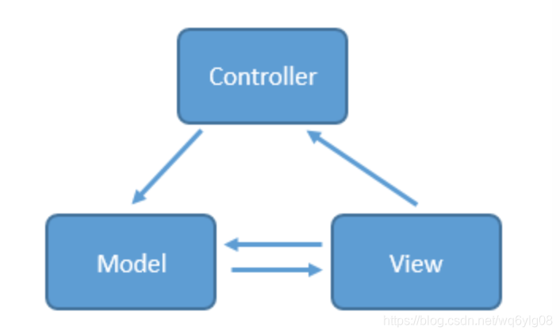
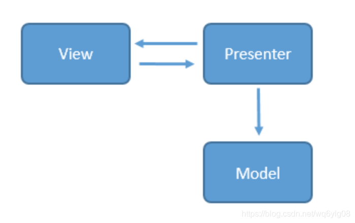
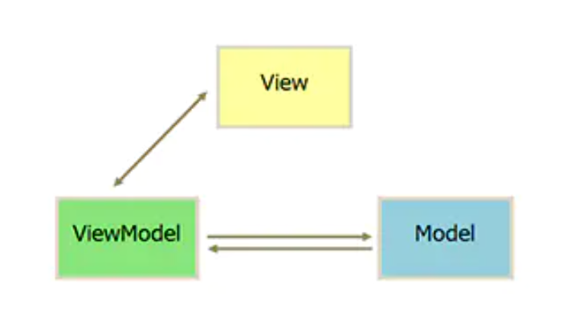

## mvc,mvp,mvvm的优缺点
### mvc
- model 数据模型，各种bean
- view UI相关显示，xml的view
- controller 接收UI响应，操作数据模型，然后将数据显示到view

当用户操作ui，view响应之后会发送指令到controller，cotroller通知model层更新数据，model层更新完数之后直接显示在view层上
#### 缺点
1. view层于model层之间存在耦合，后期开发，测试，维护都需要花大量的精力
2. android中mvc的controller一般都是Activity/Fragment,这两个既充当controller又兼顾着view的角色，大一点项目中controller将会非常复杂

### mvp
- model 数据模型，管理数据状态
- view  呈现给用户看到的UI，包括XML/Activity/Fragment
- presenter 主持者，presenter通过view接收用户的输入，然后操作model处理数据，之后将数据传回view显示；

MVP是由mvc演进而来的，解决了controller庞大的问题，解决了view和model耦合的问题

#### 缺点
presenter在大型项目中还是很庞大

### mvvm
- model 数据模型，管理数据状态
- view 呈现给用户看到的UI，包括XML/Activity/Fragment
- viewModel viewModel的作用与presenter基本类似，android中viewModel与view的生命周期进行绑定，在数据控制这块相对presenter有了进步，不用开发者手动去根据生命周期来操控数据；一个view可以持有多个viewModel引用，这就解决了大型项目时presenter的复杂问题；

