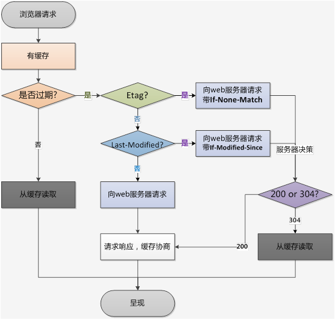
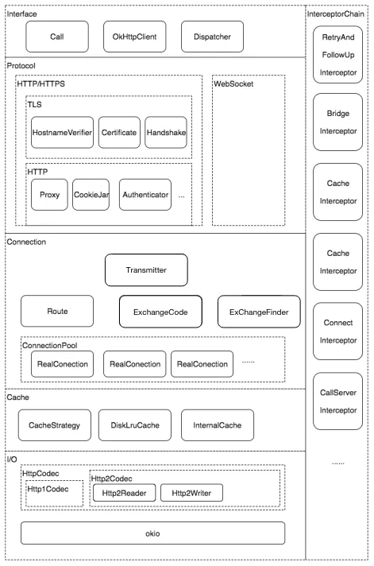

[TOC]
# android 高级面试知识点


## mvc,mvp,mvvm的优缺点
### mvc
- model 数据模型，各种bean
- view UI相关显示，xml的view
- controller 接收UI响应，操作数据模型，然后将数据显示到view


当用户操作ui，view响应之后会发送指令到controller，cotroller通知model层更新数据，model层更新完数之后直接显示在view层上
#### 缺点
1. view层于model层之间存在耦合，后期开发，测试，维护都需要花大量的精力
2. android中mvc的controller一般都是Activity/Fragment,这两个既充当controller又兼顾着view的角色，大一点项目中controller将会非常复杂

### mvp
- model 数据模型，管理数据状态
- view  呈现给用户看到的UI，包括XML/Activity/Fragment
- presenter 主持者，presenter通过view接收用户的输入，然后操作model处理数据，之后将数据传回view显示；

MVP是由mvc演进而来的，解决了controller庞大的问题，解决了view和model耦合的问题

#### 缺点
presenter在大型项目中还是很庞大

### mvvm
- model 数据模型，管理数据状态
- view 呈现给用户看到的UI，包括XML/Activity/Fragment
- viewModel viewModel的作用与presenter基本类似，android中viewModel与view的生命周期进行绑定，在数据控制这块相对presenter有了进步，不用开发者手动去根据生命周期来操控数据；一个view可以持有多个viewModel引用，这就解决了大型项目时presenter的复杂问题；


## 插件化
插件化主要解决的三个核心问题: 类加载，资源加载，生命周期管理
- 类加载
  主要通过 PathClassLoader 和 DexClassLoader 来加载未安装的apk, 主要就是创建 插件的 classLoader 然后反射获取DexPathList 的 dexElements 字段，在反射获取宿主工程的classLoader中的 DexPathList 的 dexElements 字段，将插件 ClassLoader 中的 dexElements 合并到宿主 ClassLoader 的 dexElements，将合并的 dexElements 设置到宿主 ClassLoader
- 资源加载
  通过反射 AssetManager 将插件的apk(资源)路径添加到 AssetManager 中,然后将AssetManager作为参数创建 Resource对象，在宿主 application中重写 getResource并返回插件的resource对象， 插件工程中Activity也重写getResource函数，然后返回getApplication().getResource(),因为插件工程也是运行在宿主apk中的，所以获取的application也是宿主的application
- 生命周期管理
  比如Activity的插件化，由于Activity必须要在AndroidManifest.xml中注册，所以需要事先占坑, 如何启动我们的插件Activity呢？
  系统启动Activity的时候都是通过 instrumentation 类实现的，所以创建个代理 instrumentation，然后实现execStartActivity，通过hook instrumentation这个类，将其替换成我们的代理类，在启动我们插件Activity的时候，将intent替换为占坑的Activity，

hook其实就是反射获取某个类的属性，替换成我们定义的代理类对象,比如上面的 instrumentation类，其存在于ContextImpl的属性mMainThread(ActivityThread)中的 mInstrumentation(Instrumentation)属性中,所以我们可以用代理的Instrumentation来替换mInstrumentation从而接管 Instrumentation 的工作

### DexClassLoader 和 PathClassLoader的区别
这两个类都是继承于 BaseDexClassLoader，只是构造函数传入的 optmizedDirectory 的参数不一样，PathClassLoader这个值为null，这个参数是系统加载完dex文件之后，用于保存.odex文件的路径，android 8.0之后以及弃用了
如果传入值为null，则系统采用默认路径 /data/dalvik-cache/  来保存优化后的 .odex文件
这个参数对于我们的使用没有什么影响

## 组件化 模块化
- 组件化是正对基础架构的，组件说简单的就是一个一个可以被复用的功能代码块，从一个压缩图片的函数到提供整个用户信息管理体系的sso都可以变成一个组件。
- 模块化更偏向于业务架构，比较适合那种业务很复杂，需要多个团队进行配合开发的情况，这是业务架构就需要把业务拆分成一个一个可以独立运行的模块，比如首页、登录注册这些都可以拆成一个一个的模块，每个模块可以被不同的团队独立开发，模块之间互不干扰。这样可以有效提供团队的开发效率。

### 优点:
组件化可以提供代码的复用率，降低维护成本
模块化可以提高团队的开发效率以及容错率，降低风险。因为每个模块都是独立的，一个模块的延期、bug不会对另一个模块产生影响

### 组件化初衷
- APP 版本不断的迭代，新功能的不断增加，业务也会变的越来越复杂，维 护成本高。
- 业务耦合度高，代码越来越臃肿，团队内部多人协作开发困难。
- Android 项目在编译代码的时候电脑会非常卡，又因为单一工程下代码耦 合严重，每修改一处代码后都要重新编译打包测试，导致非常耗时。
- 方便单元测试，改动单独一个业务模块，不需要着重于关注其他模块被影 响。

### 优势
- 组件化就是将通用模块独立出来，统一管理，以提高复用，将页面拆分为 粒度更小的组件，组件内部除了包含 UI 实现，还包含数据层和逻辑层。
- 每个工程都可以独立编译、加快编译速度，独立打包。
- 每个工程内部的修改，不会影响其他工程。
- 业务库工程可以快速拆分出来，集成到其他 App 中。
- 迭代频繁的业务模块采用组件方式，业务线研发可以互不干扰、提升协作 效率，并控制产品质量，加强稳定性。
- 并行开发，团队成员只关注自己的开发的小模块，降低耦合性，后期维护 方便等。

### 组件化通信
- 接口+路由
  接口+路由实现方式则相对容易理解点，抽取一个 LibModule 作为路由服务，每个组件声明自己提供的服务 Service API，这些 Service 都是一些接口，组件负责将这些 Service 实现并注册到一个统一的路由 Router 中去，如果要使用某个组件的功能，只需要向 Router 请求这个 Service 的实现，具体的实现细节我们全然不关心，只要能返回我们需要的结果就可以了


## 源码相关
### okhttp相关
#### 概念
- OkHttpClient
  采用了建造者模式来创建
- Request
  请求对象
```java
  Request request = new Request.Builder()
    .url(url)
    .build();
```
- Call
  OkHttpClient 实现了Call.Factory，负责根据请求创建新的 Call。callFactory 负责创建 HTTP 请求，HTTP 请求被抽象为了 okhttp3.Call 类，它表示一个已经准备好，可以随时执行的 HTTP 请求

#### 实际请求
1. 同步请求(阻塞的)
```java
Response response = call.execute();
```
2. 异步请求
```java
call.enqueue(new Callback() {
    @Override
    public void onFailure(Call call, IOException e) {
    }

    @Override
    public void onResponse(Call call, Response response) throws IOException {
        System.out.println(response.body().string());
    }
});
```
### 特点
1. 采用线程池来处理请求，默认最大并发64，
2. 采用连接池技术，支持5个并发的socket连接，减少tcp握手和挥手次数
3. 支持gzip压缩
4. 支持响应缓存从而避免重复的网络请求
5. 请求失败，自动重连，发生异常时重连
6. 很方便的拦截器，拦截器用来添加，移除，转换请求和响应 的头部信息，比如添加公参等

#### okhttp拦截器
1. RetryAndFollowUpInterceptor
  作用是连接失败后进行重试、对请求结果跟进后进行重定向
2. BridgeInterceptor
  意为 桥拦截器，相当于 在 请求发起端 和 网络执行端 架起一座桥，把应用层发出的请求 变为 网络层认识的请求，把网络层执行后的响应 变为 应用层便于应用层使用的结果，对请求添加了header："Content-Type"、"Content-Length" 或 "Transfer-Encoding"、"Host"、"Connection"、"Accept-Encoding"、"Cookie"、"User-Agent"，即网络层真正可执行的请求
3. CacheInterceptor
  缓存拦截器，对相同的url请求，会进行缓存，以减少网络开销，同时处理了http缓存的一整套逻辑，判断缓存是否过期，header是否设置了etag，Last-Modified，Date


4. ConnectInterceptor
  连接拦截器[参考这里](https://cloud.tencent.com/developer/article/1667344),主要管理tcp连接的复用，复用逻辑，通过ExchangeFinder寻找可用的tcp连接，如果有可用的直接复用，否则新建一个链接，如下图
  
  连接池中的连接是否可用，是通过判断 connection.transmitters(连接上的数据流的数量是否为空来判断的，transmitter数据流即表示一个请求，这就算tcp连接多路复用的实现，当连接数量为空时，会给连接的空闲时间设为5分钟之前，表示连接已经超过最大空闲时间，后续需要清理掉的连接)，这个操作在将连接存入连接池之前会调用的清理操作中处理的；
  从连接池中取连接的操作，就是遍历连接池，进行进行地址等一系列匹配
  删除连接，连接上没有数据流，就关闭socket，等待被清理

5. CallServerInterceptor
  请求服务拦截器，也就是真正地去进行网络IO读写了——写入http请求的header和body数据、读取响应的header和body。

#### okhttp整体架构图



### Arouter的原理
ARouter 核心实现思路是，我们在代码里加入的@Route 注解，会在编译时期通 过 apt 生成一些存储 path 和 activityClass 映射关系的类文件(一般生成类文件用javapoet，这是是大名鼎鼎的squareup出品的一个开源库，是用来生成java文件的一个library)，还会有分组的情况，同一组的映射关系在同一个文件中，然后统一有一个管理分组的文件记录分组信息，然后 app 进程启 动的时候会拿到这些类文件，把保存这些映射关系的数据读到内存里(保存在 map 里)，然后在进行路由跳转的时候，通过 build()方法传入要到达页面的路由 地址，ARouter 会通过它自己存储的路由表找到路由地址对应的 Activity.class(activity.class = map.get(path))，然后 new Intent()，当调用 ARouter 的 withString()方法它的内部会调用 intent.putExtra(String name, String value)， 调用 navigation()方法，它的内部会调用 startActivity(intent)进行跳转，这样便可 以实现两个相互没有依赖的 module 顺利的启动对方的 Activity 了

#### Arouter路由拦截
```java
// 比较经典的应用就是在跳转过程中处理登陆事件，这样就不需要在目标页重复做登陆检查
// 拦截器会在跳转之间执行，多个拦截器会按优先级顺序依次执行
@Interceptor(priority = 8, name = "测试用拦截器")
public class TestInterceptor implements IInterceptor {
    @Override
    public void process(Postcard postcard, InterceptorCallback callback) {
    ...
    callback.onContinue(postcard);  // 处理完成，交还控制权
    // callback.onInterrupt(new RuntimeException("我觉得有点异常"));      // 觉得有问题，中断路由流程

    // 以上两种至少需要调用其中一种，否则不会继续路由
    }

    @Override
    public void init(Context context) {
    // 拦截器的初始化，会在sdk初始化的时候调用该方法，仅会调用一次
    }
}

```
路由拦截原理与生成路由表类似，只是路由使用的是 @Interceptor 注解，拦截器需要继承 IInterceptor，原理也是通过apt生成一些映射关系，生成的映射关会根据拦截器所在的模块划分(这样可以把不同的拦截器功能放到不同的模块中) 这个映射关系，key是优先级，value就是对应的拦截器class，程序启动后读取这个到内存中，通过反射创建拦截器对象保存到Warehouse中,Aouter在路由跳转的时候会判断是否有拦截器，所有的拦截器的处理是在线程池中依次进行处理的进行的，ARouter有个机制，就是拦截器处理有超时机制，超时中断整个路由


### 跨进程组件通信
- Arouter不支持跨进程的组件通信
#### 爱奇艺开源了一个框架 [Andromeda](https://github.com/iqiyi/Andromeda/blob/master/CHINESE_README.md)

#### HermesEventBus[饿了么开源的跨进程组件通信框架](https://github.com/Xiaofei-it/HermesEventBus)
- 原理
  事件收发是基于EventBus，IPC通信是基于Hermes。Hermes是一个简单易用的Android IPC库。首先选一个进程作为主进程，将其他进程作为子进程。
  - 每次一个event被发送都会经过以下四步：
  1、使用Hermes库将event传递给主进程。
  2、主进程使用EventBus在主进程内部发送event。
  3、主进程使用Hermes库将event传递给所有的子进程。
  4、每个子进程使用EventBus在子进程内部发送event。


