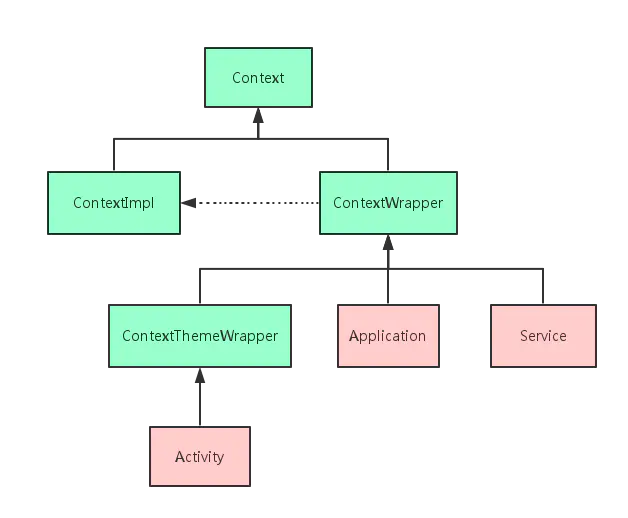
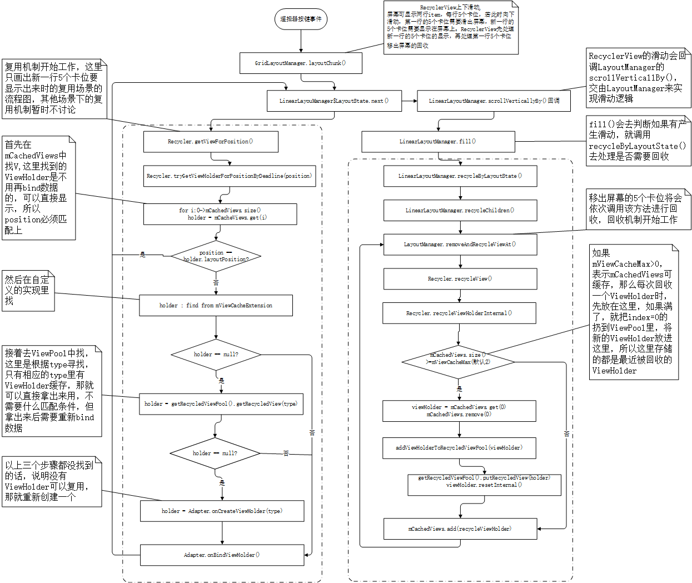

# android基础

### Activity的生命周期


### Fragment的生命周期


#### 关于Fragment重叠的问题
出现这种问题的原因是：当我们旋转屏幕的时候，activity会被销毁并重新创建，并且在销毁之前执行了onSaveInstanceState(Bundle outState)这个方法。这个方法会保存activity的一些信息，其中就包括添加过的fragment，当activity被重新创建时，会初始化其中的变量，这个时候点击底部导航的话会重新去添加fragment，也就导致了重叠的问题

还有一种可能也会造成fragment重叠的问题，就是当内存不足时activity被系统回收时，再次进入也会造成重叠的问题，原因也是因为onSaveInstanceState(outState);方法保存了activity的一些数据。

- 解决方案：
  - onSaveInstanceState 中不调用 super.onSaveInstanceState 这样界面就不会被保存下来，也就不会发生重影
  ```java
  public void onSaveInstanceState(Bundle outState) {
    // TODO Auto-generated method stub
    //super.onSaveInstanceState(outState);   //将这一行注释掉，阻止activity保存fragment的状态
  }
  ```
  - onSaveInstanceState 在 onCreate的时候，判断savedInstanceState是否为null，通过tag找到 fragment, 赋值给 初始化的变量,否则创建新的fragment，并添加
  ```java
  @Override
  public void onCreate(Bundle savedInstanceState) {
    super.onCreate(savedInstanceState);
    if (savedInstanceState==null) {
        mainFragment = MainFragment.newInstance();
        ft.add(R.id.fl_content, mainFragment, "MainFragment");
    }else {
        mainFragment = (MainFragment) getSupportFragmentManager().findFragmentByTag("MainFragment");
    }
  }
  ```
  - 在添加fragment的时候，先通过 tag 找一下是不是已经存在fragment了，不存在则添加 并加上tag信息
  ```java
  Fragment tempFragment = getSupportFragmentManager().findFragmentByTag("MainFragment");
  if (tempFragment==null) {
      mainFragment = MainFragment.newInstance();
      ft.add(R.id.fl_content, mainFragment, "MainFragment");
  }else {
      mainFragment = (MainFragment) tempFragment;
  }
  ```

### Context理解
android中 context 可以理解为程序运行的上下文，运行的场景，他为当前场景的提供了很多能力比如说资源加载，启动其他场景Activity，获取系统服务，创建view等
- 分类



### view的绘制原理
[深入理解view的绘制流程](https://www.jianshu.com/p/060b5f68da79)


### 如何正确获取view的宽高
view的测量是在viewRootImpl里面进行的，viewRootImpl的创建是在 onResume的时候创建的，但是view的测量不一定说在onResume之后就完成；
- 监听viewTreeObserver
在布局发生改变或者某个视图的可视状态发生改变时调用该事件，会被多次调用，因此需要在获取到视图的宽度和高度后执行 remove 方法移除该监听事件
```java
protected void onStart() {
            super.onStart();
            ViewTreeObserver observer = tv.getViewTreeObserver();
            observer.addOnGlobalLayoutListener(new ViewTreeObserver.OnGlobalLayoutListener() {
                @Override
                public void onGlobalLayout() {
                    int width = tv.getMeasuredWidth();
                    int height = tv.getMeasuredHeight();
                    tv.getViewTreeObserver().removeOnGlobalLayoutListener(this);
                }
            });
        }

```
- 通过view post一个runnable获取
UI 事件队列会按顺序处理事件，在 setContentView() 被调用后，事件队列中会包含一个要求重新 layout 的 message，所以任何 post 到队列中的 Runnable 对象都会在 Layout 发生变化后执行
```java
mImageView.post(new Runnable() {
    @Override
    public void run() {

        Log.i("TAG", "width = " + mImageView.getWidth() +
              "height = " + mImageView.getHeight());

    }
});
```

### view的事件分发机制
- 分发 DispatchTouchEvent
首先会调用Activity的 DispatchTouchEvent()
Activity-> PhoneWindow->DocorView->ViewGroup->ContentView-View
- 拦截 onInterceptTouchEvent
这个方法是在ViewGroup中的，表示是否需要拦截事件，
- onTouchEvent
表示是否消费事件

- 总结
dispatchTouchEvent 代表分发事件，onInterceptTouchEvent()代表拦截事件，onTouchEvent()代表消耗事件，由自己处理。
默认状态下事件是按照从Activity到ViewGroup再到View的顺序进行分发的，分发下去处不处理是另一回事，分发完成后，不处理则向上一层回调，调用上一层的onTouchEvent进行处理事件，若onTouchEvent返回true，则表示在该层消耗了事件，若返回false，表示事件还没被处理，需要再向上回调一层，调用上一层的onTouchEvent方法


### Intent.putExtra和Bundle
intent的 putExtra方法内部实现还是依靠 Bundle来实现的，内部有个mExtra的bundle对象
Bundle的putxxx方法可以传很多数据
intent的传递数据在于两个组件a,b之间，如果b传到c，还得在重复写一遍；
bundle传递数据可以在a,b,c之间共享数据


## 屏幕适配方案
目前android上都是以dp来适配的，几个概念
- 像素密度(dpi):

- 屏幕密度(屏幕密度):density = dpi / 160;
- 像素:px = density * dp;
px = dp * (dpi / 160);

### 主流适配方案
#### [宽高限定符方案](https://mp.weixin.qq.com/s/X-aL2vb4uEhqnLzU5wjc4Q)
具体就是穷举市面上所有的android手机的屏幕分辨率，设定一个基准的分辨率，其他分辨率都根据这个基准分辨率来计算，在不同的尺寸文件夹内部，根据该尺寸编写对应的dimens文件。
比如以480x320为基准分辨率
宽度为320，将任何分辨率的宽度整分为320份，取值为x1-x320
高度为480，将任何分辨率的高度整分为480份，取值为y1-y480

那么对于800*480的分辨率的dimens文件来说，
x1=(480/320)*1=1.5px
x2=(480/320)*2=3px
- dimension文件

- 具体的每个dimension文件

- 缺点：
这个方案有一个致命的缺陷，那就是需要精准命中才能适配，比如1920x1080的手机就一定要找到1920x1080的限定符，否则就只能用统一的默认的dimens文件了。而使用默认的尺寸的话，UI就很可能变形，简单说，就是容错机制很差
之前很早的时候有用，现在基本不用了

#### [今日头条适配方案](https://mp.weixin.qq.com/s/d9QCoBP6kV9VSWvVldVVwA)
它是通过修改density值，强行把所有不同尺寸分辨率的手机的宽度dp值改成一个统一的值，这样就解决了所有的适配问题
比如，设计稿宽度是360px，那么开发这边就会把目标dp值设为360dp，在不同的设备中，动态修改density值，从而保证(手机像素宽度)px/density这个值始终是360dp,这样的话，就能保证UI在不同的设备上表现一致了

#### [smallestWidth 限定符适配方案](https://mp.weixin.qq.com/s/X-aL2vb4uEhqnLzU5wjc4Q)
smallestWidth适配，或者叫sw限定符适配。指的是Android会识别屏幕可用高度和宽度的最小尺寸的dp值（其实就是手机的宽度值），然后根据识别到的结果去资源文件中寻找对应限定符的文件夹下的资源文件。
这种机制和上文提到的宽高限定符适配原理上是一样的，都是系统通过特定的规则来选择对应的文件

- dimension 资源文件目录

- 具体的dimension文件
以375个像素宽度的设计稿为例，在values-sw360dp文件夹下的dimens文件应该怎么编写呢？
这个文件夹下，意味着手机的最小宽度的dp值是360，我们把360dp等分成375等份，每一个设计稿中的像素，大概代表smallestWidth值为360dp的手机中的0.96dp，400dp的手机中1像素对应的是1.07dp

  - 360dp
  
  - 400dp
  

#### [终极适配方案](https://juejin.cn/post/6844903661819133960)
这个方案是基于 头条的适配方案去实现的，封装较好，易于接入和使用


## RecycleView缓存机制
[原文参考](https://www.wanandroid.com/wenda/show/14222)
  https://www.jianshu.com/p/3e9aa4bdaefd

- RecycleView有几级缓存
  一级缓存：mAttachedScrap 和 mChangedScrap
  二级缓存：mCachedViews
  三级缓存：ViewCacheExtension
  四级缓存：RecycledViewPool

- 每一级缓存具体作用是什么？分别在什么场景下会用到哪些缓存呢？
mAttachedScrap/mChangedScrap
在每次layout()时，recyclerview会将当前children进行remove/detach,当我们开启stableId时进行的是detach操作，此时如果Holder发生了改变(notifyItemChanged/rangeChanged)那么就放入changeScrap中，反之放入到AttachScrap

  mAttachedScrap：主要用在插入或是删除itemView时，先把屏幕内的ViewHolder保存至AttachedScrap中，作用在LayoutManager中，它仅仅把需要从ViewGroup中移除的子view设置它的父view为null，从而实现了从RecyclerView中移除操作detachView()。需要新插入的view从cacheView/Pool中找，没找到则createViewHolder。而从ViewGroup中移除的子view会放到Pool缓存池中, 实现: ArrayList<ViewHolder> mAttachedScrap

  mChangedScrap：主要用到刷新屏幕上的itemView数据，它不需要重新layout，notifyItemChanged()或者notifyItemRangeChanged() 实现: ArrayList<ViewHolder> mChangedScrap

  mCachedViews：保存最近移出屏幕的ViewHolder，包含数据和position信息，复用时必须是相同位置的ViewHolder才能复用，应用场景在那些需要来回滑动的列表中，当往回滑动时，能直接复用ViewHolder数据，不需要重新bindView。用一个数组保存ViewHolder，实现是：ArrayList<ViewHolder> mCachedViews

  RecycledViewPool：缓存池，当cacheView满了后，将cacheView中移出的ViewHolder放到Pool中，放之前会把ViewHolder数据清除掉，所以复用时需要重新bindView。实现是： SparseArray<ArrayList<ViewHolder>> mScrap;//按viewType来保存ViewHolder，每种类型最大缓存个数默认为5

写到这里发现漏讲了一个prefetch，好吧，这个prefetch机制就是RecyclerView在滚动和惯性滚动的时候，借助Handler来事先从RecycledViewPool中取出即将要显示的Item，随即扔到mCachedViews中，这样的话，当layout到这个Item时，就能直接拿来用而不用绑定数据了

### [RecycleView滚动时的复用与回收](https://www.jianshu.com/p/9306b365da57)
RecyclerView 滑动场景下的回收复用涉及到的结构体两个：
mCachedViews 和 RecyclerViewPool
- 回收
回收由 LayoutManager 来遍历移出屏幕的卡位，然后对每个卡位进行回收操作，回收时，都是把 ViewHolder 放在 mCachedViews 里面，如果 mCachedViews 满了，那就在 mCachedViews 里拿一个 ViewHolder 扔到 ViewPool 缓存里，然后 mCachedViews 就可以空出位置来放新回收的 ViewHolder 了
- 复用
复用时，也是先到 mCachedViews 里找 ViewHolder，但需要各种匹配条件，概括一下就是只有原来位置的卡位可以复用存在 mCachedViews 里的 ViewHolder，如果 mCachedViews 里没有，那么才去 ViewPool 里找。

在 ViewPool 里的 ViewHolder 都是跟全新的 ViewHolder 一样，只要 type 一样，有找到，就可以拿出来复用，重新绑定下数据即可。

#### 相关问题
- recycleView滑动时，新一行的数据被复用，移除屏幕的一行被回收，这个是先复用在回收还是先回收再复用？复用的viewHolder是不是刚刚回收的viewHolder
先复用，在回收；复用会先去mCacheViews中寻找是否可以直接使用的，如果没有再去 RecyclerViewPool 中看看有没有可以复用的；复用的ViewHolder不可能是刚刚回收的viewHolder


#### RecycleView性能优化
[RecycleView性能优化及高级使用](https://blog.csdn.net/smileiam/article/details/88396546)
- 数据处理和视图加载分离
把数据处理的过程也放到后台线程执行，onBindViewHolder中只做数据的填充操作
- 数据优化
数据分页加载，对数据新增删除采用 DiffUtil进行处理，然后进行局部刷新
- 对 ItemView 设置监听器，不要对每个 Item 都调用 addXxListener，应该大家公用一个 XxListener，根据 ID 来进行不同的操作，优化了对象的频繁创建带来的资源消耗。
- 如果 Item 高度是固定的话，可以使用 RecyclerView.setHasFixedSize(true); 来避免 requestLayout 浪费资源；
- 利用recycleView的数据预取功能
LinearLayoutManager 的 setInitialItemPrefetchCount()方法（25.1版本起可用）。例如，如果你竖直方向的list至少展示三个条目，调用setInitialItemPrefetchCount(4)。

- 减少itemview的布局层级


### 布局优化

#### FrameLayout、LinearLayout、RelativeLayout对比
1.RelativeLayout会让子View调用2次onMeasure，LinearLayout 在有weight时，也会调用子View2次onMeasure
2.RelativeLayout的子View如果高度和RelativeLayout不同，则会引发效率问题，当子View很复杂时，这个问题会更加严重。如果可以，尽量使用padding代替margin。
3.在不影响层级深度的情况下,使用LinearLayout和FrameLayout而不是RelativeLayout。
最后再思考一下文章开头那个矛盾的问题，为什么Google给开发者默认新建了个RelativeLayout，而自己却在DecorView自己是FrameLayout但是它只有一个子元素是属于LinearLayout。因为DecorView的层级深度是已知而且固定的，上面一个标题栏，下面一个内容栏。采用RelativeLayout并不会降低层级深度，所以此时在根节点上用LinearLayout是效率最高的。而之所以给开发者默认新建了个RelativeLayout是希望开发者能采用尽量少的View层级来表达布局以实现性能最优，因为复杂的View嵌套对性能的影响会更大一些。

4.能用两层LinearLayout，尽量用一个RelativeLayout，在时间上此时RelativeLayout耗时更小。另外LinearLayout慎用layout_weight,也将会增加一倍耗时操作。由于使用LinearLayout的layout_weight,大多数时间是不一样的，这会降低测量的速度。这只是一个如何合理使用Layout的案例，必要的时候，你要小心考虑是否用layout weight。总之减少层级结构，才是王道，让onMeasure做延迟加载，用viewStub，include等一些技巧

- 多级嵌套的view中性能
FrameLayout == LinearLayout > RelativeLayout

#### include,merge,viewStub
[原文链接](https://www.jianshu.com/p/354fb8a42ad8)
##### include
include标签只是为了解决复用问题，将公共的布局直接包含，并没有解决层级嵌套的问题
- 举例说明：
一个公共布局文件 my_layout.xml（这个布局后面例子也会用到）:
```xml
<?xml version="1.0" encoding="utf-8"?>
<LinearLayout xmlns:android="http://schemas.android.com/apk/res/android"
              android:id="@+id/linearLayout"
              android:layout_width="match_parent"
              android:layout_height="match_parent"
              android:orientation="vertical">
    <Button
        android:id="@+id/button"
        android:layout_width="match_parent"
        android:layout_height="wrap_content"
        android:text="Button"/>
    <TextView
        android:id="@+id/textView"
        android:layout_width="match_parent"
        android:layout_height="wrap_content"
        android:text="TextView"/>
</LinearLayout>
```
使用这个公共布局文件：
```xml
<?xml version="1.0" encoding="utf-8"?>
<LinearLayout xmlns:android="http://schemas.android.com/apk/res/android"
              android:layout_width="match_parent"
              android:layout_height="match_parent"
              android:orientation="vertical">

    <include
        android:id="@+id/include_layout"
        layout="@layout/my_layout"
        android:layout_width="match_parent"
        android:layout_height="wrap_content"/>
</LinearLayout>
```
**注意事项：**
    使用 include 最常见的问题就是 findViewById 时候出现 NullPointerException 。
这个问题出现的前提是在 <include /> 中设置了id，被 include 进来的布局的根元素也设置了id。
那么这时使用被 include 进来的根元素id进行 findViewById 就会出现NullPointerException。

**在上述例子中：**
```java
findViewById(R.id.include_layout);// 正常
findViewById(R.id.linearLayout);// 会出现NullPointerException
findViewById(R.id.button);// 正常
findViewById(R.id.textView); // 正常
```
##### viewStub
viewStub标签是可以起到懒加载的作用
ViewStub就是一个宽高都为0的一个View，它默认是不可见的。
只有通过调用 setVisibility() 函数或者 Inflate() 函数才会将其要装载的目标布局给加载出来，从而达到延迟加载的效果。
在ViewStub布局可显示之前，系统不会消耗资源去实例化里面的布局，可以节省系统资源消耗。

设置 ViewStub 中延时加载的布局有两种方式：

在xml中使用 android:layout 属性来设置。
在代码中使用 ViewStub.setLayoutResource(res); 来设置。
使ViewStub中布局显示出来也有两种方法：

调用 ViewStub.setVisibility(View.VISIBLE);。
调用 ViewStub.inflate();。
这两个方法本质上都是调用ViewStub.inflate();来实现布局的加载显示。

举例说明：
```xml
<ViewStub
    android:id="@+id/view_stub"
    android:layout_width="fill_parent"
    android:layout_height="49dp"
    android:layout="@layout/my_layout"
    android:inflatedId="@+id/view_stub_inflated_id"/>
```
my_layout 布局文件就是上文中的 my_layout.xml
```java

// 第一种使用方法：
//使用android:layout="@layout/my_layout"设置布局
ViewStub viewStub = (ViewStub) findViewById(R.id.view_stub);
//设置setVisibility，使布局文件实例化
viewStub .setVisibility(View.VISIBLE);
// 通过ViewStub的xml中的属性 inflatedId 来获取View
LinearLayout linearLayout =(LinearLayout) findViewById(R.id.view_stub_inflated_id);
if ( viewStub.getVisibility() == View.VISIBLE ) {
    // 已经加载成功
}

// 第二种使用方法：
ViewStub viewStub = (ViewStub) findViewById(R.id.view_stub);
viewStub.setLayoutResource(R.layout.my_layout);
//使用 inflate，使布局文件实例化
LinearLayout linearLayout= (LinearLayout)viewStub.inflate();
if (linearLayout!= null){
    //已经加载成功
}
```

##### merge
merge它可以删减多余的层级，优化UI。
例如你的主布局文件是垂直的LinearLayout，这时使用include将 my_layout.xml 引入进来。
新布局也是垂直的LinearLayout，那么这个新的LinearLayout就没有任何意义了。使用的话反而增加反应时间。这时可以使用<merge/>标签优化。

merge 原理就是在解析xml时候，如果是 <merge/> 标签，那么直接将其中的子元素添加到merge 标签parent中，这样就保证了不会引入额外的层级
```xml
<?xml version="1.0" encoding="utf-8"?>
<merge xmlns:android="http://schemas.android.com/apk/res/android">
    <Button
        android:id="@+id/button"
        android:layout_width="match_parent"
        android:layout_height="wrap_content"
        android:text="Button"/>
    <TextView
        android:id="@+id/textView"
        android:layout_width="match_parent"
        android:layout_height="wrap_content"
        android:text="TextView"/>
</merge>
```


1、熟练掌握组件化和插件化
2、熟练java、kotlin、rxjava
3、熟悉常有的网络协议
4、熟悉android的性能优化、内存优化
5、熟悉进程、线程、互斥、内存的使用
6、有android native开发经验优先、熟练flutter优先
7、至少在跟维护一个中大型项目两年以上，如果项目从0开始搭建最好
8、最好有android源码，特别是ui部分源代码的阅读经验，能有其他部分源码阅读更好
9、加分项目 android的音视频编解码经验和相机卡发经验


