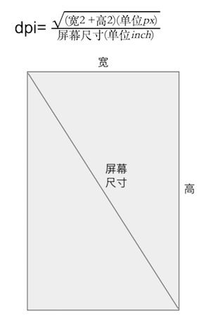
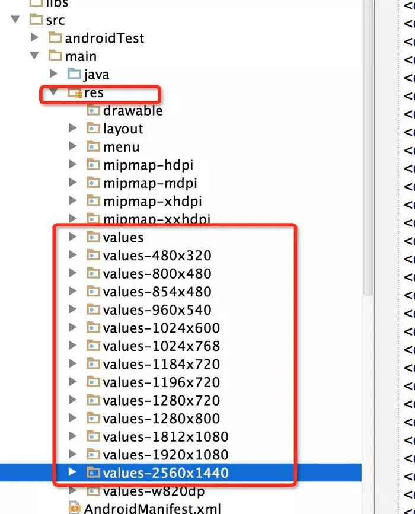
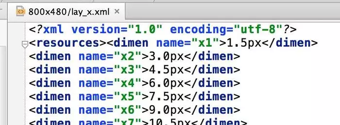
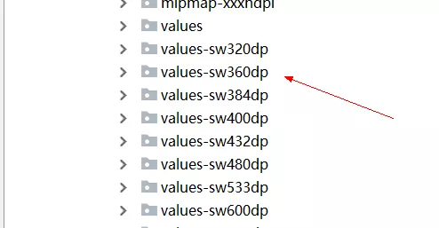
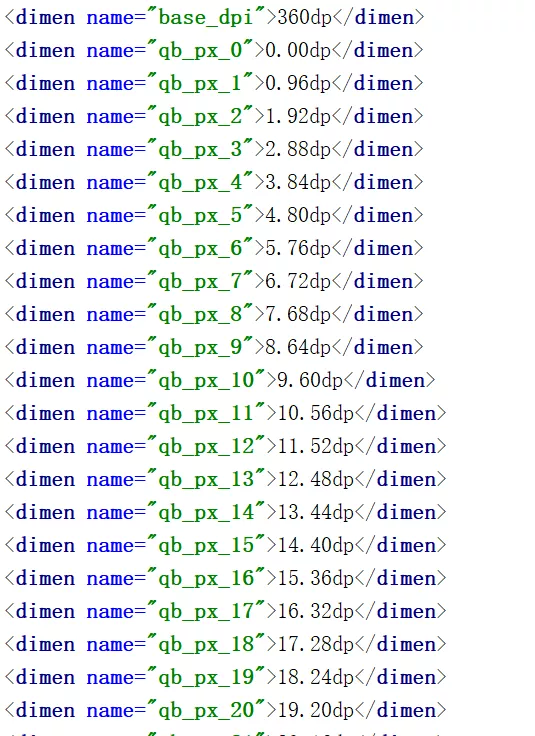
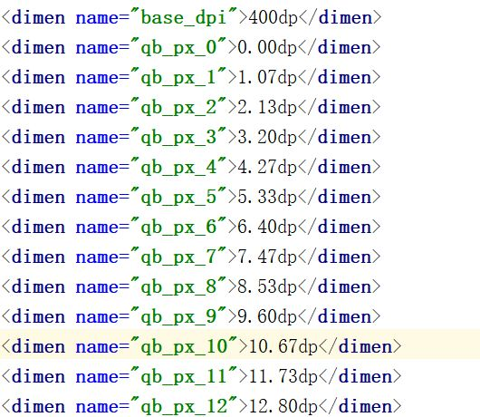

# android基础

### Activity的生命周期

### Fragment的生命周期

### view的绘制原理
[深入理解view的绘制流程](https://www.jianshu.com/p/060b5f68da79)

### view的事件分发机制

### Intent.putExtra和Bundle
intent的 putExtra方法内部实现还是依靠 Bundle来实现的，内部有个mExtra的bundle对象
Bundle的putxxx方法可以传很多数据
intent的传递数据在于两个组件a,b之间，如果b传到c，还得在重复写一遍；
bundle传递数据可以在a,b,c之间共享数据

## 屏幕适配方案
目前android上都是以dp来适配的，几个概念
- 像素密度(dpi):

- 屏幕密度(屏幕密度):density = dpi / 160;
- 像素:px = density * dp;
px = dp * (dpi / 160);

### 主流适配方案
#### [宽高限定符方案](https://mp.weixin.qq.com/s/X-aL2vb4uEhqnLzU5wjc4Q)
具体就是穷举市面上所有的android手机的屏幕分辨率，设定一个基准的分辨率，其他分辨率都根据这个基准分辨率来计算，在不同的尺寸文件夹内部，根据该尺寸编写对应的dimens文件。
比如以480x320为基准分辨率
宽度为320，将任何分辨率的宽度整分为320份，取值为x1-x320
高度为480，将任何分辨率的高度整分为480份，取值为y1-y480

那么对于800*480的分辨率的dimens文件来说，
x1=(480/320)*1=1.5px
x2=(480/320)*2=3px
- dimension文件

- 具体的每个dimension文件

- 缺点：
这个方案有一个致命的缺陷，那就是需要精准命中才能适配，比如1920x1080的手机就一定要找到1920x1080的限定符，否则就只能用统一的默认的dimens文件了。而使用默认的尺寸的话，UI就很可能变形，简单说，就是容错机制很差
之前很早的时候有用，现在基本不用了

#### [今日头条适配方案](https://mp.weixin.qq.com/s/d9QCoBP6kV9VSWvVldVVwA)
它是通过修改density值，强行把所有不同尺寸分辨率的手机的宽度dp值改成一个统一的值，这样就解决了所有的适配问题
比如，设计稿宽度是360px，那么开发这边就会把目标dp值设为360dp，在不同的设备中，动态修改density值，从而保证(手机像素宽度)px/density这个值始终是360dp,这样的话，就能保证UI在不同的设备上表现一致了

#### [mallestWidth 限定符适配方案](https://mp.weixin.qq.com/s/X-aL2vb4uEhqnLzU5wjc4Q)
smallestWidth适配，或者叫sw限定符适配。指的是Android会识别屏幕可用高度和宽度的最小尺寸的dp值（其实就是手机的宽度值），然后根据识别到的结果去资源文件中寻找对应限定符的文件夹下的资源文件。
这种机制和上文提到的宽高限定符适配原理上是一样的，都是系统通过特定的规则来选择对应的文件

- dimension 资源文件目录

- 具体的dimension文件
以375个像素宽度的设计稿为例，在values-sw360dp文件夹下的dimens文件应该怎么编写呢？
这个文件夹下，意味着手机的最小宽度的dp值是360，我们把360dp等分成375等份，每一个设计稿中的像素，大概代表smallestWidth值为360dp的手机中的0.96dp，400dp的手机中1像素对应的是1.07dp

  - 360dp
  
  - 400dp
  

#### [终极适配方案](https://juejin.cn/post/6844903661819133960)
这个方案是基于 头条的适配方案去实现的，封装较好，易于接入和使用

## RecycleView缓存机制
[原文参考](https://www.wanandroid.com/wenda/show/14222)
  https://www.jianshu.com/p/3e9aa4bdaefd
- RecycleView有几级缓存
  一级缓存：mAttachedScrap 和 mChangedScrap
  二级缓存：mCachedViews
  三级缓存：ViewCacheExtension
  四级缓存：RecycledViewPool

- 每一级缓存具体作用是什么？分别在什么场景下会用到哪些缓存呢？
  mAttachedScrap：LayoutManager每次layout子View之前，那些已经添加到RecyclerView中的Item以及被删除的Item的临时存放地。使用场景就是RecyclerView滚动时、还有在可见范围内删除Item后用notifyItemRemoved方法通知更新时；

  mChangedScrap：作用：存放可见范围内有更新的Item。使用场景：可见范围内的Item有更新，并且使用notifyItemChanged方法通知更新时；

  mCachedViews：作用：存放滚动过程中没有被重新使用且状态无变化的那些旧Item。场景：滚动，prefetch；

  RecycledViewPool：作用：缓存Item的最终站，用于保存那些Removed、Changed、以及mCachedViews满了之后更旧的Item。场景：Item被移除、Item有更新、滚动过程；

写到这里发现漏讲了一个prefetch，好吧，这个prefetch机制就是RecyclerView在滚动和惯性滚动的时候，借助Handler来事先从RecycledViewPool中取出即将要显示的Item，随即扔到mCachedViews中，这样的话，当layout到这个Item时，就能直接拿来用而不用绑定数据了

1、熟练掌握组件化和插件化
2、熟练java、kotlin、rxjava
3、熟悉常有的网络协议
4、熟悉android的性能优化、内存优化
5、熟悉进程、线程、互斥、内存的使用
6、有android native开发经验优先、熟练flutter优先
7、至少在跟维护一个中大型项目两年以上，如果项目从0开始搭建最好
8、最好有android源码，特别是ui部分源代码的阅读经验，能有其他部分源码阅读更好
9、加分项目 android的音视频编解码经验和相机卡发经验

