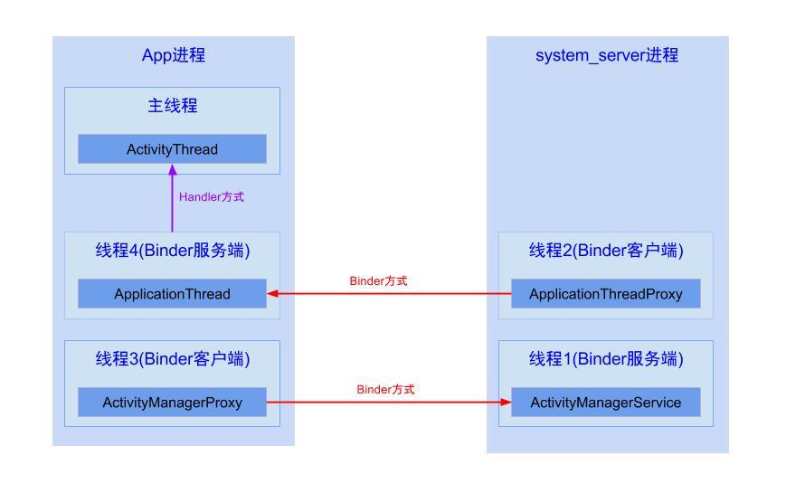

[TOC]

# android主线程是死循环，为什么不会影响程序运行？
[参考这里](https://www.zhihu.com/question/34652589?spm=a2c4e.10696291.0.0.2d9f19a4zaM5ya)
这里涉及到android消息循环机制，其实ActivityThread.main()中，首先会创建Looper对象和Handler对象用于处理主线程的消息，
然后会创建 ApplicationThread，这个是一个Binder的服务端继承了IApplicationThread.Stub，提供服务给system_server进程中的ApplicationThreadProxy(ATP)调用
之后进入looper.loop()，而loop()中会循环从MsgQueue中取数据，这个操作是阻塞的(这里底层是从pipe中去读，没有消息便会阻塞，让出CPU执行权)；

一张图片理解App运行过程



## 主线程死循环会不会一直消耗cpu
不会，主线程中虽然是死循环，但是其实是阻塞去取msgQueue中数据，大多数情况下是休眠状态，不会消耗大量cpu

## 主线程阻塞了，如何响应其他事件
上面说到在一开始，会创建 ApplicationThread，这个是ActivityThread的内部类，其通过handler想主线程发送消息；
而且他实现了Binder的服务端，远程调用的服务端运行的时候，是运行在一个独立的线程中的，所以需要通过handler想主线程发送消息


# Handler机制

## 考点
- send message delay问题
有一个handler,然后调用
sendMessageDelay(MSG1, 10s);
sendMessageDelay(MSG2, 5s);
紧接着调用sleep(15s);
问题是，过了多久才能收到MSG1和MSG2的消息
经过测试: 答案是15s 后，先收到MSG2，后收到MSG1; 测试代码如下
解析: 因为sendMessage和sendMessageDelay函数都是运行在当前调用的线程中的，当前线程sleep了，那handler也会把sleep的时间计算在message delay的时间中
15s已经>10s>5s 所以时间到期，就直接处理了msg2，和msg1, msg在入队列的时候有顺序的


# AIDL VS Binder
Binder是android 提供的ipc(Inter-Process Communication)通信框架，用于进程间通信
AIDL是为了方便Binder的开发提出的框架

Binder是C/S架构，多个client可以调用东一个server,调用远程服务时是同步的，

### 关于远程调用线程的问题
- server端:
  - service的创建在主线程;
  - service的函数被调用的时候，运行在server进程中的一个新线程
  - server端调用callback回调client端，这个也是同步调用的，server也会阻塞知道client端callback执行完成

- client端:
  - client端调用远程函数时，调用者会阻塞等待远程调用执行完成，
  所以如果在主线程调用远程service的函数需要注意有可能导致ANR
  - client调用的时候有callback的情况
  远端server调用callback回调给client端时，这个callback函数运行在client端调用remote函数的线程中，
  即如果client在主线程调用remote，那么callback就运行在主线程
[相关代码远程调用代码](https://github.com/cxy200927099/Note/tree/master/android/aidl)


## android 签名V1,V2,V3的区别
[详细参考这里](https://blog.csdn.net/freekiteyu/java/article/details/97884257)
v1 方案：基于 JAR 签名。
v2 方案：APK 签名方案 v2，在 Android 7.0 引入。
v3 方案：APK 签名方案 v3，在 Android 9.0 引入。
v1 到 v2 是颠覆性的，为了解决 JAR 签名方案的安全性问题，而到了 v3 方案，其实结构上并没有太大的调整，可以理解为 v2 签名方案的升级版，有一些资料也把它称之为 v2+ 方案。
因为这种签名方案的升级，就是向下兼容的，所以只要使用得当，这个过程对开发者是透明的


## android序列化
### Parcelable和Serializable
#### Serializable
java提供的序列化方式，是一个空接口，对象继承这个接口即可表明当前对象是可序列化的，一般用于持久化到磁盘
序列化的实现是由ObjectOutputStream.writeObject(obj)进行序列化，以及ObjectInputStream.readObject(obj)进行反序列化的
- serialVersionUID
```
private static final long serialVersionUID= 1L;
```
在序列化的时候，最好为当前类指定一个固定的serialVersionUID，如果不指定，系统也可以序列化，但是序列化的时候会默认生成一个 serialVersionUID，并将这个值写入存储介质，当类结构发生变化，比如新增一个变量，那反序列化的时候会由于serialVersionUID不一致导致反序列化失败
#### Parcelable
android提供的对象序列化方式，使用上稍微麻烦些，但是都是基于内存的操作，性能上比Serializable好很多
实现对象序列化，继承Parcelable接口
1）重写writeToParcel 将对象数据序列化成一个Parcel对象(序列化之后成为Parcel对象.以便Parcel容器取出数据)
2）重写describeContents方法,默认值为0
3）Public static final Parcelable.Creator<T>CREATOR (将Parcel容器中的数据转换成对象数据) 同时需要实现两个方法:
　　3.1 CreateFromParcel(从Parcel容器中取出数据并进行转换.)
　　3.2 newArray(int size)返回对象数据的大小

## java方面

## 线程
###

## 并发

### 悲观锁
顾明思议悲观，每次去取数据的时候都认为别人会修改，所以都会上锁，然后别人拿数据的时候就会阻塞直到拿到锁
### 乐观锁
每次去拿数据的时候都认为别人不会修改，所以不会上锁。但是在更新的时候会判断一下，在此期间是否有人去更新这个数据，利用版本号等机制来控制。乐观锁适用于多读的应用类型，这样可以提高吞吐量
### 重入锁
也叫递归锁，指同一线程 在获得外层的锁之后，在锁之内还可以获取该锁，java中synchronized和ReentrantLock都是重入锁
### 读写锁
读写锁包含两个锁，读锁和写锁；读数据的时候，加上读锁，多个线程可以并发读，写数据的时候加上写锁，只允许一个线程在同时写
读-读能共存，读-写不能共存，写-写不能共存
### CAS(compare and swap)无锁机制
包含三个参数，V(要更新的变量)，E(预期值)，N(新值)
仅当V值等于E值时，才会将V的值设为N，
如果V值和E值不同，则说明已经有其他线程做了更新，则当前线程什么都不做。
最后，CAS返回当前V的真实值
- 特点
性能比较好，不会死锁
### 自旋锁
当一个线程在获取锁的时候，如果锁已经被其他线程获取，那该线程将循环等待，不停尝试获取锁，直到成功为止，
自旋锁lock用到了CAS，第一个线程进入的时候能够成功获取锁，不会进入while循环，如果此时A没有释放锁，
另一个线程又来获取锁，不满足cas会进入while循环，然后不断判断是否满足cas，直到线程A释放锁，线程B才能退出循环

### ArrayList,LinkedList,Vector
1.ArrayList是实现了基于动态数组的数据结构，LinkedList基于链表的数据结构。
2.对于随机访问get和set，ArrayList优于LinkedList，因为LinkedList要移动指针。
3.对于新增和删除操作add和remove，LinedList比较占优势，因为ArrayList要移动数据
Vector是很老的数据结构，与ArrayList类似，是线程安全的
ArrayList和LindedList都是线程不安全的

#### ArrayList的几种遍历方式区别
- 根据下标遍历，普通for循环方式
```java
for(int i = 0; i < list.size(); i++){
  list.get(i)
s}
```
- for each方式,使用冒号
```for(String s:list)```
这种方式底层是通过迭代器来实现的
- 迭代器方式
```java
Iterator it = list.iterator();
while(it.hasNext()){
  it.next()
}
```
耗时上: 普通for循环< 迭代器 < foreach方式
### hashmap相关

#### hashmap实现原理
- 底层数据结构
jdk1.7 及以前，HashMap 由数组+链表组成，数组 Entry 是 HashMap 的主体，Entry 是 HashMap 中的一个静态内部类，每一个 Entry 包含一个 key-value 键值对，
链表是为解决哈希冲突而存 在。
从 jdk1.8 起，HashMap 是由数组+链表/红黑树组成，当某个 bucket 位置的链表长度达到阀 值 8 时，这个链表就转变成红黑树，优化了hash冲突过多时，链表太长照成的查找慢的问题
红黑树是近似平衡树
- 线程不安全
存储比较快，能接受null值
- 为什么要使用加载因子，为什么要进行扩容
加载因子是指当 HashMap 中存储的元素/最大空间值的阀值，如果超过这个值，就会进行扩容。默认值是0.75
加载因子是为了让空间得到充分利用，如果加载因子太大，虽对空间利用更充分，但查 找效率会降低;
如果加载因子太小，表中的数据过于稀疏，很多空间还没用就开始扩容，就 会对空间造成浪费。
至于为什么要扩容，如果不扩容，HashMap 中数组处的链表会越来越长，这样查找效率就会大大降低。

- hashmap如何扩容
根据加载因子判断的，默认0.75，当加载因子超过0.75，则会大小扩充为原来2倍

- hashmap中的数组长度一定是2的幂次
目的是为了当hashcode值转化到数组的index时，能尽量的均匀，如何做呢？
index = (n-1)& hashcode
而n=2的幂次的时候，比如16，n-1之后对应的二进制数据0111(最高位为0，其他位都为1)，这样做与运算的时候，能尽量真实的获取hashcode值的低位，使其均匀
如果不是2的幂次，比如15，n-1之后对应二进制数据1110,那么无论什么hashcode值，与上n-1之后最后一位都是0，这样table中最后一位为1的index
0001，0011，0101，1001，1011，0111，1101这几个位置永远都不能存放元素，空间浪费很大，并且增加了hash碰撞的几率，降低查询效率

#### hashmap与hashTable，HashSet
1、HashMap是线程不安全的，在多线程环境下会容易产生死循环，但是单线程环境下运行效率高；Hashtable线程安全的，很多方法都有synchronized修饰，但同时因为加锁导致单线程环境下效率较低。
2、HashMap允许有一个key为null，允许多个value为null；而Hashtable不允许key或者value为null。
3 jdk1.8之后，hashmap使用了数组+链表+红黑树数据结构来实现的,而hashTable还是使用数组+链表的形式

hashSet底层实现set接口，仅存储对象，使用对象来计算hashcode值
hashmap实现map接口，存储键值对，使用key来计算hashcode

#### ConcurrentHashmap
ConcurrentHashMap 是用 Node 数组+链表+红黑树数据结构来实现的， 并发制定用 synchronized 和 CAS 操作

#### linkedHashmap

#### SparseArray, ArrayMap


## 导致内存泄漏的原因
根本原因: 长生命周期的对象持有短生命周期的对象，导致短生命周期对象无法及时释放

### cursor游标为关闭
记得及时关闭游标
### 内部类引起的泄漏
比如在Activity中定义的内部类，并启动了一个长时间运行的线程，因为非静态内部类和匿名内部类会持有外部类的引用，这样Activity退出的时候，得不到及时的回收
如Activity中定义了非静态内部类handler，handler的消息队列中还有未处理的消息，或者正在处理消息，activity退出了，也会导致Activity内存泄漏
- 解决
  使用静态内部类+WeakRefernce,即 static修饰内部类，然后内部类构造函数传入acitvity,使用WeakReference来存储Activity
  更新UI的时候，需要对Activity判空处理，有可能Activity已经被回收了

### 静态集合类引起的内存泄漏

### 注册/反注册未成对使用

### Bitmap对象不再使用时，没有调用recycle()释放


## 网络方面
### http与https的区别
[https详解](https://zhuanlan.zhihu.com/p/138645414)
安全问题
- http: http位于OSI网络模型的应用层，采用明文方式进行传输，非常不安全，容易被人篡改和窃取数据
- SSL(Secure Socket Layer):位于TCP传输层和应用层之间，用于web安全传输的协议，后来重新命名为TLC(Transport Layer Security)
TLS1.0就是SSL3.1， SSL/TLS 利用对称加密和非对称加密的特点来实现安全的
- https: 建立在SSL/TLS协议之上，通过SSL/TLS进行加密

### https的连接过程


