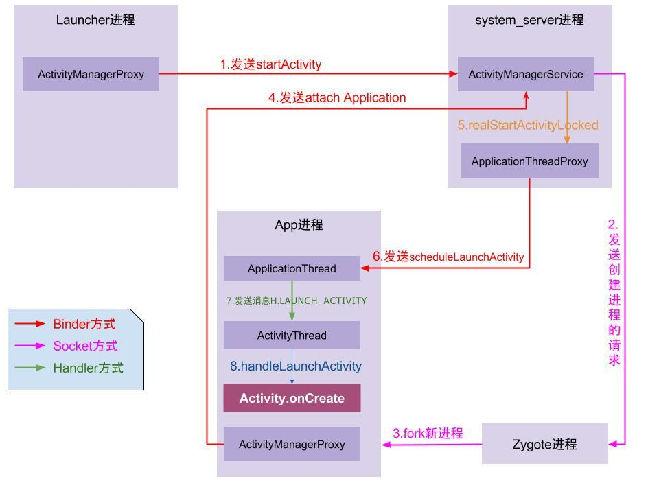
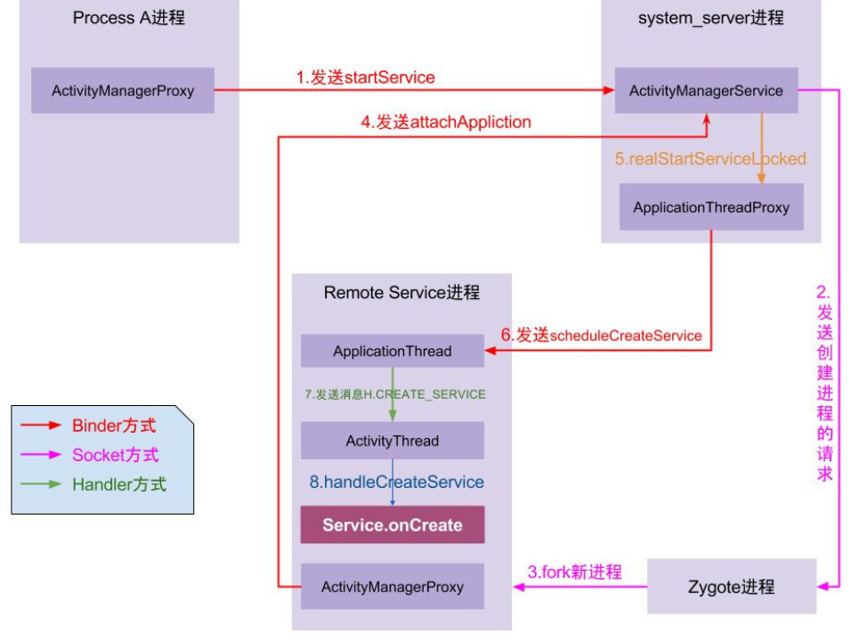
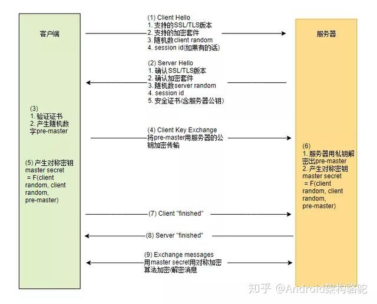
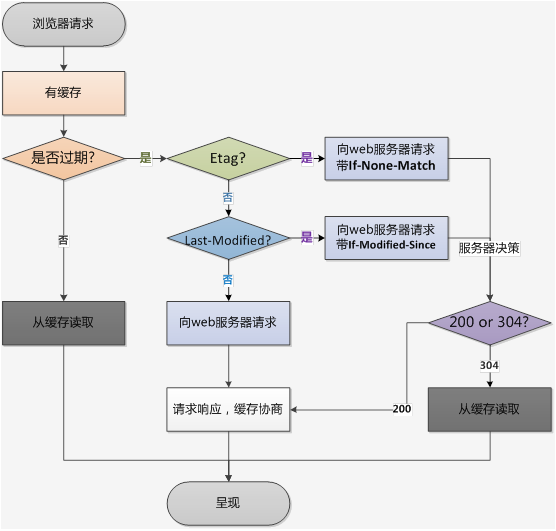
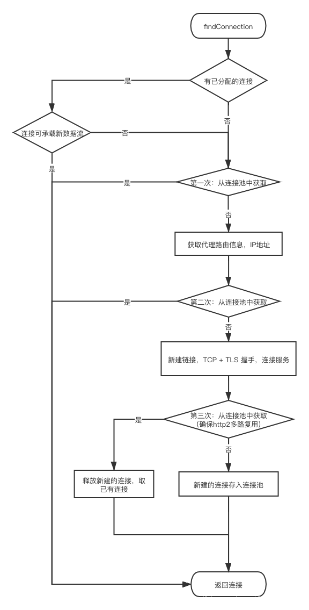
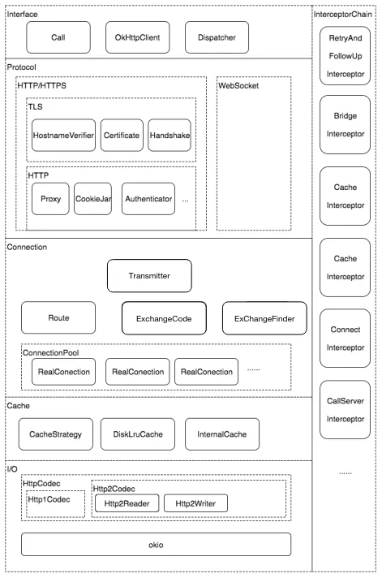

[TOC]

# android主线程是死循环，为什么不会影响程序运行？
[参考这里](https://www.zhihu.com/question/34652589?spm=a2c4e.10696291.0.0.2d9f19a4zaM5ya)
这里涉及到android消息循环机制，其实ActivityThread.main()中，首先会创建Looper对象和Handler对象用于处理主线程的消息，
然后会创建 ApplicationThread，这个是一个Binder的服务端继承了IApplicationThread.Stub，提供服务给system_server进程中的ApplicationThreadProxy(ATP)调用
之后进入looper.loop()，而loop()中会循环从MsgQueue中取数据，这个操作是阻塞的(这里底层是从pipe中去读，没有消息便会阻塞，让出CPU执行权)；

- 启动流程图


### activity的启动过程


### Service的启动过程


## 主线程死循环会不会一直消耗cpu
不会，主线程中虽然是死循环，但是其实是阻塞去取msgQueue中数据，大多数情况下是休眠状态，不会消耗大量cpu

## 主线程阻塞了，如何响应其他事件
上面说到在一开始，会创建 ApplicationThread，这个是ActivityThread的内部类，其通过handler想主线程发送消息；
而且他实现了Binder的服务端，远程调用的服务端运行的时候，是运行在一个独立的线程中的，所以需要通过handler想主线程发送消息


# Handler机制
looper
messageQueue

## 考点
- send message delay问题
有一个handler,然后调用
sendMessageDelay(MSG1, 10s);
sendMessageDelay(MSG2, 5s);
紧接着调用sleep(15s);
问题是，过了多久才能收到MSG1和MSG2的消息
经过测试: 答案是15s 后，先收到MSG2，后收到MSG1; 测试代码如下
解析: 因为sendMessage和sendMessageDelay函数都是运行在当前调用的线程中的，当前线程sleep了，那handler也会把sleep的时间计算在message delay的时间中
15s已经>10s>5s 所以时间到期，就直接处理了msg2，和msg1, msg在入队列的时候有顺序的

## 子线程更新UI
通过handler去更新
RunOnUiThread
view.Post(Runnable)
AsyncTask
这些操作UI的底层实现都是通过Handler

### handler更新UI的原理
默认无参构造Handler时，最终会调用 Looper.myLooper()获取looper，而这里面是通过ThreadLocal变量来获取Looper的，
threadlocal修饰的变量是线程独有的，这个looper在主线程中(prepareMainLooper)是已经创建好的,所以在主线程中创建handler的时候，默认是有Looper的，其他线程创建就handler需要自己创建looper

## 子线程一定不能更新UI吗？
不一定，android判断线程是否能更新UI是在 ViewRootImpl中去判断的，而ViewRootImpl的创建是在Activity的OnResume中创建的
这样当在OnCreate中创建子线程去执行UI更新的时候， ViewRootImpl还没有被创建


# AIDL VS Binder
Binder是android 提供的ipc(Inter-Process Communication)通信框架，用于进程间通信
AIDL是为了方便Binder的开发提出的框架

Binder是C/S架构，多个client可以调用同一个server,调用远程服务时是同步的，

### 关于远程调用线程的问题
- server端:
  - service的创建在主线程;
  - service的函数被调用的时候，运行在server进程中的一个新线程
  - server端调用callback回调client端，这个也是同步调用的，server也会阻塞知道client端callback执行完成

- client端:
  - client端调用远程函数时，调用者会阻塞等待远程调用执行完成，
  所以如果在主线程调用远程service的函数需要注意有可能导致ANR
  - client调用的时候有callback的情况
  远端server调用callback回调给client端时，这个callback函数运行在client端调用remote函数的线程中，
  即如果client在主线程调用remote，那么callback就运行在主线程
[相关代码远程调用代码](https://github.com/cxy200927099/Note/tree/master/android/aidl)


## android 签名V1,V2,V3的区别
[详细参考这里](https://blog.csdn.net/freekiteyu/java/article/details/97884257)
v1 方案：基于 JAR 签名。
v2 方案：APK 签名方案 v2，在 Android 7.0 引入。
v3 方案：APK 签名方案 v3，在 Android 9.0 引入。
v1 到 v2 是颠覆性的，为了解决 JAR 签名方案的安全性问题，而到了 v3 方案，其实结构上并没有太大的调整，可以理解为 v2 签名方案的升级版，有一些资料也把它称之为 v2+ 方案。
因为这种签名方案的升级，就是向下兼容的，所以只要使用得当，这个过程对开发者是透明的


## android序列化
### Parcelable和Serializable
#### Serializable
java提供的序列化方式，是一个空接口，对象继承这个接口即可表明当前对象是可序列化的，一般用于持久化到磁盘
序列化的实现是由ObjectOutputStream.writeObject(obj)进行序列化，以及ObjectInputStream.readObject(obj)进行反序列化的
- serialVersionUID
```
private static final long serialVersionUID= 1L;
```
在序列化的时候，最好为当前类指定一个固定的serialVersionUID，如果不指定，系统也可以序列化，但是序列化的时候会默认生成一个 serialVersionUID，并将这个值写入存储介质，当类结构发生变化，比如新增一个变量，那反序列化的时候会由于serialVersionUID不一致导致反序列化失败
#### Parcelable
android提供的对象序列化方式，使用上稍微麻烦些，但是都是基于内存的操作，性能上比Serializable好很多
实现对象序列化，继承Parcelable接口
1）重写writeToParcel 将对象数据序列化成一个Parcel对象(序列化之后成为Parcel对象.以便Parcel容器取出数据)
2）重写describeContents方法,默认值为0
3）Public static final Parcelable.Creator<T>CREATOR (将Parcel容器中的数据转换成对象数据) 同时需要实现两个方法:
　　3.1 CreateFromParcel(从Parcel容器中取出数据并进行转换.)
　　3.2 newArray(int size)返回对象数据的大小

## java方面

## 线程和进程
### 概述
- 进程是具有一定独立功能的程序关于某个数据集合上的一次运行活动,进程是系统进行资源分配和调度的一个独立单位.
- 线程是进程的一个实体,是CPU调度和分派的基本单位,它是比进程更小的能独立运行的基本单位.线程自己基本上不拥有系统资源,只拥有一点在运行中必不可少的资源(如程序计数器,一组寄存器和栈),但是它可与同属一个进程的其他的线程共享进程所拥有的全部资源.
- 一个线程可以创建和撤销另一个线程;同一个进程中的多个线程之间可以并发执行.
- 相对进程而言，线程是一个更加接近于执行体的概念，它可以与同进程中的其他线程共享数据，但拥有自己的栈空间，拥有独立的执行序列。
- 在串行程序基础上引入线程和进程是为了提高程序的并发度，从而提高程序运行效率和响应时间
### 区别
1) 简而言之,一个程序至少有一个进程,一个进程至少有一个线程.
2) 线程的划分尺度小于进程，使得多线程程序的并发性高。
3) 另外，进程在执行过程中拥有独立的内存单元，而多个线程共享内存，从而极大地提高了程序的运行效率。
4) 线程在执行过程中与进程还是有区别的。每个独立的线程有一个程序运行的入口、顺序执行序列和程序的出口。但是线程不能够独立执行，必须依存在应用程序中，由应用程序提供多个线程执行控制。
5) 从逻辑角度来看，多线程的意义在于一个应用程序中，有多个执行部分可以同时执行。但操作系统并没有将多个线程看做多个独立的应用，来实现进程的调度和管理以及资源分配。这就是进程和线程的重要区别


## ThreadLocal
ThreadLocal是android提供的可以为每个线程创建私有变量的类，其原理还因为每个thread都有一个ThreadLocalMap对象来管理，当给threadLocal修饰的对象赋值时，首先是获取当前的线程，然后得到线程私有的threadLocalMap对象，在把threadLocal对象作为key，设置的值value一起存入threadLocalMap

## 线程池提
ThreadPoolExecutor 主要功能就是复用线程，减少线程的创建和销毁,线程池的工作原理，当一个任务提交到线程池时；
1. 判断核心线程池中线程是否已满，如果没满，则创建一个核心线 程执行任务，否则进入下一步
2. 判断工作队列是否已满，没有满则加入工作队列，否则执行下一步
3. 判断线程数是否达到了最大值，如果没有则创建非核心线程执行任务，否则执行饱和策略，默认抛出异常

### 线程池的参数
- corePoolSize 核心线程数。当线程数小于该值时，线程池会优先创建新线程来执行新任务
- maximumPoolSize 线程池所能维护的最大线程数
- keepAliveTime 空闲线程的存活时间
- workQueue 任务队列，用于缓存未执行的任务
- threadFactory 线程工厂。可通过工厂为新建的线程设置更有意义的名字
- handler 拒绝策略。当线程池和任务队列均处于饱和状态时，使用拒绝策略处理新任务。默认是 AbortPolicy， 即直接抛出异常

### android中常用线程池
1. FixedThreadPool:
  可重用固定线程数的线程池，只有核心线程，没有非核心线程， 核心线程不会被回收，有任务时，有空闲的核心线程就用核心线程执行，没有则 加入队列排队
2. SingleThreadExecutor:
  单线程线程池，只有一个核心线程，没有非核心线程，当 任务到达时，如果没有运行线程，则创建一个线程执行，如果正在运行则加入队列等待，可以保证所有任务在一个线程中按照顺序执行，和 FixedThreadPool 的 区别只有数量
3. CachedThreadPool:
  按需创建的线程池，没有核心线程，非核心线程有 Integer.MAX_VALUE 个，每次提交 任务如果有空闲线程则由空闲线程执行，没有空闲线程则创建新的线程执行，适 用于大量的需要立即处理的并且耗时较短的任务
4. ScheduledThreadPoolExecutor:
  继承自 ThreadPoolExecutor,用于延时执行任务或 定期执行任务，核心线程数固定，线程总数为 Integer.MAX_VALUE

## AsyncTask
#### 原理
AsyncTask 中有两个线程池（SerialExecutor 和THREAD_POOL_EXECUTOR）和一个 Handler（InternalHandler），其中线程池 SerialExecutor 用于任务的排队，而线程池 THREAD_POOL_EXECUTOR 用于真正地执行任务，InternalHandler 用于将执行环境从线池切换到主线程。
- sHandler 是一个静态的 Handler 对象，为了能够将执行环境切换到主线程，这就要求 sHandler 这个对象必须在主线程创建。由于静态成员会在加载类的时候进行初始化，因此这就变相要求 AsyncTask 的类必须在主线程中加载，否则同一个进程中的 AsyncTask 都将无法正常工作。

## 并发

### Volatile
解决变量在多线程之间的可见性问题，不能保证原子性，可以限制指令重排；
- 可见性:
强制读写内存，读写都是直接读写内存而不是缓存
- 指令重排:
为了提高执行效率，编译器在编译过程中会对指令进行重排，
而volatile修饰的变量可以限制重排，起到一个屏障的作用，如何限制:
  - 在 volatile 变量的写入指令之前，对其它变量的读写指令不能重排到该指令之后
  - 在 volatile 变量的读取指令之后，对其它变量的读写指令不能重排到该指令之前


### 悲观锁
顾明思议悲观，每次去取数据的时候都认为别人会修改，所以都会上锁，然后别人拿数据的时候就会阻塞直到拿到锁
### 乐观锁
每次去拿数据的时候都认为别人不会修改，所以不会上锁。但是在更新的时候会判断一下，在此期间是否有人去更新这个数据，利用版本号等机制来控制。乐观锁适用于多读的应用类型，这样可以提高吞吐量
### 重入锁
也叫递归锁，指同一线程 在获得外层的锁之后，在锁之内还可以获取该锁，java中synchronized和ReentrantLock都是重入锁
### 读写锁
读写锁包含两个锁，读锁和写锁；读数据的时候，加上读锁，多个线程可以并发读，写数据的时候加上写锁，只允许一个线程在同时写
读-读能共存，读-写不能共存，写-写不能共存
### CAS(compare and swap)无锁机制
包含三个参数，V(要更新的变量)，E(预期值)，N(新值)
仅当V值等于E值时，才会将V的值设为N，
如果V值和E值不同，则说明已经有其他线程做了更新，则当前线程什么都不做。
最后，CAS返回当前V的真实值
- 特点
性能比较好，不会死锁
### 自旋锁
当一个线程在获取锁的时候，如果锁已经被其他线程获取，那该线程将循环等待，不停尝试获取锁，直到成功为止，
自旋锁lock用到了CAS，第一个线程进入的时候能够成功获取锁，不会进入while循环，如果此时A没有释放锁，
另一个线程又来获取锁，不满足cas会进入while循环，然后不断判断是否满足cas，直到线程A释放锁，线程B才能退出循环

### Synchronized vs Lock
#### Synchronized
Synchronized是java的关键字
修饰一个类，其作用的范围是synchronized后面括号括起来的部分，作用的对象是这个类的所有对象。
修饰一个方法，被修饰的方法称为同步方法，其作用的范围是整个方法，作用的对象是调用这个方法的对象；
修改一个静态的方法，其作用的范围是整个静态方法，作用的对象是这个类的所有对象；
修饰一个代码块，被修饰的代码块称为同步语句块，其作用的范围是大括号{}括起来的代码，作用的对象是调用这个代码块的对象；

在定义接口方法时不能使用synchronized关键字。
构造方法不能使用synchronized关键字，但可以使用synchronized代码块来进行同步。
synchronized 关键字不能被继承。如果子类覆盖了父类的 被 synchronized 关键字修饰的方法，那么子类的该方法只要没有 synchronized 关键字，那么就默认没有同步，也就是说，不能继承父类的 synchronized

- 原理:
synchronized经过编译之后，会在同步块的前后分别形成monitorenter和monitorexit这个两个字节码指令。在执行monitorenter指令时，首先要尝试获取对象锁。如果这个对象没被锁定，或者当前线程已经拥有了那个对象锁，把锁的计算器加1，相应的，在执行monitorexit指令时会将锁计算器就减1，当计算器为0时，锁就被释放了。如果获取对象锁失败，那当前线程就要阻塞，直到对象锁被另一个线程释放为止。
主要是为了避免进入内核态线程阻塞


#### Lock,ReentrantLock
- Lock是一个接口，ReentrantLock是实现了这个接口
由于ReentrantLock是java.util.concurrent包下提供的一套互斥锁,其特点如下
- 等待可中断
持有锁的线程长期不释放的时候，正在等待的线程可以选择放弃等待，这相当于Synchronized来说可以避免出现死锁的情况。通过lock.lockInterruptibly()来实现这个机制
- 公平锁
Synchronized是非公平锁，唤醒是随机的，ReentrantLock可以实现公平锁，即先申请的线程优先获取到该锁
- 锁绑定多个对象
一个ReentrantLock对象可以同时绑定对个对象。ReenTrantLock提供了一个Condition（条件）类，用来实现分组唤醒需要唤醒的线程们，而不是像synchronized要么随机唤醒一个线程要么唤醒全部线程

ReentrantLock内部是一种自旋锁，通过循环调用CAS来实现加锁，避免进入内核线程阻塞

#### Atomic
原子操作，java.util.concurrent下的另一个专门为线程安全设计的Java包，包含多个原子操作类
其底层原理也是基于自旋锁+CAS来实现的
CAS相对于其他锁，不会进行内核态操作，有着一些性能的提升。但同时引入自旋，当锁竞争较大的时候，自旋次数会增多。cpu资源会消耗很高。换句话说，CAS+自旋适合使用在低并发有同步数据的应用场景。
- 如何实现线程安全
//使用unsafe的native方法，实现高效的硬件级别CAS


## ArrayList,LinkedList,Vector
1.ArrayList是实现了基于动态数组的数据结构，LinkedList基于链表的数据结构。
2.对于随机访问get和set，ArrayList优于LinkedList，因为LinkedList要移动指针。
3.对于新增和删除操作add和remove，LinedList比较占优势，因为ArrayList要移动数据
Vector是很老的数据结构，与ArrayList类似，是线程安全的
ArrayList和LinkedList都是线程不安全的

#### ArrayList的几种遍历方式区别
- 根据下标遍历，普通for循环方式
```java
for(int i = 0; i < list.size(); i++){
  list.get(i)
}
```
- for each方式,使用冒号
```
for(String s:list)
```
这种方式底层是通过迭代器来实现的
- 迭代器方式
```java
Iterator it = list.iterator();
while(it.hasNext()){
  it.next()
}
```
耗时上: 普通for循环< 迭代器 < foreach方式
## hashmap相关

#### hashmap实现原理
- 底层数据结构
jdk1.7 及以前，HashMap 由数组+链表组成，数组 Entry 是 HashMap 的主体，Entry 是 HashMap 中的一个静态内部类，每一个 Entry 包含一个 key-value 键值对，
链表是为解决哈希冲突而存 在。
从 jdk1.8 起，HashMap 是由数组+链表/红黑树组成，当某个 bucket 位置的链表长度达到阀 值 8 时，这个链表就转变成红黑树，优化了hash冲突过多时，链表太长照成的查找慢的问题
红黑树是近似平衡树
- 线程不安全
存储比较快，能接受null值
- 为什么要使用加载因子，为什么要进行扩容
加载因子是指当 HashMap 中存储的元素/最大空间值的阀值，如果超过这个值，就会进行扩容。默认值是0.75
加载因子是为了让空间得到充分利用，如果加载因子太大，虽对空间利用更充分，但查 找效率会降低;
如果加载因子太小，表中的数据过于稀疏，很多空间还没用就开始扩容，就 会对空间造成浪费。
至于为什么要扩容，如果不扩容，hash冲突就会越来越多，HashMap中entry数组某个index的链表会越来越长，这样查找效率就会大大降低。

- hashmap如何扩容
根据加载因子判断的，默认0.75，当加载因子超过0.75，则会大小扩充为原来2倍

- hashmap中的数组长度一定是2的幂次
目的是为了当hashcode值转化到数组的index时，能尽量的均匀，如何做呢？
index = (n-1)& hashcode
而n=2的幂次的时候，比如16，n-1之后对应的二进制数据0111(最高位为0，其他位都为1)，这样做与运算的时候，能尽量真实的获取hashcode值的低位，使其均匀
如果不是2的幂次，比如15，n-1之后对应二进制数据1110,那么无论什么hashcode值，与上n-1之后最后一位都是0，这样table中最后一位为1的index
0001，0011，0101，1001，1011，0111，1101这几个位置永远都不能存放元素，空间浪费很大，并且增加了hash碰撞的几率，降低查询效率

#### hashmap与hashTable，HashSet
1、HashMap是线程不安全的，在多线程环境下会容易产生死循环，但是单线程环境下运行效率高；Hashtable线程安全的，很多方法都有synchronized修饰，但同时因为加锁导致单线程环境下效率较低。
2、HashMap允许有一个key为null，允许多个value为null；而Hashtable不允许key或者value为null。
3 jdk1.8之后，hashmap使用了数组+链表+红黑树数据结构来实现的,而hashTable还是使用数组+链表的形式

hashSet底层实现set接口，仅存储对象，使用对象来计算hashcode值
hashmap实现map接口，存储键值对，使用key来计算hashcode

#### ConcurrentHashmap
ConcurrentHashMap 是用 Node 数组+链表+红黑树数据结构来实现的， 并发制定用 synchronized 和 CAS 操作

#### linkedHashmap
LinkedHashMap继承于HashMap，只是hashMap是无序的，LinkedHashMap内部用一个双向链表来维护entry，其定义了
```java
// transient表示在序列话的时候，这个成员变量不被序列化
transient LinkedEntry<K, V> header;
// LinkedEntry 继承于HashMapEntry
static class LinkedEntry<K, V> extends HashMapEntry<K, V> {
    LinkedEntry<K, V> nxt;
    LinkedEntry<K, V> prv;

    /** Create the header entry */
    LinkedEntry() {
        super(null, null, 0, null);
        nxt = prv = this;
    }

    /** Create a normal entry */
    LinkedEntry(K key, V value, int hash, HashMapEntry<K, V> next,
                LinkedEntry<K, V> nxt, LinkedEntry<K, V> prv) {
        super(key, value, hash, next);
        this.nxt = nxt;
        this.prv = prv;
    }
}
```
- 重排
linkedHashMap在get和put的时候，如果accessOrder==true，即按访问顺序的方式排序，则需要对双向链表中
的entry进行重排序，具体就是删除entry在链表中的位置，然后重新添加到链表的尾部

##### LruCache实现原理
android的LruCache实现就是基于LinkedHashMap，LruCache是线程安全的，内部用了`synchronize`来修饰get，put等方法
每次调 用 get(), 则将该对象移到链表的尾端。 调用put插入新的对象也是存储在链表尾端，这样当内存缓存达到设定的最大值 时，将链表头部的对象(近期最少用到的)移除。

#### SparseArray, ArrayMap
##### SparseArray
内部用两个数组来存储key，value，存储空间比hashMap少,使用基本类型，避免自动装箱
在get和put的时候内部都用了二分查找算法，其存储的元素都是按照从小到大排列好的
[关于什么时候该用SparseArray替代HashMap](https://greenspector.com/en/android-should-you-use-hashmap-or-sparsearray/)
- 结论:
如果使用HashMap存储的key是Integer或者Long，则建议用SparseArray来代替，网上还有说存储的item小于1000的时候用SparseArray的性能会好于HashMap

##### ArrayMap
ArrayMap是一个<key,value>映射的数据结构，它设计上更多的是考虑内存的优化，内部是使用两个数组进行数据存储，一个数组记录key的hash值，另外一个数组记录Value值，它和SparseArray一样，也会对key使用二分法进行从小到大排序，在添加、删除、查找数据的时候都是先使用二分查找法得到相应的index，然后通过index来进行添加、查找、删除等操作，所以，应用场景和SparseArray的一样，如果在数据量比较大的情况下，那么它的性能将退化至少50%
- 如果key的类型已经确定为int类型，那么使用SparseArray，因为它避免了自动装箱的过程，如果key为long类型，它还提供了一个LongSparseArray来确保key为long类型时的使用
- 如果key类型为其它的类型，则使用ArrayMap


## 类加载机制
[参考](https://juejin.cn/post/6844903505937858568)
类加载机制首先得从类的生命周期说起
### 类的生命周期
类从被加载到虚拟机内存中开始，到卸载出内存为止，它的整个生命周期包括：加载（Loading）、验证（Verification）、准备（Preparation）、解析（Resolution）、初始化（Initialization）、使用（Using）和卸载（Unloading）7个阶段。其中验证、准备、解析3个部分统称为连接（Linking）
#### 加载
从java字节码的二进制流中加载数据，最终存到方法区中(当然在此之前还需要对加载的数据进行验证)
#### 验证
这一步的工作就是验证加载的数据是否合理
- 格式验证
  符合java虚拟机规范中规定的class文件格式，class文件的完整性;
- 元数据验证
    - 针对数据类型的验证,检查这个类是否有父类（除了Object之外都应有父类）
    - 本类的父类是否继承了不允许被继承的类（被final修饰 如果本类不是抽象类，
    - 是否实现了父类中的全部虚方法或接口
- 字节码验证
  - 保证任意时刻操作数栈的数据类型与指令代码序列都能配合工作。（如：不能出现这样的状况：操作栈中放了一个int类型的数据，使用却按照long或者引用类型加载）
  - 保证跳转指令不会跳转到方法体以外的字节码指令上
  - 类型转换是有效的（如多态）
- 符号引用的验证
    符号引用是一组字符串，用来描述引用的过程, 为后续解析阶段虚拟机可以将符号引用直接转为 直接引用
#### 准备
经过验证阶段，虚拟机从文件，数据类型，方法逻辑，符号引用等各个方面对类进行了验证，已确保代码的正确性。接下来开始为代码的运行做准备，进入准备阶段
  - 对类变量进行初始化(不是我们程序指定的初始化值)，各类型变量的默认初始化,比如 int默认为0， String默认为null
#### 解析
解析阶段是将常量池中符号引用转化成直接引用的过程。主要针对常量池中的类或接口，字段，类方法，接口方法，方法类型，方法句柄，调用限定符
java虚拟机规范中规定了只有执行了以下字节码指令前才会将所用到的符号引用转化为直接引用：
- anewarray 创建一个引用类型的数组
- checkcast 检查对象是否是给定类型
- getfield putfield 从对象获取某一个字段 设置对象的字段
- getstatic putstatic 从类中获取某一静态变量 设置静态变量
- instanceof 确定对象是否是给定类型
- invokedynamic invokeinterface invokestatic invokevirtual 调用动态方法，接口方法，静态方法，虚方法
- invokespecial 调用实例化方法，私有方法，父类中的方法
- ldc idc_w 把常量池中的项压入栈
- multianewarray 创建多为引用类型性数组
- new 实例化对象
#### 初始化
阶段是为类设置类变量的值和一些其他初始化操作的阶段（如执行static{ }静态代码块）。
#### 使用
程序中正常使用类，比如new一个对象

#### 卸载
由java虚拟机去处理

## 双亲委派机制
双亲委派是类加载器加载class时的一种策略，就是判断该类 是否已经加载，如果没有则不是自身去查找而是委托给父加载器进行查找，这样 依次进行递归，直到委托到最顶层的 Bootstrap ClassLoader,如果 Bootstrap ClassLoader 找到了该 Class,就会直接返回，如果没找到，则继续依次向下查找， 如果还没找到则最后交给自身去查找
### 双亲委托模式的好处
1.避免重复加载，如果已经加载过一次 Class，则不需要再次加载，而是直接读取 已经加载的 Class
2.更加安全，确保，java 核心 api 中定义类型不会被随意替换，比如，采用双亲 委托模式可以使得系统在 Java 虚拟机启动时就加载了 String 类，也就无法用自定 义的 String 类来替换系统的 String 类，这样便可以防止核心 API 库被随意篡改

## android类加载器
- PathClassLoader: 主要用于系统和app的类加载器,其中optimizedDirectory为null, 采用默认目录/data/dalvik-cache/
- DexClassLoader: 可以从包含classes.dex的jar或者apk中，加载类的类加载器, 可用于执行动态加载,但必须是app私有可写目录来缓存odex文件. 能够加载系统没有安装的apk或者jar文件， 因此很多插件化方案都是采用DexClassLoader;
- BaseDexClassLoader: 比较基础的类加载器, PathClassLoader和DexClassLoader都只是在构造函数上对其简单封装而已.
- BootClassLoader: 作为父类的类构造器。

## 热修复原理
1. 下发补丁（内含修复好的 class）到用户手机，即让 app 从 服务器上下载（网络传输）
2. app 通过**"某种方式"**，使补丁中的 class 被 app 调用（本 地更新）
这里某种方式就涉及到android的类加载机制，android中对class进行了优化，将多个class合并成一个dex文件，android的在加载dex的类加载器中有个DexPathList,在DexPathList.findClass()过程，一个Classloader可以包含多个dex文件，每个dex文件被封装到一个Element对象，这些Element对象排列成有序的数组dexElements。当查找某个类时，会遍历所有的dex文件，如果找到则直接返回，不再继续遍历dexElements。也就是说当两个类不同的dex中出现，会优先处理排在前面的dex文件，这便是热修复的核心精髓，将需要修复的类所打包的dex文件插入到dexElements前面


## 导致内存泄漏的原因
根本原因: 长生命周期的对象持有短生命周期的对象，导致短生命周期对象无法及时释放

### cursor游标为关闭
记得及时关闭游标
### 内部类引起的泄漏
比如在Activity中定义的内部类，并启动了一个长时间运行的线程，因为非静态内部类和匿名内部类会持有外部类的引用，这样Activity退出的时候，得不到及时的回收
如Activity中定义了非静态内部类handler，handler的消息队列中还有未处理的消息，或者正在处理消息，activity退出了，也会导致Activity内存泄漏
- 解决
  使用静态内部类+WeakRefernce,即 static修饰内部类，然后内部类构造函数传入acitvity,使用WeakReference来存储Activity
  更新UI的时候，需要对Activity判空处理，有可能Activity已经被回收了
### 静态集合类引起的内存泄漏
### 注册/反注册未成对使用
### Bitmap对象不再使用时，没有调用recycle()释放
### animation对象没有及时调用cancel()取消动画


## 网络方面

### http常见错误码
- 常见的错误码
200 - 服务器成功返回网页
404 - 请求的网页不存在
503 - 服务不可用

- 1xx（临时响应）
表示临时响应并需要请求者继续执行操作的状态代码。

代码 说明
100 （继续） 请求者应当继续提出请求。服务器返回此代码表示已收到请求的第一部分，正在等待其余部分。
101 （切换协议） 请求者已要求服务器切换协议，服务器已确认并准备切换。

- 2xx （成功）
表示成功处理了请求的状态代码。

代码 说明
200 （成功） 服务器已成功处理了请求。通常，这表示服务器提供了请求的网页。
201 （已创建） 请求成功并且服务器创建了新的资源。
202 （已接受） 服务器已接受请求，但尚未处理。
203 （非授权信息） 服务器已成功处理了请求，但返回的信息可能来自另一来源。
204 （无内容） 服务器成功处理了请求，但没有返回任何内容。
205 （重置内容） 服务器成功处理了请求，但没有返回任何内容。
206 （部分内容） 服务器成功处理了部分 GET 请求。

- 3xx （重定向）
表示要完成请求，需要进一步操作。 通常，这些状态代码用来重定向。

代码 说明
300 （多种选择） 针对请求，服务器可执行多种操作。服务器可根据请求者 (user agent) 选择一项操作，或提供操作列表供请求者选择。
301 （永久移动） 请求的网页已永久移动到新位置。服务器返回此响应（对 GET 或 HEAD 请求的响应）时，会自动将请求者转到新位置。
302 （临时移动） 服务器目前从不同位置的网页响应请求，但请求者应继续使用原有位置来进行以后的请求。
303 （查看其他位置） 请求者应当对不同的位置使用单独的 GET 请求来检索响应时，服务器返回此代码。
304 （未修改） 自从上次请求后，请求的网页未修改过。服务器返回此响应时，不会返回网页内容。
305 （使用代理） 请求者只能使用代理访问请求的网页。如果服务器返回此响应，还表示请求者应使用代理。
307 （临时重定向） 服务器目前从不同位置的网页响应请求，但请求者应继续使用原有位置来进行以后的请求。

- 4xx（请求错误）
这些状态代码表示请求可能出错，妨碍了服务器的处理。

代码 说明
400 （错误请求） 服务器不理解请求的语法。
401 （未授权） 请求要求身份验证。 对于需要登录的网页，服务器可能返回此响应。
403 （禁止） 服务器拒绝请求。
404 （未找到） 服务器找不到请求的网页。
405 （方法禁用） 禁用请求中指定的方法。
406 （不接受） 无法使用请求的内容特性响应请求的网页。
407 （需要代理授权） 此状态代码与 401（未授权）类似，但指定请求者应当授权使用代理。
408 （请求超时） 服务器等候请求时发生超时。
409 （冲突） 服务器在完成请求时发生冲突。服务器必须在响应中包含有关冲突的信息。
410 （已删除） 如果请求的资源已永久删除，服务器就会返回此响应。
411 （需要有效长度） 服务器不接受不含有效内容长度标头字段的请求。
412 （未满足前提条件） 服务器未满足请求者在请求中设置的其中一个前提条件。
413 （请求实体过大） 服务器无法处理请求，因为请求实体过大，超出服务器的处理能力。
414 （请求的 URI 过长） 请求的 URI（通常为网址）过长，服务器无法处理。
415 （不支持的媒体类型） 请求的格式不受请求页面的支持。
416 （请求范围不符合要求） 如果页面无法提供请求的范围，则服务器会返回此状态代码。
417 （未满足期望值） 服务器未满足”期望”请求标头字段的要求。

- 5xx（服务器错误）
这些状态代码表示服务器在尝试处理请求时发生内部错误。 这些错误可能是服务器本身的错误，而不是请求出错。

代码 说明
500 （服务器内部错误） 服务器遇到错误，无法完成请求。
501 （尚未实施） 服务器不具备完成请求的功能。例如，服务器无法识别请求方法时可能会返回此代码。
502 （错误网关） 服务器作为网关或代理，从上游服务器收到无效响应。
503 （服务不可用） 服务器目前无法使用（由于超载或停机维护）。通常，这只是暂时状态。
504 （网关超时） 服务器作为网关或代理，但是没有及时从上游服务器收到请求。
505 （HTTP 版本不受支持） 服务器不支持请求中所用的 HTTP 协议版本。


#### HttpWatch状态码Result is
200 - 服务器成功返回网页，客户端请求已成功。
302 - 对象临时移动。服务器目前从不同位置的网页响应请求，但请求者应继续使用原有位置来进行以后的请求。
304 - 属于重定向。自上次请求后，请求的网页未修改过。服务器返回此响应时，不会返回网页内容。
401 - 未授权。请求要求身份验证。 对于需要登录的网页，服务器可能返回此响应。
404 - 未找到。服务器找不到请求的网页。
2xx - 成功。表示服务器成功地接受了客户端请求。
3xx - 重定向。表示要完成请求，需要进一步操作。客户端浏览器必须采取更多操作来实现请求。例如，浏览器可能不得不请求服务器上的不同的页面，或通过代理服务器重复该请求。
4xx - 请求错误。这些状态代码表示请求可能出错，妨碍了服务器的处理。
5xx - 服务器错误。表示服务器在尝试处理请求时发生内部错误。 这些错误可能是服务器本身的错误，而不是请求出错。

### http1.0 1.1 2.0的区别
- 1.0
在HTTP1.0中，一次请求 会建立一个TCP连接，请求完成后主动断开连接。这种方法的好处是简单，各个请求互不干扰。
但每次请求都会经历 3次握手、2次或4次挥手的连接建立和断开过程——极大影响网络效率和系统开销
- 1.1
在HTTP1.1中，解决了HTTP1.0中连接不能复用的问题，支持持久连接——使用keep-alive机制：一次HTTP请求结束后不会立即断开TCP连接，如果此时有新的HTTP请求，且其请求的Host同上次请求相同，那么会直接复用TCP连接。这样就减少了建立和关闭连接的消耗和延迟。keep-alive机制在HTTP1.1中是默认打开的——即在请求头添加：connection:keep-alive
- 2.0
HTTP1.1中，连接的复用是串行的：一个请求建立了TCP连接，请求完成后，下一个相同host的请求继续使用这个连接。 但客户端想 同时 发起多个并行请求，那么必须建立多个TCP连接。将会产生网络延迟、增大网路开销。
并且HTTP1.1不会压缩请求和响应报头，导致了不必要的网络流量；HTTP1.1不支持资源优先级导致底层TCP连接利用率低下。在HTTP2.0中，这些问题都会得到解决，HTTP2.0主要有以下特性
  - 新的二进制格式（Binary Format）：
  http/1.x使用的是明文协议，其协议格式由三部分组成：request line，header，body，其协议解析是基于文本，但是这种方式存在天然缺陷，文本的表现形式有多样性，要做到健壮性考虑的场景必然很多，二进制则不同，只认0和1的组合；基于这种考虑，http/2.0的协议解析决定采用二进制格式，实现方便且健壮
  - 多路复用（MultiPlexing）：
  即连接共享，使用streamId用来区分请求，一个request对应一个stream并分配一个id，这样一个TCP连接上可以有多个stream，每个stream的frame可以随机的混杂在一起，接收方可以根据stream id将frame再归属到各自不同的request里面
  - 优先级和依赖（Priority、Dependency）：
  每个stream都可以设置优先级和依赖，优先级高的stream会被server优先处理和返回给客户端，stream还可以依赖其它的sub streams；优先级和依赖都是可以动态调整的，比如在APP上浏览商品列表，用户快速滑动到底部，但是前面的请求已经发出，如果不把后面的优先级设高，那么当前浏览的图片将会在最后展示出来，显然不利于用户体验
  - header压缩：
  http2.0使用encoder来减少需要传输的header大小，通讯双方各自cache一份header fields表，既避免了重复header的传输，又减小了需要传输的大小
  - 重置连接：
  很多APP里都有停止下载图片的需求，对于http1.x来说，是直接断开连接，导致下次再发请求必须重新建立连接；http2.0引入RST_STREAM类型的frame，可以在不断开连接的前提下取消某个request的stream
#### 其中涉及了两个新的概念：
- 数据流-stream：基于TCP连接之上的逻辑双向字节流，用于承载双向消息，对应一个请求及其响应。客户端每发起一个请求就建立一个数据流，后续该请求及其响应的所有数据都通过该数据流传输。每个数据流都有一个唯一的标识符和可选的优先级信息。
- 帧-frame：HTTP/2的最小数据切片单位，承载着特定类型的数据，例如 HTTP 标头、消息负载，等等。 来自不同数据流的帧可以交错发送，然后再根据每个帧头的数据流标识符重新组装，从而在宏观上实现了多个请求或响应并行传输的效果

### http与https的区别
[https详解](https://zhuanlan.zhihu.com/p/138645414)
安全问题
- http: http位于OSI网络模型的应用层，采用明文方式进行传输，非常不安全，容易被人篡改和窃取数据
- SSL(Secure Socket Layer):位于TCP传输层和应用层之间，用于web安全传输的协议，后来重新命名为TLC(Transport Layer Security)
TLS1.0就是SSL3.1， SSL/TLS 利用对称加密和非对称加密的特点来实现安全的
- https: 建立在SSL/TLS协议之上，通过SSL/TLS进行加密

### https的连接过程



### okhttp相关
#### 概念
- OkHttpClient
  采用了建造者模式来创建
- Request
  请求对象
```java
  Request request = new Request.Builder()
    .url(url)
    .build();
```
- Call
  OkHttpClient 实现了Call.Factory，负责根据请求创建新的 Call。callFactory 负责创建 HTTP 请求，HTTP 请求被抽象为了 okhttp3.Call 类，它表示一个已经准备好，可以随时执行的 HTTP 请求

#### 实际请求
1. 同步请求(阻塞的)
```java
Response response = call.execute();
```
2. 异步请求
```java
call.enqueue(new Callback() {
    @Override
    public void onFailure(Call call, IOException e) {
    }

    @Override
    public void onResponse(Call call, Response response) throws IOException {
        System.out.println(response.body().string());
    }
});
```
### 特点
1. 采用线程池来处理请求，默认最大并发64，
2. 采用连接池技术，支持5个并发的socket连接，减少tcp握手和挥手次数
3. 支持gzip压缩
4. 支持响应缓存从而避免重复的网络请求
5. 请求失败，自动重连，发生异常时重连
6. 很方便的拦截器，拦截器用来添加，移除，转换请求和响应 的头部信息，比如添加公参等

#### okhttp拦截器
1. RetryAndFollowUpInterceptor
  作用是连接失败后进行重试、对请求结果跟进后进行重定向
2. BridgeInterceptor
  意为 桥拦截器，相当于 在 请求发起端 和 网络执行端 架起一座桥，把应用层发出的请求 变为 网络层认识的请求，把网络层执行后的响应 变为 应用层便于应用层使用的结果，对请求添加了header："Content-Type"、"Content-Length" 或 "Transfer-Encoding"、"Host"、"Connection"、"Accept-Encoding"、"Cookie"、"User-Agent"，即网络层真正可执行的请求
3. CacheInterceptor
  缓存拦截器，对相同的url请求，会进行缓存，以减少网络开销，同时处理了http缓存的一整套逻辑，判断缓存是否过期，header是否设置了etag，Last-Modified，Date


4. ConnectInterceptor
  连接拦截器[参考这里](https://cloud.tencent.com/developer/article/1667344),主要管理tcp连接的复用，复用逻辑，通过ExchangeFinder寻找可用的tcp连接，如果有可用的直接复用，否则新建一个链接，如下图
  
  连接池中的连接是否可用，是通过判断 connection.transmitters(连接上的数据流的数量是否为空来判断的，transmitter数据流即表示一个请求，这就算tcp连接多路复用的实现，当连接数量为空时，会给连接的空闲时间设为5分钟之前，表示连接已经超过最大空闲时间，后续需要清理掉的连接)，这个操作在将连接存入连接池之前会调用的清理操作中处理的；
  从连接池中取连接的操作，就是遍历连接池，进行进行地址等一系列匹配
  删除连接，连接上没有数据流，就关闭socket，等待被清理

5. CallServerInterceptor
  请求服务拦截器，也就是真正地去进行网络IO读写了——写入http请求的header和body数据、读取响应的header和body。

### okhttp整体架构图



## android优化
### 布局优化
减少过渡绘制，减少布局嵌套，能用linearLayout和FrameLayout，就不用 RelativeLayout ，RelativeLayout测绘比较耗时
使用include配合merge标签，include可以重用布局，merge减少自己的一层布局
viewStub按需加载，使用到了才去加载布局
复杂的界面使用ConstraintLayout代替RelativeLayout
### 绘制优化
onDraw中不要创建新的局部对象
onDraw中不要做耗时的任务
android屏幕刷新率60HZ，每一帧绘制的时间大约16ms，如果onDraw函数过于繁重，会导致丢帧，卡顿
### 内存优化
避免内存泄漏，内存泄漏最终会触发GC，GC的时候stop-the-world会造成界面卡顿
1. 集合类中对象的释放，比如arrayList，不用的时候及时调用clear(),并将集合对象赋值为null
2. 单例中持有Context(Activity),如果单例中需要用到Context，使用ApplicationContext，因为单例生命周期是和进程一样的
3. 匿名内部类和非静态内部类，这两个类会默认持有外部类的引用，导致外部类(常见的Activity)得不到回收
解决使用静态内部类，及弱引用的方式
4. 资源关闭问题
即使关闭一些对象比如文件流，网络流，广播，一些第三方库的解除注册

使用leakcanary帮助debug时检测内存泄漏

### 启动速度优化
1. 利用提前展示出来的Window，快速展示出来一个界面，给用户快速反馈的体验
2. 在Application中OnCreate中尽量不要做太多初始化工作，可以将一些非必要的组件做成异步的方式加载
3. 数据库及IO操作都移到工作线程，并且设置线程优先级为THREAD_PRIORITY_BACKGROUND，这样工作线程最多能获取到10%的时间片，优先保证主线程执行
4. 冷启动，热启动，温启动
  - 冷启动
  应用程序进程从头开始启动，系统中不存在该进程，这时候一些资源初始化，数据的加载是从头开始的，这时就是上述1，2，3中的优化点
  - 热启动
  启动app时，后台已有app的进程（例：按back键、home键，应用虽然会退出，但是该应用的进程是依然会保留在后台，可进入任务列表查看），所以在已有进程的情况下，这种启动会从已有的进程中来启动应用，这个方式叫热启动，这时候我们可以在onSaveInstanceState的时候保存一些数据，然后Activity再次创建时，从onCreate中bundle获取
  - 温启动
  介于冷启动和热启动之间, 一般来说在以下两种情况下发生
  用户back退出了App, 然后又启动. App进程可能还在运行, 但是activity需要重建。用户退出App后, 系统可能由于内存原因将App杀死, 进程和activity都需要重启, 但是可以在onCreate中将被动杀死锁保存的状态(saved instance state)恢复
### apk大小优化
删除无用的资源，
图片适配以一套为标准比如xxhdp,
png,jpg压缩，
代码压缩，混淆，优化
插件化
###  其他优化
线程优化:使用线程池，优化响应速度，减少频繁创建线程和销毁线程带来的开销，
bitmap的优化，压缩质量，尺寸

### bitmap相关
- 从网络加载一个10M的图片；
首先下载图片，然后解码获取原始图片的大小，可以根据当前显示的view大小设置解码图片的option.insampleSize = 2表示缩小一半，
按需加载图片;对图片进行缓存

- 怎么读取一张100m的图片；
BitmapRegionDecoder只解码图片的部分区域

## 如何保证一个后台服务不被杀死,比较省电的方式是什么
1. onStartCommand方法，返回START_STICKY
进程没kill掉的时候，保证不了
2. 提升service的优先级，在AndroidManifest.xml文件中对于intent-filter可以通过android:priority = “1000”这个属性设置最高优先级，1000是最高值，如果数字越小则优先级越低，同时适用于广播
3. 如果service是进程，提升进程优先级
  1.前台进程( FOREGROUND_APP)
  2.可视进程(VISIBLE_APP )
  3.次要服务进程(SECONDARY_SERVER )
  4.后台进程 (HIDDEN_APP)
  5.内容供应节点(CONTENT_PROVIDER)
  6.空进程(EMPTY_APP)
  将进程设置为前台运行，此时需要配合Notification来使用，但是在onDestroy中记得调用停止前台运行
  内存极度紧张情况下，还是会被kill掉
4. 监听系统广播，拉起服务，比如锁屏
5. 跳转到系统白名单界面让用户自己添加app进入白名单


## 插件化
插件化主要解决的三个核心问题: 类加载，资源加载，生命周期管理
- 类加载
  主要通过 PathClassLoader 和 DexClassLoader 来加载未安装的apk, 主要就是创建 插件的 classLoader 然后反射获取DexPathList 的 dexElements 字段，在反射获取宿主工程的classLoader中的 DexPathList 的 dexElements 字段，将插件 ClassLoader 中的 dexElements 合并到宿主 ClassLoader 的 dexElements，将合并的 dexElements 设置到宿主 ClassLoader
- 资源加载
  通过反射 AssetManager 将插件的apk(资源)路径添加到 AssetManager 中,然后将AssetManager作为参数创建 Resource对象，在宿主 application中重写 getResource并返回插件的resource对象， 插件工程中Activity也重写getResource函数，然后返回getApplication().getResource(),因为插件工程也是运行在数组apk中的，所以获取的application也是宿主的application
- 生命周期管理
  比如Activity的插件化，由于Activity必须要在AndroidManifest.xml中注册，所以需要事先占坑, 如何启动我们的插件Activity呢？
  系统启动Activity的时候都是通过 instrumentation 类实现的，所以创建个代理 instrumentation，然后实现execStartActivity，通过hook instrumentation这个类，将其替换成我们的代理类，在启动我们插件Activity的时候，将intent替换为占坑的Activity，

hook其实就是反射获取某个类的属性，替换成我们定义的代理类对象,比如上面的 instrumentation类，其存在于ContextImpl的属性mMainThread(ActivityThread)中的 mInstrumentation(Instrumentation)属性中,所以我们可以用代理的Instrumentation来替换mInstrumentation从而接管 Instrumentation 的工作

## 组件化
### 组件化初衷
- APP 版本不断的迭代，新功能的不断增加，业务也会变的越来越复杂，维 护成本高。
- 业务耦合度高，代码越来越臃肿，团队内部多人协作开发困难。
- Android 项目在编译代码的时候电脑会非常卡，又因为单一工程下代码耦 合严重，每修改一处代码后都要重新编译打包测试，导致非常耗时。
- 方便单元测试，改动单独一个业务模块，不需要着重于关注其他模块被影 响。

### 优势
- 组件化就是将通用模块独立出来，统一管理，以提高复用，将页面拆分为 粒度更小的组件，组件内部除了包含 UI 实现，还包含数据层和逻辑层。
- 每个工程都可以独立编译、加快编译速度，独立打包。
- 每个工程内部的修改，不会影响其他工程。
- 业务库工程可以快速拆分出来，集成到其他 App 中。
- 迭代频繁的业务模块采用组件方式，业务线研发可以互不干扰、提升协作 效率，并控制产品质量，加强稳定性。
- 并行开发，团队成员只关注自己的开发的小模块，降低耦合性，后期维护 方便等。

### 组件化通信
- 接口+路由
  接口+路由实现方式则相对容易理解点，抽取一个 LibModule 作为路由服务，每个组件声明自己提供的服务 Service API，这些 Service 都是一些接口，组件负责将这些 Service 实现并注册到一个统一的路由 Router 中去，如果要使用某个组件的功能，只需要向 Router 请求这个 Service 的实现，具体的实现细节我们全然不关心，只要能返回我们需要的结果就可以了

### Arouter的原理
ARouter 核心实现思路是，我们在代码里加入的@Route 注解，会在编译时期通 过 apt 生成一些存储 path 和 activityClass 映射关系的类文件，然后 app 进程启 动的时候会拿到这些类文件，把保存这些映射关系的数据读到内存里(保存在 map 里)，然后在进行路由跳转的时候，通过 build()方法传入要到达页面的路由 地址，ARouter 会通过它自己存储的路由表找到路由地址对应的 Activity.class(activity.class = map.get(path))，然后 new Intent()，当调用 ARouter 的 withString()方法它的内部会调用 intent.putExtra(String name, String value)， 调用 navigation()方法，它的内部会调用 startActivity(intent)进行跳转，这样便可 以实现两个相互没有依赖的 module 顺利的启动对方的 Activity 了


view绘制原理,
测量的几种方式，区别
view事件分发机制，
ontouch和onTouchEvent的区别
如果ontouch设置了，返回true，那onTouchEvent不会被调用


binder原理，binder底层原理不是很了解，主要用AIDL比较多

Activity的启动模式
分别介绍一下，
singleTop,singleTask,singleInstance的应用场景，答得不是很好

GC机制

HashMap原理
介绍了下table，链表，tree

Handler机制，主要问handler如何保证消息的顺序执行
通过时间来控制的

用过什么第三方框架，想要问原理
答: 只停留在使用的地方


context的理解


view的事件分发机制
dispatchTouchEvent没答上来

热修复

插件化，没做过

查找链表中的回文字符


