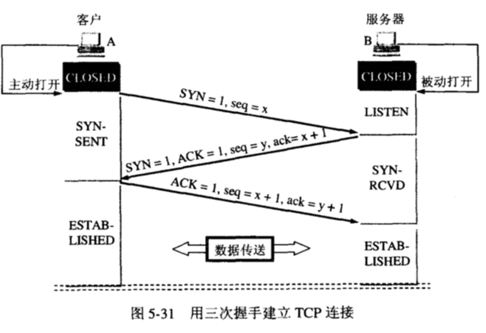
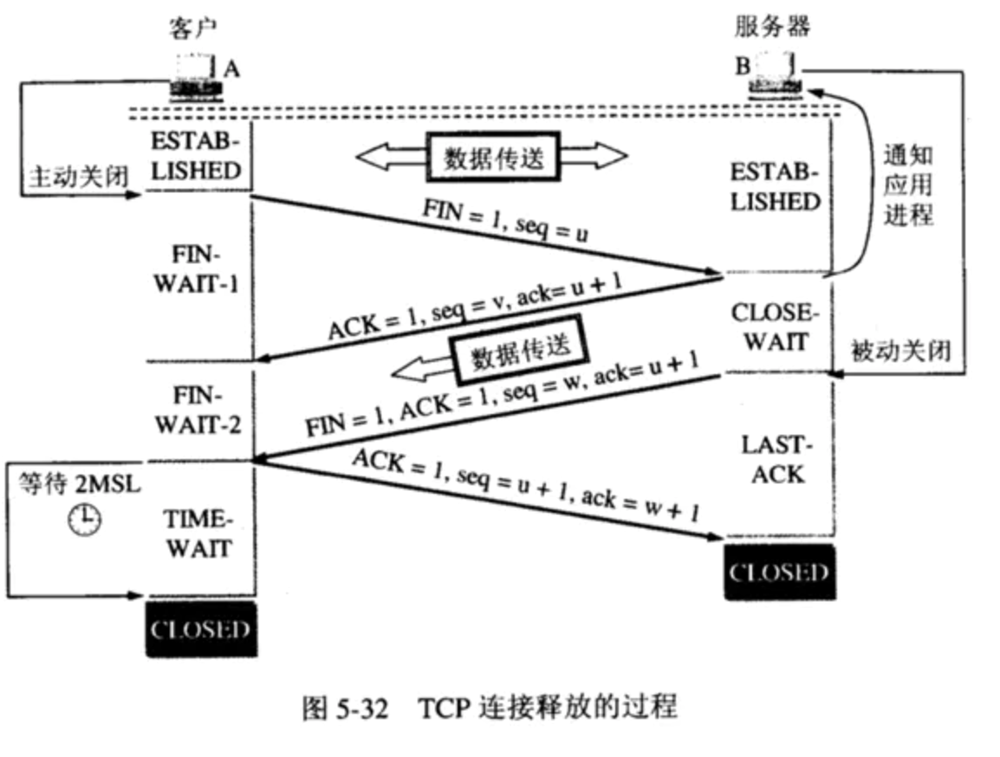

[TOC]

# android面试网络相关

### http常见错误码
- 常见的错误码
200 - 服务器成功返回网页
404 - 请求的网页不存在
503 - 服务不可用

- 1xx（临时响应）
表示临时响应并需要请求者继续执行操作的状态代码。

代码 说明
100 （继续） 请求者应当继续提出请求。服务器返回此代码表示已收到请求的第一部分，正在等待其余部分。
101 （切换协议） 请求者已要求服务器切换协议，服务器已确认并准备切换。

- 2xx （成功）
表示成功处理了请求的状态代码。

代码 说明
200 （成功） 服务器已成功处理了请求。通常，这表示服务器提供了请求的网页。
201 （已创建） 请求成功并且服务器创建了新的资源。
202 （已接受） 服务器已接受请求，但尚未处理。
203 （非授权信息） 服务器已成功处理了请求，但返回的信息可能来自另一来源。
204 （无内容） 服务器成功处理了请求，但没有返回任何内容。
205 （重置内容） 服务器成功处理了请求，但没有返回任何内容。
206 （部分内容） 服务器成功处理了部分 GET 请求。

- 3xx （重定向）
表示要完成请求，需要进一步操作。 通常，这些状态代码用来重定向。

代码 说明
300 （多种选择） 针对请求，服务器可执行多种操作。服务器可根据请求者 (user agent) 选择一项操作，或提供操作列表供请求者选择。
301 （永久移动） 请求的网页已永久移动到新位置。服务器返回此响应（对 GET 或 HEAD 请求的响应）时，会自动将请求者转到新位置。
302 （临时移动） 服务器目前从不同位置的网页响应请求，但请求者应继续使用原有位置来进行以后的请求。
303 （查看其他位置） 请求者应当对不同的位置使用单独的 GET 请求来检索响应时，服务器返回此代码。
304 （未修改） 自从上次请求后，请求的网页未修改过。服务器返回此响应时，不会返回网页内容。
305 （使用代理） 请求者只能使用代理访问请求的网页。如果服务器返回此响应，还表示请求者应使用代理。
307 （临时重定向） 服务器目前从不同位置的网页响应请求，但请求者应继续使用原有位置来进行以后的请求。

- 4xx（请求错误）
这些状态代码表示请求可能出错，妨碍了服务器的处理。

代码 说明
400 （错误请求） 服务器不理解请求的语法。
401 （未授权） 请求要求身份验证。 对于需要登录的网页，服务器可能返回此响应。
403 （禁止） 服务器拒绝请求。
404 （未找到） 服务器找不到请求的网页。
405 （方法禁用） 禁用请求中指定的方法。
406 （不接受） 无法使用请求的内容特性响应请求的网页。
407 （需要代理授权） 此状态代码与 401（未授权）类似，但指定请求者应当授权使用代理。
408 （请求超时） 服务器等候请求时发生超时。
409 （冲突） 服务器在完成请求时发生冲突。服务器必须在响应中包含有关冲突的信息。
410 （已删除） 如果请求的资源已永久删除，服务器就会返回此响应。
411 （需要有效长度） 服务器不接受不含有效内容长度标头字段的请求。
412 （未满足前提条件） 服务器未满足请求者在请求中设置的其中一个前提条件。
413 （请求实体过大） 服务器无法处理请求，因为请求实体过大，超出服务器的处理能力。
414 （请求的 URI 过长） 请求的 URI（通常为网址）过长，服务器无法处理。
415 （不支持的媒体类型） 请求的格式不受请求页面的支持。
416 （请求范围不符合要求） 如果页面无法提供请求的范围，则服务器会返回此状态代码。
417 （未满足期望值） 服务器未满足”期望”请求标头字段的要求。

- 5xx（服务器错误）
这些状态代码表示服务器在尝试处理请求时发生内部错误。 这些错误可能是服务器本身的错误，而不是请求出错。

代码 说明
500 （服务器内部错误） 服务器遇到错误，无法完成请求。
501 （尚未实施） 服务器不具备完成请求的功能。例如，服务器无法识别请求方法时可能会返回此代码。
502 （错误网关） 服务器作为网关或代理，从上游服务器收到无效响应。
503 （服务不可用） 服务器目前无法使用（由于超载或停机维护）。通常，这只是暂时状态。
504 （网关超时） 服务器作为网关或代理，但是没有及时从上游服务器收到请求。
505 （HTTP 版本不受支持） 服务器不支持请求中所用的 HTTP 协议版本。


#### HttpWatch状态码Result is
200 - 服务器成功返回网页，客户端请求已成功。
302 - 对象临时移动。服务器目前从不同位置的网页响应请求，但请求者应继续使用原有位置来进行以后的请求。
304 - 属于重定向。自上次请求后，请求的网页未修改过。服务器返回此响应时，不会返回网页内容。
401 - 未授权。请求要求身份验证。 对于需要登录的网页，服务器可能返回此响应。
404 - 未找到。服务器找不到请求的网页。
2xx - 成功。表示服务器成功地接受了客户端请求。
3xx - 重定向。表示要完成请求，需要进一步操作。客户端浏览器必须采取更多操作来实现请求。例如，浏览器可能不得不请求服务器上的不同的页面，或通过代理服务器重复该请求。
4xx - 请求错误。这些状态代码表示请求可能出错，妨碍了服务器的处理。
5xx - 服务器错误。表示服务器在尝试处理请求时发生内部错误。 这些错误可能是服务器本身的错误，而不是请求出错。

## http1.0 1.1 2.0的区别
- 1.0
在HTTP1.0中，一次请求 会建立一个TCP连接，请求完成后主动断开连接。这种方法的好处是简单，各个请求互不干扰。
但每次请求都会经历 3次握手、2次或4次挥手的连接建立和断开过程——极大影响网络效率和系统开销
- 1.1
在HTTP1.1中，解决了HTTP1.0中连接不能复用的问题，支持持久连接——使用keep-alive机制：一次HTTP请求结束后不会立即断开TCP连接，如果此时有新的HTTP请求，且其请求的Host同上次请求相同，那么会直接复用TCP连接。这样就减少了建立和关闭连接的消耗和延迟。keep-alive机制在HTTP1.1中是默认打开的——即在请求头添加：connection:keep-alive
- 2.0
HTTP1.1中，连接的复用是串行的：一个请求建立了TCP连接，请求完成后，下一个相同host的请求继续使用这个连接。 但客户端想 同时 发起多个并行请求，那么必须建立多个TCP连接。将会产生网络延迟、增大网路开销。
并且HTTP1.1不会压缩请求和响应报头，导致了不必要的网络流量；HTTP1.1不支持资源优先级导致底层TCP连接利用率低下。在HTTP2.0中，这些问题都会得到解决，HTTP2.0主要有以下特性
  - 新的二进制格式（Binary Format）：
  http/1.x使用的是明文协议，其协议格式由三部分组成：request line，header，body，其协议解析是基于文本，但是这种方式存在天然缺陷，文本的表现形式有多样性，要做到健壮性考虑的场景必然很多，二进制则不同，只认0和1的组合；基于这种考虑，http/2.0的协议解析决定采用二进制格式，实现方便且健壮
  - 多路复用（MultiPlexing）：
  即连接共享，使用streamId用来区分请求，一个request对应一个stream并分配一个id，这样一个TCP连接上可以有多个stream，每个stream的frame可以随机的混杂在一起，接收方可以根据stream id将frame再归属到各自不同的request里面
  - 优先级和依赖（Priority、Dependency）：
  每个stream都可以设置优先级和依赖，优先级高的stream会被server优先处理和返回给客户端，stream还可以依赖其它的sub streams；优先级和依赖都是可以动态调整的，比如在APP上浏览商品列表，用户快速滑动到底部，但是前面的请求已经发出，如果不把后面的优先级设高，那么当前浏览的图片将会在最后展示出来，显然不利于用户体验
  - header压缩：
  http2.0使用encoder来减少需要传输的header大小，通讯双方各自cache一份header fields表，既避免了重复header的传输，又减小了需要传输的大小
  - 重置连接：
  很多APP里都有停止下载图片的需求，对于http1.x来说，是直接断开连接，导致下次再发请求必须重新建立连接；http2.0引入RST_STREAM类型的frame，可以在不断开连接的前提下取消某个request的stream
#### 其中涉及了两个新的概念：
- 数据流-stream：基于TCP连接之上的逻辑双向字节流，用于承载双向消息，对应一个请求及其响应。客户端每发起一个请求就建立一个数据流，后续该请求及其响应的所有数据都通过该数据流传输。每个数据流都有一个唯一的标识符和可选的优先级信息。
- 帧-frame：HTTP/2的最小数据切片单位，承载着特定类型的数据，例如 HTTP 标头、消息负载，等等。 来自不同数据流的帧可以交错发送，然后再根据每个帧头的数据流标识符重新组装，从而在宏观上实现了多个请求或响应并行传输的效果

## http三次握手，四次挥手
### 三次握手
主要目的是双方互相确认对方都能有 发送和接收的能力，这样才能建立可靠的连接


- 为什么要三次握手，因为两次不能让双方确认对方都能有 发送和接收的能力，四次又多余了,三次就正好

### 每次握手失败对应的措施：
- 第一次握手失败：
  如果第一次的SYN传输失败，两端都不会申请资源。如果一段时间后之前的SYN发送成功了，这时客户端只会接收他最后发送的SYN的SYN+ACK回应，其他的一概忽略，服务端也是如此，会将之前多申请的资源释放了。

- 第二次握手失败：
  如果服务端发送的SYN+ACK传输失败，客户端由于没有收到这条响应，不会申请资源，虽然服务端申请了资源，但是迟迟收不到来自客户端的ACK，也会将该资源释放。

- 第三次握手失败:
  如果第三次握手失败，服务器会定时重新发送SYN+ACK，重传次数根据/proc/sys/net/ipv4/tcp_synack_retries来指定，默认是5次。如果重传指定次数到了后，仍然未收到ACK应答，那么一段时间后，server自动关闭这个连接。但是client认为这个连接已经建立，如果client端向server写数据，server端将以RST包响应.


### 四次挥手

1. client发送fin=1 seq=u， 进入FIN_wait_1状态
2. 服务端收到这个报文，很可能还有其

- 为什么连接的时候是三次握手，关闭的时候却是四次握手？
因为当Server端收到Client端的SYN连接请求报文后，可以直接发送SYN+ACK报文。其中ACK报文是用来应答的，SYN报文是用来同步的。但是关闭连接时，当Server端收到FIN报文时，很可能并不会立即关闭SOCKET，所以只能先回复一个ACK报文，告诉Client端，"你发的FIN报文我收到了"。只有等到我Server端所有的报文都发送完了，我才能发送FIN报文，因此不能一起发送。故需要四步握手。

- 为什么TIME_WAIT状态需要经过2MSL(最大报文段生存时间)才能返回到CLOSE状态？
虽然按道理，四个报文都发送完毕，我们可以直接进入CLOSE状态了，但是我们必须假想网络是不可靠的，有可能最后一个ACK丢失。所以TIME_WAIT状态就是用来重发可能丢失的ACK报文。
  - 原因：1）
  **保证A发送的最后一个ACK报文段能够到达B**.这个ACK报文段有可能丢失，使得处于LAST-ACK状态的B收不到对已发送的FIN+ACK报文段的确认，B超时重传FIN+ACK报文段，而A能在2MSL时间内收到这个重传的FIN+ACK报文段，接着A重传一次确认，重新启动2MSL计时器，最后A和B都进入到CLOSED状态，若A在TIME-WAIT状态不等待一段时间，而是发送完ACK报文段后立即释放连接，则无法收到B重传的FIN+ACK报文段，所以不会再发送一次确认报文段，则B无法正常进入到CLOSED状态。
  - 原因：2）
  防止“已失效的连接请求报文段”出现在本连接中。A在发送完最后一个ACK报文段后，再经过2MSL，就可以使本连接持续的时间内所产生的所有报文段都从网络中消失，使下一个新的连接中不会出现这种旧的连接请求报文段。


## http与https的区别
[https详解](https://zhuanlan.zhihu.com/p/138645414)
安全问题
- http: http位于OSI网络模型的应用层，采用明文方式进行传输，非常不安全，容易被人篡改和窃取数据
- SSL(Secure Socket Layer):位于TCP传输层和应用层之间，用于web安全传输的协议，后来重新命名为TLC(Transport Layer Security)
TLS1.0就是SSL3.1， SSL/TLS 利用对称加密和非对称加密的特点来实现安全的
- https: 建立在SSL/TLS协议之上，通过SSL/TLS进行加密

### https的连接过程


## 断点续传
原理: 主要是客户端在向服务端发起请求时， header中带上 Range字段,表示请求从文件的第几个字节开始获取内容，具体如下
```
Range: bytes=0-499      表示第 0-499 字节范围的内容
Range: bytes=500-999    表示第 500-999 字节范围的内容
Range: bytes=-500       表示最后 500 字节的内容
Range: bytes=500-       表示从第 500 字节开始到文件结束部分的内容
Range: bytes=0-0,-1     表示第一个和最后一个字节
Range: bytes=500-600,601-999 同时指定几个范围
```
服务端收到请求后，http返回 code为206，响应的header中会带有字段 Content-length: 示例如下
`Content-Range: bytes 10-222/7877`
表示服务端返回的内容是从第几个字段开始的
客户端就可以读取对应的数据，写到已经下载过的文件中，这个写用 RandomAccessFile 这个支持随机读写文件


