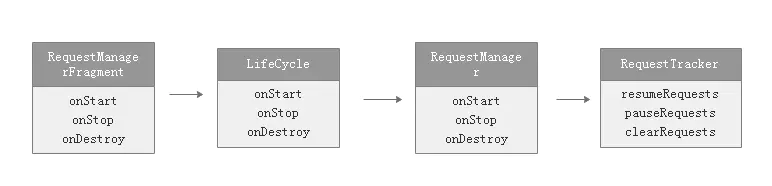

[TOC]

## jetpack

### LiveDataBus优点
答：
LiveDataBus的实现及其简单，相对EventBus复杂的实现，LiveDataBus只需要一个类就可以实现
LiveDataBus可以减小APK包的大小
LiveDataBus只依赖Android官方组件LiveData，本身实现只一个类。EventBus 57Kb、RxJava 2.2M
LiveDataBus 依赖方支持更好
LiveDataBus只依赖Android官方组件LiveData，相比RxBus依赖的RxJava和RxAndroid，依赖方支持更好
LiveDataBus具有生命周期感知

## 内存相关

### 什么是内存抖动？如何避免
答：非常频繁的创建与销毁对象。这可能会导致大量内存碎片的产生，同时GC频繁的工作会影响程序流畅性。所以需要避免在频繁调用的方法中new对象，同时也可以使用对象池来管理需要经常创建的小对象完成复用，如：Handler的message池

## JVM相关

### volatile
保证变量的可见性，以及禁止指令重排
- 变量可见性:
  由于cpu的含有多级缓存，这个线程对变量的写入并没有写入内存，导致另一个线程读取该变量时，读取的是旧值，这就算变量对于另一个线程的可见性问题
  volaitle关键字修饰变量，强制将将变量写入内存，且强制从内存读取数据
- 指令重排:
  为了提高执行效率，编译器在编译过程中会对指令进行重排,对于程序的执行顺序上会有不同，但是能保证同一个线程内最终执行结果是一致的，这样多线程的时候就存在结果不确定性
  volatile关键字可以阻止指令重排

### GC算法有哪些
答：标记-清除算法：一般为老年代的垃圾回收算法，效率高，但可能产生大量内存碎片
标记-整理算法：parallel old收集器与serial old收集器使用了此算法，解决了标记清除的内存碎片问题，但是效率低
复制算法：一般用于新生代的垃圾回收。会导致可用內存缩小；需要額外空间做分配担保(老年代)

1. 为什么栈区中需要程序计数器
在多线程运行时，CPU采用分片轮询机制；线程之间抢占CPU会导致某个线程被暂停，当CPU调度到当前线程时，需要知道上次执行的位置，因此需要程序计数器来保存程序执行的位置
2. 虚拟机栈主要有哪些部分组成，他们的作用分别是？
虚拟机栈中包含栈帧，一个函数对应一个栈帧，栈帧里面包括 局部变量表，操作数栈，动态链接
局部变量表: 保存当前函数的局部变量
操作数栈: 存储操作时产生的临时变量
动态链接: 保证多态特性得以正确执行，也就是运行的时候能正确找到对应的方法；还有能正确找到so库中的方法去执行
函数出口: 即函数返回的地址
3. 请问如何用插桩技术实现用户行为统计？
用户行为一般指用户点击了某个按钮(可能的操作请求链接，进入某个界面，退出某个界面)，或者滑动事件
对于点击，找到对应字节码之后，在view的onClick方法中加入相关的埋点，
对于滑动，找到对应字节码之后，在view的onTouch方法中加入相关的埋点

4. stop the world
jvm执行GC的时候，会停止所有线程，所以app这时候会卡顿

5. 如何排除oom
android studio profiler: 可以直接定位到哪一行代码
验证某个界面有没有内存泄漏，可以在进入那个界面之前dump一份内存，进入之后退出在dump一份堆内存，
用工具转换一下
hprof-conv -z 1.hprof 2.hprof
然后用mat去分析，查看直方图，上面有个功能，可以对比两次dump的内存，然后看增加的对象，右键查看引用链，可以排除软引用，弱引用，虚引用引起的内存，然后就能查看到引用

1. 内存抖动发生的根本原因
  程序发生了内存泄漏，导致频繁GC

2. 为什么GC会造成APP运行过程中出现卡顿
  stop-the-world,jvm在进行GC的时候，会让所有线程进入等待

3. 如何判断对象应该被回收
  可达性分析，目前主要是判断对象是否可以到达GCRoot，如果对象和GCRoot直接没有任何连接，则说明对象没有被引用，可以回收

4. 为什么survivor区是两块内存空间
  主要是提升GC的效率
  提升minor GC: 因为新生代发生GC的次数较多，为了提升效率采用复制算法，第一次minor gc后 eden的没被回收的对像会进入survivor区，而在survivor区域内存够用的情况下
  并不会马上进入老年代，而是要达到一定年龄(minor gc的次数,可以设置)，如果只有一个survivor区，进入survivor的对象在下一次minor gc到来时，只能进入老年区，这样老年区很快
  就会达到满的状态；将survivor分为两个大小一样的区A,B，发生第一次GC时候，将存活的对象拷贝到A区，第二次GC之后存活的对象拷贝到B区，同时把A区的对象拷贝B区，然后清空A区回收内存；
  第三次gc，存活的对象拷贝到A区，把B区对象复制到A区，然后这样来回交替，这样可以记录对象经历了多少次GC，比如15次，达到15次之后在进入老年代，就可以延缓老年代内存满的时间，即减少
  Full GC的次数，从而达到了提升效率

### glide相关

#### glide生命周期
[参考这里](https://www.jianshu.com/p/317b2d6bde1b)
Glide生命周期绑定是从入口单例类Glide开始的，通过with()多个重载方法来实现对生命周期的绑定工作。
如果是在子线程进行的with操作，那么Glide将默认使用ApplicationContext，可以理解为不对请求的生命周期进行管理，通过Activity拿到FragmentManager，并将创建RequestManager的任务传递下去。最终都走到了fragmentGet方法，注意细微区别是Activity传的参数的是Activity的FragmentManager，Fragment传的参数的是ChildFragmentManager，这两者不是一个东西。

最终会创建一个 RequestManagerFragment 添加到fragmentManager中，这样RequestManagerFragment就可以感知fragement的生命周期变化,

而创建RequestManagerFragment的时候会创建 RequestManager，这个类实现了 LifecycleListener，在创建 RequestManager的时候传入了lifeCycle，通过lifeCycle注册监听，从而感知相应的生命周期变化，

RequestTracker即所有请求操作的真正处理者，所有Request的暂停取消执行操作都由RequestTracker来完成

#### glide的缓存机制
1. glide缓存的资源
  - 原图：SOURCE
  - 处理之后的图片：RESULT，经过压缩和变形等处理后的图片
2. 内存缓存策略
  Glide默认是会在内存中缓存处理图(RESULT)的.
3. 磁盘缓存策略(diskCacheStrategy)
  Glide磁盘缓存策略分为四种,默认的是RESULT(默认值这一点网上很多文章都写错了,但是这一点很重要):
  1.ALL:缓存原图(SOURCE)和处理图(RESULT)
  2.NONE:什么都不缓存
  3.SOURCE:只缓存原图(SOURCE)
  4.RESULT:只缓存处理图(RESULT) —默认值
和其他三级缓存一样,Glide的缓存读取顺序是 内存–>磁盘–>网络
glide区图片的时候，首先会尝试从cache里面取,这里cache就是Glide的构造函数里面的MemoryCache(是一个LruResourceCache),如果取到了,就从cache里面删掉,然后加入activeResources中，如果cache里面没取到,就会从activeResources中取,activeResources是一个以弱引用为值的map,他是用于存储使用中的资源.之所以在内存缓存的基础上又多了这层缓存,是为了当内存不足而清除cache中的资源中,不会影响使用中的资源.

