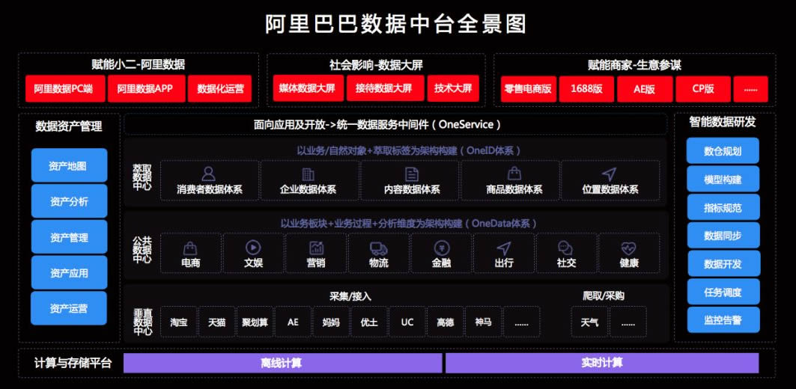

# 中台架构
中台架构最早由阿里巴巴在2015年率先提出，2018年8月，又发布“双中台+ET”数字化转型方法论，其中的双中台包括了数据中台和业务中台。
- 在“业务中台”模式下，前端业务部门可以像搭积木一样调用平台上的产品技术模块，从而快速搭建新业务场景。
- “数据中台”则打破了不同业务部门之间的烟囱式IT架构，从而打通数据孤岛，实现了“一切业务数据化”的目标。
- ET大脑是指其面向特定行业的智能化解决方案。

一般来说，数据中台是指企业利用大数据技术，对内外部海量数据统一进行采集、计算、存储，并使用统一的数据规范进行管理，数据规范包括数据口径、数据模型、元数据规范、参考数据标准、主数据标准、业务规则等。

广义的数据中台，还包括企业长期积累下来与业务有较强关联性的一些技术组件，如业务标签，算法模型，数据产品等。数据中台的主要作用在于将企业内部所有数据统一处理形成标准化数据，挖掘出对企业最有价值的数据，构建企业数据资产库，对内对外提供一致的、高可用大数据服务

- 架构图

## 相关概念

- ROI:投资回报率
- OLAP:联机分析处理OLAP是一种软件技术，它使分析人员能够迅速、一致、交互地从各个方面观察信息，以达到深入理解数据的目的。
  现在来理解就是数据仓库

