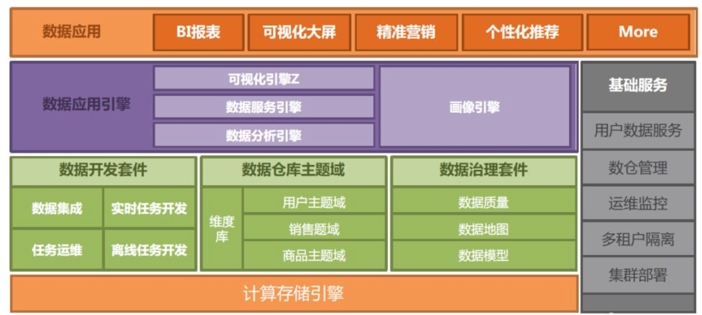
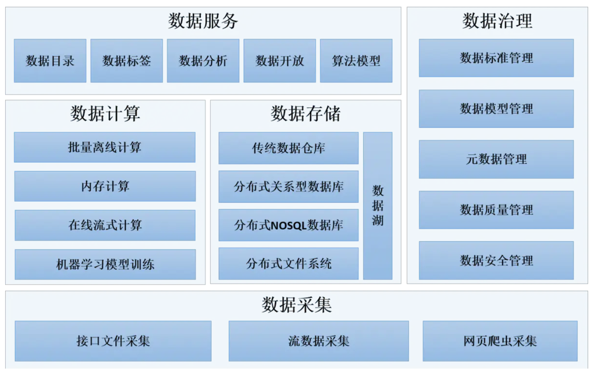

# 中台架构
中台架构最早由阿里巴巴在2015年率先提出，2018年8月，又发布“双中台+ET”数字化转型方法论，其中的双中台包括了数据中台和业务中台。
- 在“业务中台”模式下，前端业务部门可以像搭积木一样调用平台上的产品技术模块，从而快速搭建新业务场景。
- “数据中台”则打破了不同业务部门之间的烟囱式IT架构，从而打通数据孤岛，实现了“一切业务数据化”的目标。
- ET大脑是指其面向特定行业的智能化解决方案。

一般来说，数据中台是指企业利用大数据技术，对内外部海量数据统一进行采集、计算、存储，并使用统一的数据规范进行管理，数据规范包括数据口径、数据模型、元数据规范、参考数据标准、主数据标准、业务规则等。

广义的数据中台，还包括企业长期积累下来与业务有较强关联性的一些技术组件，如业务标签，算法模型，数据产品等。数据中台的主要作用在于将企业内部所有数据统一处理形成标准化数据，挖掘出对企业最有价值的数据，构建企业数据资产库，对内对外提供一致的、高可用大数据服务

- 架构图

## 相关概念

- ROI:投资回报率
- OLAP:联机分析处理OLAP是一种软件技术，它使分析人员能够迅速、一致、交互地从各个方面观察信息，以达到深入理解数据的目的。
  现在来理解就是数据仓库

田老师，咱这边有没有什么可以熟悉当前业务之类的文档，我们做工程也提前熟悉下公司的业务
还有关于数据中台，目前公司这块积累到什么程度？ 是否有现有架构之类的文档可以提前熟悉一下？
需求:
1. 目前提升用户转化率这块，工程上是否有积累，业务相关的文档，技术文档也想了解下
2. 当前公司中台架构这目前处在什么阶段？具体相关文档是否有积累，中台概念比较大，与业务是紧密相连的，工程上涉及到的知识点比较多

如上网络上流传的阿里的中台架构，我们当前是否有类似的架构，后续我们努力的方向？

