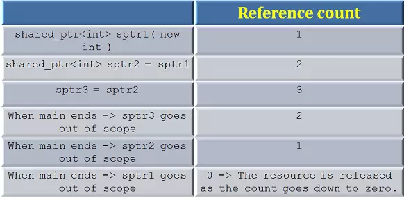
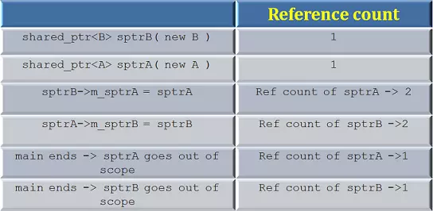

## shared_ptr

#### 理解
share_ptr，这种智能指针思想是共享所有权，即多个指针共享一个对象，通过引用计数，当最后一个指针离开作用域时；
内存才会自动释放

#### 创建
```cpp
void main( )
{
 shared_ptr<int> sptr1( new int );
}
```
使用make_shared宏来加速创建的过程。因为shared_ptr主动分配内存并且保存引用计数(reference count),make_shared 以一种更有效率的方法来实现创建工作。
```cpp
void main( )
{
 shared_ptr<int> sptr1 = make_shared<int>(100);
}
```
上面的代码创建了一个shared_ptr,指向一块内存，该内存包含一个整数100，以及引用计数1.如果通过sptr1再创建一个shared_ptr,引用计数就会变成2. 该计数被称为强引用(strong reference)，除此之外，shared_ptr还有另外一种引用计数叫做弱引用(weak reference)，后面将介绍。

通过调用use_count()可以得到引用计数， 据此你能找到shared_ptr的数量。当debug的时候，可以通过观察shared_ptr中strong_ref的值得到引用计数。


#### 析构
shared_ptr默认调用delete释放关联的资源。如果用户采用一个不一样的析构策略时，他可以自由指定构造这个shared_ptr的策略。下面的例子是一个由于采用默认析构策略导致的问题：

```cpp
class Test
{
public:
 Test(int a = 0 ) : m_a(a)
 {
 }
 ~Test( )
 {
  cout<<"Calling destructor"<<endl;
 }
public:
         int m_a;
};
void main( )
{
 shared_ptr<Test> sptr1( new Test[5] );
}
```
在此场景下，shared_ptr指向一组对象，但是当离开作用域时，默认的析构函数调用delete释放资源。实际上，我们应该调用delete[]来销毁这个数组。用户可以通过调用一个函数，例如一个lamda表达式，来指定一个通用的释放步骤。

```cpp
void main( )
{
 shared_ptr<Test> sptr1( new Test[5],
        [ ](Test* p) { delete[ ] p; } );
}
```
通过指定delete[]来析构，上面的代码可以完美运行。

#### 问题

##### 从裸指针创建share_ptr导致crash
-  良好的写法
```cpp
void main( )
{
 shared_ptr<int> sptr1( new int );
 shared_ptr<int> sptr2 = sptr1;
 shared_ptr<int> sptr3;
 sptr3 =sptr1
```

如上图，所有的shared_ptrs拥有相同的引用计数，属于相同的组。上述代码工作良好，让我们看另外一组例子

- 错误的使用
```cpp
void main( )
{
 int* p = new int;
 shared_ptr<int> sptr1( p);
 shared_ptr<int> sptr2( p );
}
```
上述代码会产生一个错误，因为两个来自不同组的shared_ptr指向同一个资源。下表给你关于错误原因的图景：

避免这个问题，尽量不要从一个裸指针(naked pointer)创建shared_ptr.

##### 循环引用--导致内存泄漏
```cpp
class B;
class A
{
public:
 A(  ) : m_sptrB(nullptr) { };
 ~A( )
 {
  cout<<" A is destroyed"<<endl;
 }
 shared_ptr<B> m_sptrB;
};

class B
{
public:
 B(  ) : m_sptrA(nullptr) { };
 ~B( )
 {
  cout<<" B is destroyed"<<endl;
 }
 shared_ptr<A> m_sptrA;
};
//***********************************************************
void main( )
{
 shared_ptr<B> sptrB( new B );
 shared_ptr<A> sptrA( new A );
 sptrB->m_sptrA = sptrA;
 sptrA->m_sptrB = sptrB;
}
```
上面的代码产生了一个循环引用.A对B有一个shared_ptr, B对A也有一个shared_ptr，与sptrA和sptrB关联的资源都没有被释放，参考下表：

当sptrA和sptrB离开作用域时，它们的引用计数都只减少到1，所以它们指向的资源并没有释放！！！！！

#### 注意点
1.如果几个shared_ptrs指向的内存块属于不同组，将产生错误。
2. 如果从一个普通指针创建一个shared_ptr还会引发另外一个问题。在上面的代码中，考虑到只有一个shared_ptr是由p创建的，代码可以好好工作。万一程序员在智能指针作用域结束之前删除了普通指针p。天啦噜！！！又是一个crash。
3. 循环引用：如果共享智能指针卷入了循环引用，资源都不会正常释放。

为了解决循环引用，C++提供了另外一种智能指针：weak_ptr


### unique_ptr
独享指针所有权，不能进行赋值，

#### 理解
unique_ptr也是对auto_ptr的替换。unique_ptr遵循着独占语义。在任何时间点，资源只能唯一地被一个unique_ptr占有。当unique_ptr离开作用域，所包含的资源被释放。如果资源被其它资源重写了，之前拥有的资源将被释放。所以它保证了他所关联的资源总是能被释放。

#### 使用
##### 创建
1. 创建非数组类型
与shared_ptr一样
```cpp
unique_ptr<int> uptr( new int );
```
2. 创建数组类型
unique_ptr提供了创建数组对象的特殊方法，当指针离开作用域时，调用delete[]代替delete。当创建unique_ptr时，这一组对象被视作模板参数的部分。这样，程序员就不需要再提供一个指定的析构方法，如下：
```cpp
unique_ptr<int[ ]> uptr( new int[5] );
```

当把unique_ptr赋给另外一个对象时，资源的所有权就会被转移。

**记住unique_ptr不提供复制语义（拷贝赋值和拷贝构造都不可以），只支持移动语义(move semantics).**s

在上面的例子里，如果upt3和upt5已经拥有了资源，只有当拥有新资源时，之前的资源才会释放。

```cpp
unique_ptr<int> ap(new int(88 ));
unique_ptr<int> one (ap) ; // 会出错
unique_ptr<int> two = one; //会出错
```
#### 接口
unique_ptr提供的接口和传统指针差不多，但是不支持指针运算。
unique_ptr提供一个release()的方法，释放所有权。release和reset的区别在于，release仅仅释放所有权但不释放资源，reset也释放资源。
