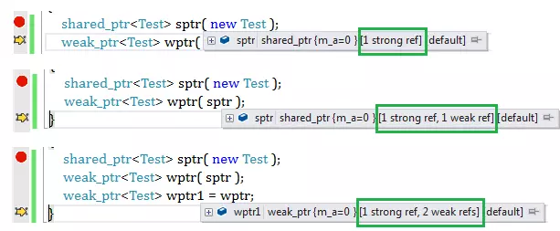
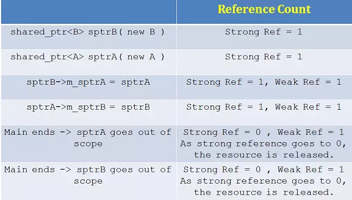

## weak_ptr

#### 理解
weak_ptr 拥有共享语义（sharing semantics）和不包含语义（not owning semantics）。这意味着，weak_ptr可以共享shared_ptr持有的资源。所以可以从一个包含资源的shared_ptr创建weak_ptr。

weak_ptr不支持普通指针包含的*，->操作。它并不包含资源所以也不允许程序员操作资源。既然如此，我们如何使用weak_ptr呢？

答案是从weak_ptr中创建shared_ptr然后再使用它。通过增加强引用计数，当使用时可以确保资源不会被销毁。当引用计数增加时，可以肯定的是从weak_ptr中创建的shared_ptr引用计数至少为1.否则，当你使用weak_ptr就可能发生如下问题：当shared_ptr离开作用域时，其拥有的资源会释放，从而导致了混乱。

#### 使用
##### 创建
可以以shared_ptr作为参数构造weak_ptr.从shared_ptr创建一个weak_ptr增加了共享指针的弱引用计数(weak reference)，意味着shared_ptr与其它的指针共享着它所拥有的资源。但是当shared_ptr离开作用域时，这个计数不作为是否释放资源的依据。换句话说，就是除非强引用计数变为0，才会释放掉指针指向的资源，在这里，弱引用计数(weak reference)不起作用。
```cpp
void main( )
{
 shared_ptr<Test> sptr( new Test );
 weak_ptr<Test> wptr( sptr );
 weak_ptr<Test> wptr1 = wptr;
}
```
可以从下图观察shared_ptr和weak_ptr的引用计数：

将一个weak_ptr赋给另一个weak_ptr会增加弱引用计数(weak reference count)。
所以，当shared_ptr离开作用域时，其内的资源释放了，这时候指向该shared_ptr的weak_ptr发生了什么？weak_ptr过期了（expired）。

##### 判断weak_ptr是否有效
调用use-count()去获取引用计数，该方法只返回强引用计数，并不返回弱引用计数。
调用expired()方法。**比调用use_count()方法速度更快。**
##### 使用
从weak_ptr调用lock()可以得到shared_ptr或者直接将weak_ptr转型为shared_ptr

```cpp
void main( )
{
 shared_ptr<Test> sptr( new Test );
 weak_ptr<Test> wptr( sptr );
 shared_ptr<Test> sptr2 = wptr.lock( );
}
```
**如之前所述，从weak_ptr中获取shared_ptr增加强引用计数。**


#### 解决循环引用
循环引用中采用 weak_ptr的方式

```cpp
class B;
class A
{
public:
 A(  ) : m_a(5)  { };
 ~A( )
 {
  cout<<" A is destroyed"<<endl;
 }
 void PrintSpB( );
 weak_ptr<B> m_sptrB;
 int m_a;
};
class B
{
public:
 B(  ) : m_b(10) { };
 ~B( )
 {
  cout<<" B is destroyed"<<endl;
 }
 weak_ptr<A> m_sptrA;
 int m_b;
};

void A::PrintSpB( )
{
 if( !m_sptrB.expired() )
 {
  cout<< m_sptrB.lock( )->m_b<<endl;
 }
}

void main( )
{
 shared_ptr<B> sptrB( new B );
 shared_ptr<A> sptrA( new A );
 sptrB->m_sptrA = sptrA;
 sptrA->m_sptrB = sptrB;
 sptrA->PrintSpB( );
}
```

