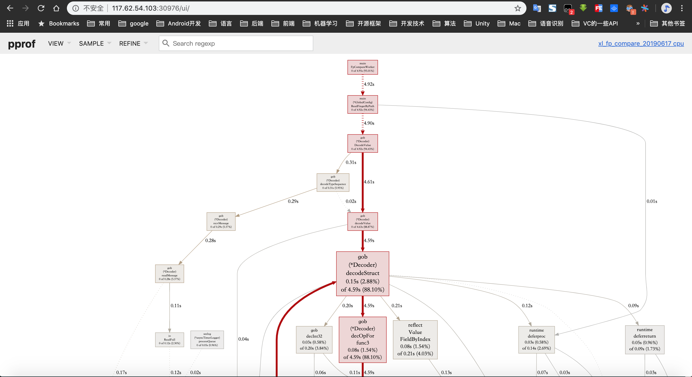
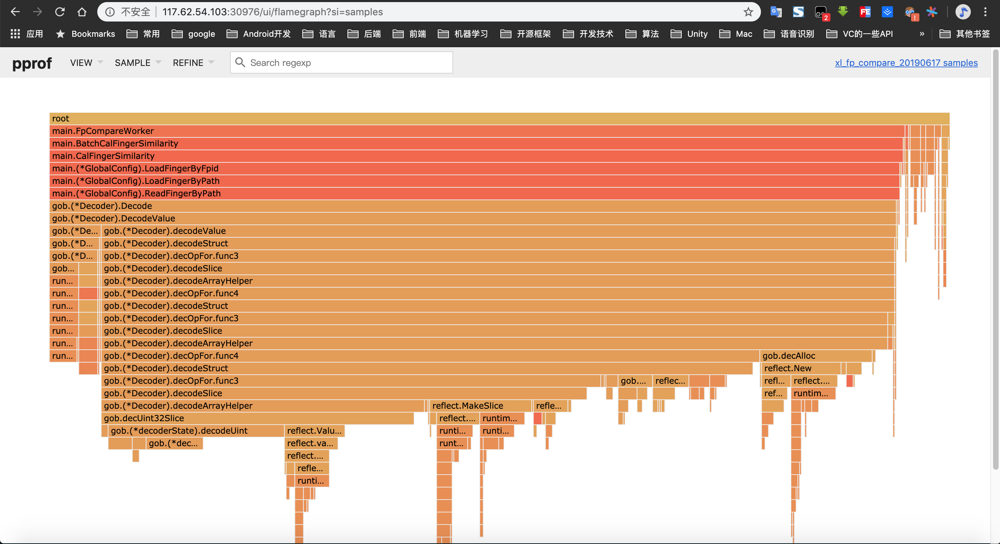

# go程序debug

## dlv
[开源的go代码调试工具](https://github.com/go-delve/delve)

## Linux安装
1. go get获取源码
```
go get -u github.com/go-delve/delve/cmd/dlv
```
2. 编译
进入goroot下 `src/github.com/go-delve/delve/cmd/dlv` 目录,执行`go build`即可生成dlv可执行文件


## debug使用
[详细可以参考这里](http://lday.me/2017/02/27/0005_gdb-vs-dlv/)

```dlv exec ./<your-execute-bin> ```
```
//开始调试
[root@tw06a1573 recovery_fingerprint]# ./dlv exec ./fp_writer_1
Type 'help' for list of commands.
//设置断点
(dlv) b main.main
Breakpoint 1 set at 0x85d36f for main.main() /Users/chenxingyi/work/go/src/xxx.xxx/ai/shortvideo_finger/src/main/fp_writer_1.go:5
//设置断点
(dlv) b query_fingerprints.go:281
Breakpoint 2 set at 0x844d50 for xxx.xxx/ai/shortvideo_finger/src/fp_algorithms.SelectQueryFeatures() /Users/chenxingyi/work/go/src/xxx.xxx/ai/shortvideo_finger/src/fp_algorithms/query_fingerprints.go:281
//显示所有断点
(dlv) bp
Breakpoint unrecovered-panic at 0x42a8c0 for runtime.startpanic() /Users/chenxingyi/work/go/go1.10.8/src/runtime/panic.go:588 (0)
	print runtime.curg._panic.arg
Breakpoint 1 at 0x85d36f for main.main() /Users/chenxingyi/work/go/src/xxx.xxx/ai/shortvideo_finger/src/main/fp_writer_1.go:5 (0)
Breakpoint 2 at 0x844d50 for xxx.xxx/ai/shortvideo_finger/src/fp_algorithms.SelectQueryFeatures() /Users/chenxingyi/work/go/src/xxx.xxx/ai/shortvideo_finger/src/fp_algorithms/query_fingerprints.go:281 (0)
//继续运行
(dlv) c
> main.main() /Users/chenxingyi/work/go/src/xxx.xxx/ai/shortvideo_finger/src/main/fp_writer_1.go:5 (hits goroutine(1):1 total:1) (PC: 0x85d36f)
//打印某个变量 startIndex的值，*这里出现某些变量不能答应的现象*
(dlv) p startIndex
Command failed: could not find symbol value for startIndex
//单步运行
(dlv) n
> main.main() /Users/chenxingyi/work/go/src/xxx.xxx/ai/shortvideo_finger/src/main/fp_writer_1.go:7 (PC: 0x85d37b)
//打印变量 len(disArray)
dlv) p len(disArray)
Command failed: could not find symbol value for disArray
//打印变量
(dlv) p startIndex
10780
//打印变量
(dlv) p sampleRange
600
//设置断点
(dlv) b query_fingerprints.go:288
Command failed: could not find /Users/chenxingyi/work/go/src/xxx.xxx/ai/shortvideo_finger/src/fp_algorithms/query_fingerprints.go:288
(dlv) b query_fingerprints.go:289
Breakpoint 3 set at 0x844c24 for xxx.xxx/ai/shortvideo_finger/src/fp_algorithms.SelectQueryFeatures() /Users/chenxingyi/work/go/src/xxx.xxx/ai/shortvideo_finger/src/fp_algorithms/query_fingerprints.go:289
(dlv)
```

## 问题
在调试过程中，发现有部分变量无法print其val，有部分源码的某些行无法设置断点


## 性能调优
golang中提供了pprof可以帮我分析当前程序的cpu，内存，croutune，
- CPU profile：报告程序的 CPU 使用情况，按照一定频率去采集应用程序在 CPU 和寄存器上面的数据
- Memory Profile（Heap Profile）：报告程序的内存使用情况
- Block Profiling：报告 goroutines 不在运行状态的情况，可以用来分析和查找死锁等性能瓶颈
- Goroutine Profiling：报告 goroutines 的使用情况，有哪些 goroutine，它们的调用关系是怎样的
go阆中

### pprof使用
```go
import _ "net/http/pprof"
```
通过一句话，就可以开启监控，这种情况下是使用了默认的配置，端口为8000
当然，我们可以指定配置端口,如下
```go
http.ListenAndServe("0.0.0.0:8800", nil)
```
程序启动之后，我们就可以在线通过web浏览器访问了
```
http://127.0.0.1:8000/debug/pprof
//还有其他的子页面
http://127.0.0.1:8000/debug/pprof/profile：访问这个链接会自动进行 CPU profiling，持续 30s，并生成一个文件供下载
http://127.0.0.1:8000/debug/pprof/heap： Memory Profiling 的路径，访问这个链接会得到一个内存 Profiling 结果的文件
http://127.0.0.1:8000/debug/pprof/block：block Profiling 的路径
http://127.0.0.1:8000/debug/pprof/goroutines：运行的 goroutines 列表，以及调用关系
```

#### 用 go tool pprof 命令行查看
- 查看CPU
```
go tool pprof http://127.0.0.1:15004/debug/pprof/profile
//过了30s之后，会生成cpu的profiling文件

$ go tool pprof http://127.0.0.1:15005/debug/pprof/profile
Fetching profile over HTTP from http://127.0.0.1:15005/debug/pprof/profile
Saved profile in /home/root1/pprof/pprof.xl_fp_compare_20190617.samples.cpu.005.pb.gz
File: xl_fp_compare_20190617
Build ID: 119ac70a01860090a7a4224bcafc5f559711ef8a
Type: cpu
Time: Apr 17, 2020 at 6:55pm (CST)
Duration: 30s, Total samples = 6.72s (22.40%)
Entering interactive mode (type "help" for commands, "o" for options)
(pprof) top
Showing nodes accounting for 3360ms, 50.00% of 6720ms total
Dropped 105 nodes (cum <= 33.60ms)
Showing top 10 nodes out of 109
      flat  flat%   sum%        cum   cum%
     680ms 10.12% 10.12%     1300ms 19.35%  encoding/gob.(*decoderState).decodeUint
     500ms  7.44% 17.56%     1470ms 21.88%  runtime.mallocgc
     470ms  6.99% 24.55%     2090ms 31.10%  encoding/gob.decUint32Slice
     380ms  5.65% 30.21%      380ms  5.65%  encoding/gob.(*decBuffer).ReadByte (inline)
     260ms  3.87% 34.08%      260ms  3.87%  runtime.memclrNoHeapPointers
     240ms  3.57% 37.65%     6030ms 89.73%  encoding/gob.(*Decoder).decodeSlice
     240ms  3.57% 41.22%      270ms  4.02%  runtime.heapBitsSetType
     230ms  3.42% 44.64%      230ms  3.42%  syscall.Syscall
     200ms  2.98% 47.62%     6060ms 90.18%  encoding/gob.(*Decoder).decodeStruct
     160ms  2.38% 50.00%      160ms  2.38%  runtime.memmove
(pprof)
```

	- flat、flat% 表示函数在 CPU 上运行的时间以及百分比
	- sum% 表示当前函数累加使用 CPU 的比例
	- cum、cum%表示该函数以及子函数运行所占用的时间和比例，应该大于等于前两列的值

- 查看内存
```bash
$ go tool pprof http://127.0.0.1:15005/debug/pprof/heap
Fetching profile over HTTP from http://127.0.0.1:15005/debug/pprof/heap
Saved profile in /home/root1/pprof/pprof.xl_fp_compare_20190617.alloc_objects.alloc_space.inuse_objects.inuse_space.001.pb.gz
File: xl_fp_compare_20190617
Build ID: 119ac70a01860090a7a4224bcafc5f559711ef8a
Type: inuse_space
Time: Apr 17, 2020 at 6:59pm (CST)
Entering interactive mode (type "help" for commands, "o" for options)
(pprof) top
Showing nodes accounting for 8953.45MB, 99.58% of 8991.31MB total
Dropped 49 nodes (cum <= 44.96MB)
Showing top 10 nodes out of 23
      flat  flat%   sum%        cum   cum%
 6568.06MB 73.05% 73.05%  6568.06MB 73.05%  reflect.unsafe_NewArray
 2317.61MB 25.78% 98.83%  2317.61MB 25.78%  reflect.New
   54.78MB  0.61% 99.43%    54.78MB  0.61%  encoding/gob.(*decBuffer).Size (inline)
      12MB  0.13% 99.57%  6580.06MB 73.18%  reflect.MakeSlice
       1MB 0.011% 99.58%  8958.95MB 99.64%  main.(*GlobalConfig).LoadFingerByPath
         0     0% 99.58%  8957.95MB 99.63%  encoding/gob.(*Decoder).Decode
         0     0% 99.58%  8957.95MB 99.63%  encoding/gob.(*Decoder).DecodeValue
         0     0% 99.58%  8902.67MB 99.01%  encoding/gob.(*Decoder).decOpFor.func3
         0     0% 99.58%  8902.67MB 99.01%  encoding/gob.(*Decoder).decOpFor.func4
         0     0% 99.58%  8902.67MB 99.01%  encoding/gob.(*Decoder).decodeArrayHelper
(pprof)
```

#### 端口代理
这个用途非常好，比如我们远端的服务器，上使用pprof监听了某个端口15005，程序跑起来了，但是服务器防火墙只打开了某个端口30976
这时候我们可以通过如下命令，将30976的调试转发到15005端口
```
go tool pprof -http=0.0.0.0:30976 http://127.0.0.1:15004/debug/pprof/profile
```
这样我们在其本地机器上就可以直接通过浏览器打开
```
http://xxx.xxx.xxx.xxx:30976/
```
可视化观看程序的运行状况

- 前提
还需要在服务器上安装 graphviz，否则会报错
`Could not execute dot; may need to install graphviz.`

如下如所示:


如上所示，线越粗，表示耗时越久

还能查看火焰图


火焰图能纵轴显示函数调用栈， 横轴是抽样数，宽度越宽，表示抽到的次数越多，即执行的时间越长


