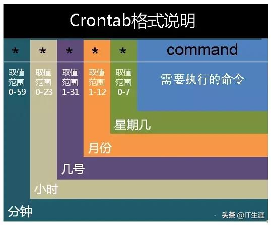

[TOC]


## 查看cpu占用--sar命令
`sar -u 1 10`
每隔1秒统计一次，一共统计10次, 如果想统计全天，直接 -u 后面不接任何数字
```bash
$ sar -u 1 5
Linux 2.6.32-754.3.5.el6.x86_64 (xxxx) 	04/17/2020 	_x86_64_	(24 CPU)

03:48:19 PM     CPU     %user     %nice   %system   %iowait    %steal     %idle
03:48:20 PM     all      9.51      0.00      0.59      0.13      0.00     89.78
03:48:21 PM     all      8.83      0.00      1.72      0.13      0.00     89.31
03:48:22 PM     all      8.75      0.00      6.02      0.04      0.00     85.18
03:48:23 PM     all      3.14      0.00      2.05      0.00      0.00     94.80
03:48:24 PM     all      8.34      0.00      0.92      0.04      0.00     90.70
Average:        all      7.71      0.00      2.25      0.07      0.00     89.97
```
|参数 |含义|
|---|---|
|CPU |all 表示统计信息为所有 CPU 的平均值。|
|%user |显示在用户级别(application)运行使用 CPU 总时间的百分比。|
|%nice |显示在用户级别，用于nice操作，所占用 CPU 总时间的百分比。|
|%system |在核心级别(kernel)运行所使用 CPU 总时间的百分比。|
|%iowait |显示用于等待I/O操作占用 CPU 总时间的百分比。|
|%steal |管理程序(hypervisor)为另一个虚拟进程提供服务而等待虚拟 CPU 的百分比。|
|%idle |显示 CPU 空闲时间占用 CPU 总时间的百分比。|


## 查看内存--sar
`sar -r 1 10`
每隔1秒统计一次，一共统计10次， -r是统计全天，如果后面不加 1 10的话就显示全天的内存使用情况
```bash
$ sar -r 1 5
Linux 2.6.32-754.3.5.el6.x86_64 (xxxx) 	04/17/2020 	_x86_64_	(24 CPU)

03:47:43 PM kbmemfree kbmemused  %memused kbbuffers  kbcached  kbcommit   %commit
03:47:44 PM  20883372 111245500     84.19  17636528  59025968  72428068     43.71
03:47:45 PM  20883048 111245824     84.19  17636532  59026028  72428068     43.71
03:47:46 PM  20883048 111245824     84.19  17636532  59026156  72428068     43.71
03:47:47 PM  20972072 111156800     84.13  17636532  59026260  72428068     43.71
03:47:48 PM  20972724 111156148     84.13  17636536  59026356  72428068     43.71
Average:     20918853 111210019     84.17  17636532  59026154  72428068     43.71
```
|参数 |含义|
|---|---|
|kbmemfree |与free命令中的free值基本一致，不包括buffer和cache的空间。|
|kbmemused |与free命令中的used值基本一致，包括buffer和cache的空间。|
|%memused |kbmemused和内存总量(不包括swap)的一个百分比。|
|kbbuffers和kbcached |free命令中的buffer和cache。|
|kbcommit |保证当前系统所需要的内存，即为了确保不溢出而需要的内存(RAM+swap)。|
|%commit |kbcommit与内存总量(包括swap)的一个百分比。|

## 查看磁盘占用--sar
`sar -d -p 1 10`
每隔1秒统计一次，一共统计10次, 如果想统计全天，直接 -d 后面不接任何数字; -p 表示将磁盘以sda,sdb...来显示
```bash
$ sar -d -p 1 2
Linux 2.6.32-754.3.5.el6.x86_64 (xxxx) 	04/17/2020 	_x86_64_	(24 CPU)

Average:          DEV       tps  rd_sec/s  wr_sec/s  avgrq-sz  avgqu-sz     await     svctm     %util
Average:          sda      2.25      0.00     67.42     30.00      0.00      0.75      0.75      0.17
Average:          sdd      0.00      0.00      0.00      0.00      0.00      0.00      0.00      0.00
Average:          sdc      0.00      0.00      0.00      0.00      0.00      0.00      0.00      0.00
Average:          sdb      0.00      0.00      0.00      0.00      0.00      0.00      0.00      0.00
Average:          sdf      3.37      0.00     31.46      9.33      0.02      6.00      5.00      1.69
Average:          sde      1.69      0.00     26.97     16.00      0.02      9.33      9.00      1.52
Average:          sdj      0.00      0.00      0.00      0.00      0.00      0.00      0.00      0.00
Average:          sdl      0.00      0.00      0.00      0.00      0.00      0.00      0.00      0.00
Average:          sdg      1.69      0.00     17.98     10.67      0.01      8.00      8.00      1.35
Average:          sdi      1.12      0.00     22.47     20.00      0.01      6.50      6.50      0.73
Average:          sdm      0.00      0.00      0.00      0.00      0.00      0.00      0.00      0.00
Average:          sdh      2.25      0.00     40.45     18.00      0.02      7.25      6.75      1.52
Average:          sdk      0.00      0.00      0.00      0.00      0.00      0.00      0.00      0.00
Average:          sdn      0.00      0.00      0.00      0.00      0.00      0.00      0.00      0.00
```
|参数 |含义|
|---|---|
|await |平均每次设备 I/O 操作的等待时间（以毫秒为单位)。|
|svctm |平均每次设备 I/O 操作的服务时间（以毫秒为单位）。|
|%util |一秒中有百分之几的时间用于 I/O 操作。|

- 对于磁盘 IO 性能，一般有如下评判标准：
  - 正常情况下 svctm 应该是小于 await 值的，而 svctm 的大小和磁盘性能有关，CPU 、内存的负荷也会对 svctm 值造成影响，过多的请求也会间接的导致 svctm 值的增加。
  - await 值的大小一般取决与 svctm 的值和 I/O 队列长度以 及I/O 请求模式，如果 svctm 的值与 await 很接近，表示几乎没有 I/O 等待，磁盘性能很好，如果 await 的值远高于 svctm 的值，则表示 I/O 队列等待太长，系统上运行的应用程序将变慢，此时可以通过更换更快的硬盘来解决问题。
  - %util 项的值也是衡量磁盘 I/O 的一个重要指标，如果 %util 接近 100% ，表示磁盘产生的 I/O 请求太多，I/O 系统已经满负荷的在工作，该磁盘可能存在瓶颈。长期下去，势必影响系统的性能，可以通过优化程序或者通过更换更高、更快的磁盘来解决此问题。


## Linux定时任务----crontab

* 默认crontab是加锁的，不让随便编辑，执行下这个解锁命令
```chattr  -i /var/spool/cron/root```

[参考这里](https://www.cnblogs.com/mingforyou/p/3930636.html)
```
//为当前用户创建crontab
crontab -e
```
在文件中输入如下，保存退出
```shell
*/2 * * * * /home/root1/checkProxyMemory/hbaseproxy_mem_check.sh > /tmp/ai_hbaseproxy_monitor.log 2>&1
```
每隔2分钟检查一次

### 示例图

### 范例一：用dmtsai的身份在每天的12：00发信给自己
`crontab -e`

此时会进入vi的编辑界面让你编辑工作。注意到，每项工作都是一行。
|分 |  时 |  日  | 月 | 周  |《==============命令行=======================》|
|---|---|---|---|---|---|
|  0  |  12 |  * | * |  * |  `mail dmtsai -s "at 12:00" < /home/dmtsai/.bashrc`|

|代表意义	|分钟	|小时|	日期|	月份|	周|	命令|
|---|---|---|---|---|---|---|
|数字范围	|0~59|0~23|	1~31|	1~12|	0~7|shell命令啊|
周的数字为0或7时，都代表“星期天”的意思。另外，还有一些辅助的字符，大概有下面这些：
|特殊字符|代表意义|
|---|---|
|`*(星号)`|代表任何时刻都接受的意思。举例来说，范例一内那个日、月、周都是*，就代表着不论何月、何日的礼拜几的12：00都执行后续命令的意思。|
|,(逗号)|	代表分隔时段的意思。举例来说，如果要执行的工作是3：00与6：00时，就会是：<br>0 3,6 * * * <br>command时间还是有五列，不过第二列是 3,6 ，代表3与6都适用|
|-(减号)|	代表一段时间范围内，举例来说，8点到12点之间的每小时的20分都进行一项工作：<br>20 8-12 * * * <br>command仔细看到第二列变成8-12.代表 8,9,10,11,12 都适用的意思|
|/n(斜线)|	 那个n代表数字，即是每隔n单位间隔的意思，例如每五分钟进行一次，则：<br>`*/5 * * * * command` <br>用*与/5来搭配，也可以写成0-59/5，意思相同|


## rsync 同步大量数据
//本地同步到远程, 需要输入密码: ERGG4Merqk8A
```
//这个命令会将multi_label整个目录下所有文件，都按原来的排布同步到远程目录12306_multi_label/multi_label下
rsync -av  --progress -e ssh multi_label  root1@10.33.23.176:/data2/cxy/12306_multi_label/multi_label
```


## 命令行光标移动
- ctrl + u 删除从开头到光标处的命令文本
- ctrl + k 删除从光标到结尾处的命令文本
- ctrl + a:光标移动到命令开头
- ctrl + e：光标移动到命令结尾
- alt f:光标向前移动一个单词
- alt b：光标向后移动一个单词
- ctrl w：删除一个词（以空格隔开的字符串）


## 快速找出两个文件的差异，并输出
这里需要说明的是，要找的两个文件 A, B内容格式是一样的，只有不同的如
```
 chenxingyi@bogon  ~  cat a.txt
aaaaaaaa
bbbbbbbb
ccccccccc
 chenxingyi@bogon  ~  cat b.txt
aaaaaaaa
bbbbbbbb
ccccccccc
ddddddddd
eeeeeeeeeee
```

命令: `grep -v -f a.txt b.txt`  //从b.txt中剔除a.txt有的

```
chenxingyi@bogon  ~  grep -v -f a.txt b.txt
ddddddddd
eeeeeeeeeee
```


## 分割字符串
命令: `echo $str | cut -d \= -f 1`
将str字符串内容，以'=' 进行分割，-f 后面是取分割后的第几个内存
例子
```shell
$ str=file=/data2/audiofinger/audio/intune_with_timestamp/00024000/song_222874_64.mp4
$ echo $str
file=/data2/audiofinger/audio/intune_with_timestamp/00024000/song_222874_64.mp4
$ echo $str | cut -d \= -f 1
file
$ echo $str | cut -d \= -f 2
/data2/audiofinger/audio/intune_with_timestamp/00024000/song_222874_64.mp4
```

## 字符串截取

```
root@wxtest045:# str="song_1000107_64.mp4.mp3"; echo ${str%.mp3}
song_1000107_64.mp4
```

## 删除文本中匹配的某一行
命令: `sed -i '/<要匹配的内容>/d' <file path>`
删除file中匹配<要匹配的内容> 的行


## 跨网传同步数据
比如机器A上的 xxx.tar，要传到机器B上 /data1/test/目录
首先需要知道机器B的外网ip
```
[root@ina005 feature_file_update_20191129]# curl ip.cn -L
{"ip": "13.126.3.86", "country": "印度", "city": "Amazon"}
```
进入机器B目录/data1/test/ 执行:
```nc -l 30976 >xxx.tar```
机器A上执行:
nc 13.126.3.86  30976 <xxx.tar

等待传输完成即可
传输过程中，可以到机器B上查看xxx.tar文件大小是否在增长，一直增长，说明文件正在传输中
传输完成可以用md5sum验证下文件传输的准确性


## 传输目录
B机器(180.97.167.168）
启动监听: nc -l 30976 | tar xfvz -
A机器
进入需要传递文件的目录
tar cfz - * | nc 180.97.167.168 30976

对于我们公司的外网机器，貌似只有30976端口可以传输


## 查看本机外网ip
curl ip.cn -L
查看本机外网ip


## 服务部署常用shell脚本
[服务部署常用shell脚本](https://github.com/cxy200927099/Note/blob/master/linux/shell/%E6%9C%8D%E5%8A%A1%E9%83%A8%E7%BD%B2%E5%B8%B8%E7%94%A8shell%E8%84%9A%E6%9C%AC.md)


## 时间
1，获取当前标准时间
currentTime=`date “+%Y-%m-%d %H:%M:%S”`

2，获取当前时间戳
currentStamp=`date +%s`

3，将标准时间转换成时间戳
standard="2016-08-03 14:13:23"               //注意格式一定要正确
stamp=`date -d "$standardTime" +%s`

4，将时间戳转换成标准时间
stamp=1287331200
standard=`date -d @"$stamp" +"%Y-%m-%d %H:%M:%S"`


"{\"msgtype\":\"text\",\"text\":{\"content\":{\"fp_writer_statics\":\"test-cxy\"}}}"


curl -s -H 'Content-Type: application/json' https://oapi.dingtalk.com/robot/send?access_token=741d8e6e12cd957839847e22add08d3017b5501aded7b0946a9ee36c5bc52adf -d \
         "{\"msgtype\":\"text\",\"text\":{\"content\":\"cxy:test-cxy\"}}"

