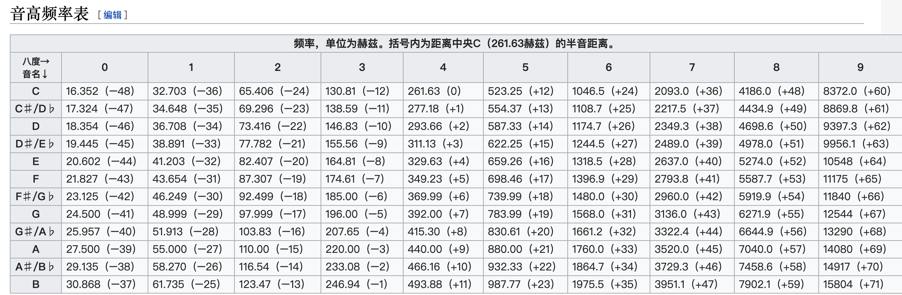

[TOC]

# 音频基础

## 基本概念
声音就是波，是由物体震动产生的， 物体震动时对周围的空气产生挤压，所以产生的声音，当物体停止震动声音随即消失

### 声波三要素
- 频率:
  频率表示音阶的高低，频率越高波长越小，反之则波长越大，这样更容易绕过障碍物，使得声音传递的更远

- 振幅:
  振幅表示声音的响度，响度表示能量大小的反应，用不同力度敲击桌子，声音的大小是不同的，分贝常用于描述响度的大小

- 波形：
  波形表示声音的音色，在同样的音调(频率)和响度(振幅)下，钢琴和小提琴的声音也是不一样的，因为它们自身介质所产生的波形是不一样的；

### 时域与频域
时域和频域都是针对信号来说的
所谓信号，可以理解为自然界中作为信息载体的各类波，比较常见的是正玄波，余弦波，由于二者只是在时间上存在偏移，即可以通过一个波平移到另一个波，因此一般都统称为正玄波；
- 时域
  对于波形来说其横轴是 t 时间单位，纵轴是随着时间变化的值，因此这类波形称为时域波形
- 频域(频率域)
  自变量是频率,即横轴是频率,纵轴是该频率信号的幅度,也就是通常说的频谱图。频谱图描述了信号的频率结构及频率与该频率信号幅度的关系


### 音调(基频)
音调是声音的主要特征之一，基频与我们称之为语调的内容直接相关，语调又与语音的表达特征相关联；
基频也称为F0,是人发出浊音时韧带的振动频率;
当发出清音时，是通过窃窃私语或发出嘶嘶声和哨声，韧带不会振动;

基频的变化在不同的人之间范围比较大，对于较低的平均男性声音，频率为70-200Hz，对于女性，它可以达到400Hz；

- [音高](https://zh.wikipedia.org/wiki/%E9%9F%B3%E9%AB%98)
音高频率表


- [人声音频率范围](https://blog.csdn.net/brandon2015/article/details/50426137)
男：低音82～392Hz，基准音区64～523Hz
　　男中音123～493Hz，164～698Hz
女：82～392Hz，基准音区160～1200Hz
　　女低音123～493Hz，220～1.1KHz

#### F0的应用范围
- 情感识别
- 区分性别
- 语音分割(将一句语音分割成几句短的声音)

提取pitch的时候，一定要保证人声清唱中不混杂其他背景音
否则提取出来的pitch不准确
目前开源的提取人声的算法(spleeter，采用深度学习网络来处理，效果非常不错)

估测F0
1. 基于时域
  算法: YIN
2. 基于频域
  倒谱分析,倒谱是估计功率谱的对数的傅里叶变换
3. 二者的混合
  YYAPT(Yet Another Algorithm of Pitch Tracking)
4. PredominantPitchMelodia
  算法库Eessentia中的提取主旋律pitch的算法
  目前我们karaoke打分中使用了这种


## 编码
就是对模拟信号进行量化，压缩存储的过程
### PCM
脉冲编码调制，是音频的原始二进制数据，通常PCM数据需要有一些概念来描述
#### 量化格式或数据格式(sampleFormat)
就是用多少bit里描述一个采样点，通常8bit，16bit，32bit
#### 采样率(sampleRate)
每秒采样多少个点，采样点越多，采样后的数字信号越趋近与原始模拟信号，越能真实的描述原始声音
常用的，通常44.1Khz
#### 声道数(channel)
有多少声道，单通道，双通道
### WAV
WAV，是一种不压缩的编码格式，直接封装pcm原始数据，在头部加了44字节，用来描述pcm的采样率，数据格式，声道数
特点:音质非常好，大量软件都支持，常用于音效素材，开发中中间音频文件的保存
### MP3
有损压缩，具有不错的压缩比，听感上非常接近wav，
特点:128Kbit/s的采样率上表现不错，压缩比比较高，大量软件都支持，兼容性较好
### AAC
现在主流的有损压缩编码，
特点: 在小于128Kbit/s的码率下表现优异，多用于视频中音频编码
### Ogg
有损编码，在各种码率下都有比较优秀的表现，尤其中低码率，128kbit/s的ogg效果比192kbit/s的MP3还好
缺点: 业界支持不够好，播放兼容性不好
试用场景: 语音聊天的音频消息场景


## 傅里叶变换
傅里叶FFT变换就是将周期的信号从时域变换到频域的过程
[详细理解过程](https://zhuanlan.zhihu.com/p/19763358?utm_source=wechat_timeline&utm_medium=social&utm_oi=564203739943067648&from=timeline)

本质就是对于任何一个周期性的波形，将其


## 窗函数
[详细参考这里](https://www.zhihu.com/question/50402321)
由于FFT变化主要是适用范围，**要么是从-∞到+∞ ，要么为周期信号**,现实世界中，不可能采集时间从-∞到+∞的信号，只能是有限时间长度的信号;
虽然这些有限长度信号可能是周期信号，但是在实际一些应用中，可能需要实时去处理这类信号的时候，只取到了其中一部分信号；如果取到的这部分是周期信号，那么其频谱与原始信号的频谱是完全一样的；但是如果取到的这部分信号时非周期信号，那么做FFT变换得到的频谱与原来相比，频谱会存在拖尾现象，这种现象称为泄漏；窗函数的作用就是为了减少这种泄漏而设计的；

具体做法是将 原始非周期信号 与 窗函数信号 在时域上做乘积,然后这段得到的信号将会是周期为1的周期信号；再对混合后的周期信号做FFT变换，就可以减少 频谱 与 原始频谱的误差

下图是常见的一些窗函数 的 时域与频域图


窗函数典型频谱特征图,及一些基本概念


常见窗函数特征:


## 短时能量分析
语音信号特性随时间变化是非平稳随机过程，因此语音信号具有时变特性，但短时间内其特性却基本不变，具备短时平稳性;
在此基础上，对语音信号流进行分段处理，即帧。语音通常在10~30 ms内保持相对平稳，因而帧长一般取10~30 ms。

短时能量分析，一般采取加窗分析，用特定的窗函数去截取原有信号[看这里](https://cn.bing.com/search?q=%E7%9F%AD%E6%97%B6%E8%83%BD%E9%87%8F&qs=n&form=QBRE&sp=-1&pq=%E7%9F%AD%E6%97%B6%E8%83%BD%E9%87%8F&sc=8-4&sk=&cvid=3CFBF11ACCA942BAA4EA85EEF6DE5240)

短时能量的定义，公式如下

E(n)为语音信号一个短时间段内的能量，其中w(n)是窗函数,x(m)表示原始语音信号，N为窗口内采样的总数(10~30ms)

下面给出一个java实现版本
```java
/**
     * 短时能量计算
     * 公式参考这里(https://zhuanlan.zhihu.com/p/39025752)
     *
     * @param org  原始数据
     * @param window 窗函数 （默认窗函数的长度远小于数据长度）
     * @return
     */
    public static double[] shortTimeEnergy(double[] org, double[] window) {

        int step = window.length;
        int orgLength = org.length;
        int energyLength = orgLength / step;
        if ( 0 != orgLength % step){
            energyLength += 1;
        }

        double[] result = new double[energyLength];
        double current = 0;
        int index = 0;
        for (int i = 0; i < energyLength; i++) {
            current = 0;
            index = i * step;
            if (index > orgLength){
                index = orgLength;
            }
            for (int j = 0; j < step; j++) {
                current += org[j+index] * window[j] * window[j];
            }
            result[i] = current;
        }
        return result;
    }
```

## 短时相关分析
相关分析是常用的时域波形分析方法，分自相关和互相关两种，分别用自相关函数和互相关函数表示。
相关函数用于测定两个信号的时域相似性，如用互相关函数可以测定两信号的时间滞后或从噪声中检测信号;如两个信号完全不同，则互相关函数接近于零，如两个信号波形相同，则在超前、滞后处出现峰值，由此可以得到两个信号的相似度。
而自相关函数用于研究信号自身，如波形的同步性、周期性等


## MFCC倒谱系数

https://blog.csdn.net/zouxy09/article/details/9156785
https://blog.csdn.net/xmdxcsj/article/details/51228791
http://www.speech.cs.cmu.edu/15-492/slides/03_mfcc.pdf


## 基因提取算法
https://zh.wikipedia.org/wiki/%E5%9F%BA%E9%9F%B3%E6%AA%A2%E6%B8%AC%E7%AE%97%E6%B3%95


## python端音频处理库
[librosa](https://librosa.github.io/librosa/index.html)
一个纯python实现的音频处理库


## 人声提取，伴奏提取
[spleeter](https://github.com/deezer/spleeter)
优点：这个算法效果非常好，能将大部分歌曲的人声很好的提取出来
缺点：对于有的音频，会卡死，只能杀掉进程


