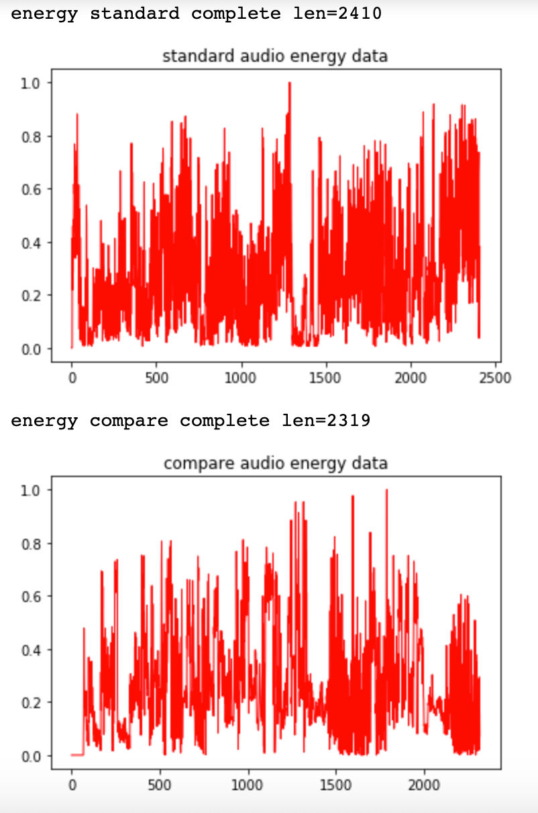
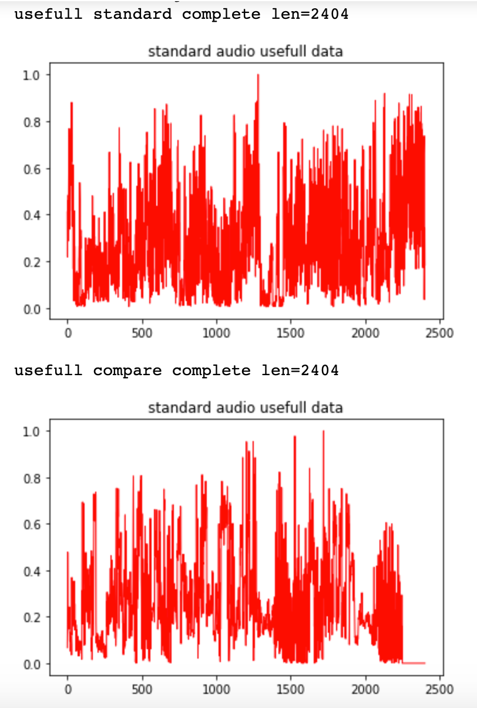
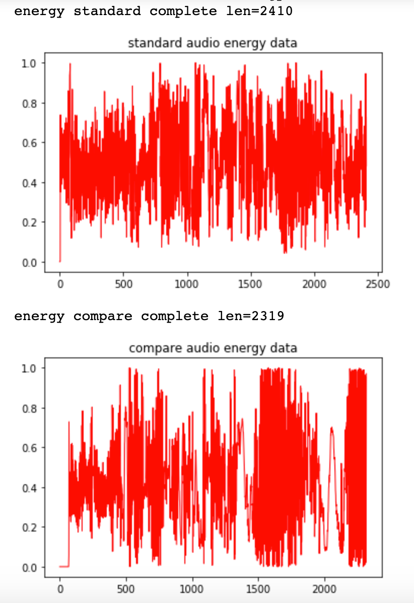
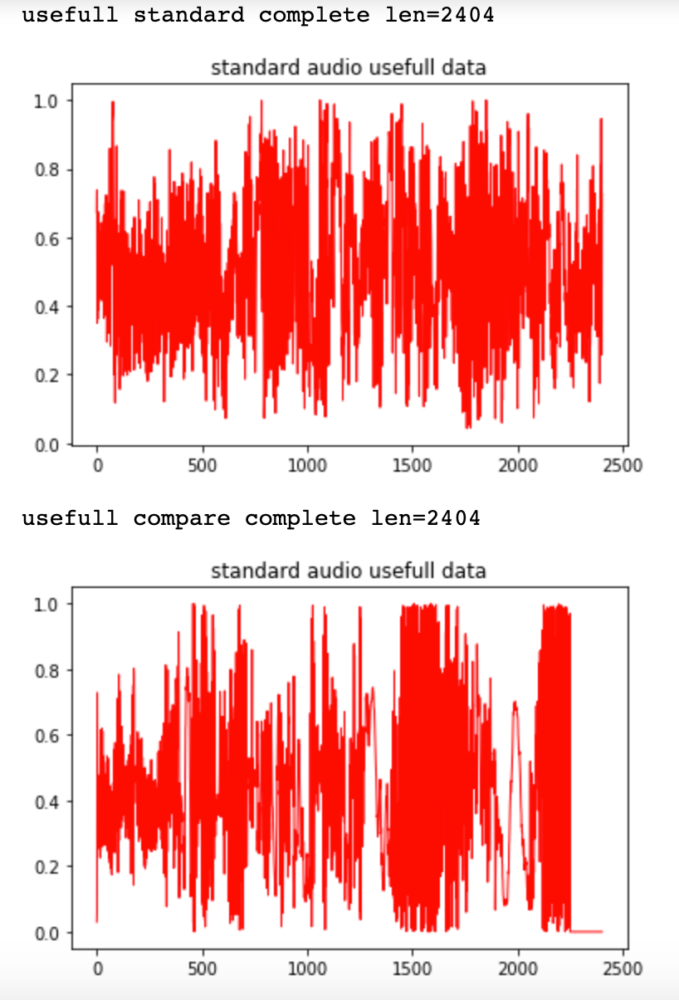

# 音乐评分调研结果

## 算法原理
### 标准(原唱)音乐处理流程
1. 对音频进行解码，得到PCM数据，按大端序，两字节组合成一个short，得出data1数组，归一化处理；
2. 对data1进行差分方程滤波，再次归一化处理，得到filterData数组
3. 计算短时能量数据
    3.1. 生成窗函数(这里选用汉明窗)
    3.2  在时域上利用窗函数采样filterData数组，计算短时能量数据，[具体公式](https://zhuanlan.zhihu.com/p/39025752)
    3.3  归一化处理，得到 energyData数组
4. 获取有效数据，设定阈值DATA_START_VALUE=0.025和DATA_END_VALUE=0.025，对energyData进行过滤，过滤规则，从数组第一个开始找到第一个大于DATA_START_VALUE的为起点，从数组末尾开始，找到第一个大于DATA_END_VALUE的为终点，得到最终 有效数据 usefulData数组
### 对比(清唱)音乐处理流程
1. 同标准(原唱)音乐处理流程
2. 同标准(原唱)音乐处理流程
3. 同标准(原唱)音乐处理流程
4.  获取有效数据，设定阈值DATA_START_VALUE=0.025和DATA_END_VALUE=0.025，对energyData进行过滤，过滤规则，从数组第一个开始找到第一个大于DATA_START_VALUE的为起点；获取标准(原唱)音乐处理流程中，最终usefulData数据的长度，用这个长度去截取清唱的音乐，保持数据长度上对齐，得到最终usefulData；

### 计算最终相似度
将上述两个usefulData数据 计算余弦距离，得到最终相似度(0 -1的范围)

##  十年歌曲对比
- 清唱与原唱对比, 相似度61%
 
- 不进行差分方程滤波, 相似度 79 %
   

### 自己录音清唱对比:
1. 人耳听大致一样(与原唱调子相同): 
    相似度(72%)  
    不加滤波 相似度(80%)  
2. 旋律一样(一个调子与原唱相同，另一个压低了调子):  
    相似度(69%)
    不加滤波 相似度(78%)  
3. 旋律不一样，声音都比较大:   
    相似度(74%)
    不加滤波 相似度(82%)  
4. 旋律不一样(一个调子与原唱相同，另一个压低了调子，乱哼): 
    相似度(72%)
    不加滤波 相似度(72%)  

## 印度歌曲对比结果
1. 印度-01 原唱与原唱对比 
不加滤波: 相似度 87%
加滤波: 相似度 59%
2. 印度-03 原唱与原唱对比 
不加滤波: 相似度 87%
加滤波: 相似度 57%
3. 印度-04 原唱与原唱对比 
不加滤波: 相似度 87%
加滤波: 相似度 60%

## 总结
1. 目前原唱里面含有背景音乐，当前使用的差分方程滤波，并没有滤掉背景音乐，反而增加了不少噪声，如果能提取出原唱的清唱，作比较或许相似度能提高
2. 音频对齐问题，由于使用的录好的音乐做比较，很难去做原唱与清唱的对齐；
3. 这种算法对比两个音频相似度，鲁棒性不好，基本上声音大，相似度就大

还得寻求更好的算法

