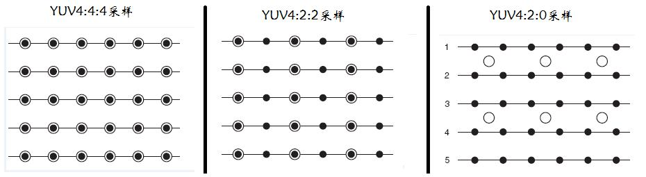

[TOC]

# 基础概念

## 颜色空间
### RGB:
红绿蓝三色
### YUV:
Y表示明亮度(Luminace或Luma),即灰阶值，
U和V表示色度(Chrominance 或 Chroma),即表示影响色彩的饱和度，用于指定像素的颜色.

- YUV和RGB的转换
YUV和RGB的转换:
```
# RGB to YUV
Y = 0.299 R + 0.587 G + 0.114 B
U = -0.1687 R - 0.3313 G + 0.5 B + 128
V = 0.5 R - 0.4187 G - 0.0813 B + 128
# YUV to RGB
R = Y + 1.402 (V-128)
G= Y - 0.34414 (U-128) - 0.71414 (V-128)
B= Y + 1.772 (U-128)
```
### YCbCr:
YCbCr是在数字领域对YUV的另一种表现形式，是YUV经过缩放和偏移得到的
其中Y 与 YUV中的Y一样表示明亮度，Cb，Cr也是只的色彩，只是表现方式不同，一般我们所说的YUV大多指的是YCbCr

#### 常见格式
- YUV4:2:0
- YUV4:2:2
- YUV4:4:4
**注：RGB 是 8:8:8 的。**


黑点表示采样该像素点的Y分量;空心圆圈表示采用该像素点的UV分量。

YUV 4:4:4采样，每一个Y对应一组UV分量。
YUV 4:2:2采样，每两个Y共用一组UV分量。
YUV 4:2:0采样，每四个Y共用一组UV分量
[详解看这里](https://blog.csdn.net/litao31415/article/details/99617965)

#### 存储
##### planar(平面)
- I420 : YYYYYYYY UU VV => YUV420P
- YV12 : YYYYYYYY VV UU => YUV420P
##### packed(打包)
- NV12 : YYYYYYYY UVUV => YUV420SP
- NV21 : YYYYYYYY VUVU => YUV420SP


## H264
-  AVC
AVC 实际上是 H.264 协议的别名
自从H.264协议中增加了SVC的部分之后，人们习惯将不包含SVC的H.264协议那一部分称为 AVC，而将SVC这一部分单独称为SVC

### 基本概念
#### I帧:
关键帧,采用帧内压缩技术。一组帧的第一帧，存放完整的数据。
#### P 帧:
向前参考帧,压缩时值参考前一个帧,属于帧间压缩技术. 只存和前一帧的差异
#### B 帧:
双向参考帧,压缩时前后帧都参考,帧间压缩技术. 压缩率更高. 缺点就是网络差的时候,解码很慢. 实时互动的直播不用.
#### GOF:
 一组帧，group of frame。2 个 I帧之间包含的帧。存放 GOF 的参数有 SPS 和 PPS。
#### SPS:
Sequence Parameter Set, 序列参数集,存放 帧数 、参考帧数目 、 解码图像尺寸 、 帧场编码模式选择标识
#### PPS:
Picture Parameter Set, 图像参数集, 存放熵编码模式选择标识、片组数目、初始量化参数和去方块滤波系数调整标识

## H264编码原理


### H264压缩技术
- 帧内预测压缩, 解决的是空域数据[人眼不敏感的数据]冗余问题。
- 帧间预测压缩, 解决的是时域数据冗余问题。
- 整数离散余弦变换(DCT) , 将空间上相关性变为频域上无关的数据,然后进行量化. 数学知识: 傅里叶变换.
- CABAC 压缩: 无损压缩


### 宏块划分与分组
把图片按照像素为单位，划分 n*n 像素的小块。有的宏块还可以接着换分为多个子块【axb】，子块大小由 H.264 自己决定。
### 帧分组
变化比较小的一连串帧，可以划分成一组帧。因此，可以用数学算法推算变化。
组内宏块查找
- 组内相邻两帧，先逐行扫描，假如找到了要找的物体【宏块】，就在该物体【宏块】周围找宏块，看是否有类似的宏块。如果有就会通过运动估算，产生一个运动矢量。把所有相邻的帧操作完后，就会形成一组的运动矢量。
- 然后，根据运动矢量和不变化的背景，就可以进行压缩。最终留下了运动矢量数据和残差数据。

### 帧内预测
首先宏块有很多种预测模式，共 9 种，Intra Prediction Mode 。根据宏块模式，可产生一个预测图。然后再计算预测图和原图的残差值。压缩后，只存 预测模块信息和残差图，即： Prediction Mode Info + Residual Picture。
### DCT 压缩
把宏块的每一个像素进行量化，再用 DCT 数学方法压缩得到 DCT Coefficient。只有左上角有数据，右下角就没数据了。数据量减少了。

### VLC 压缩
把频率高的用短码表示，频率低的用长码表示。MPEG 2 使用的技术。而这个技术再加上 上下文适应(Context Adaptive) 就是 CABAC 技术，H.264 使用的。
### NAL 单元
NAL Header :  占一个字节。F 位 + NRI + TypeF 位就是 forbidden_zero_bit，在 H.264 规范中，这一位必须是 0   NRI 位，指示重要性，暂时没什么用Type 位： NAL 单元类型。总共 0~31 种类型，常用的有： 5 - IDR 图像的片，是关键帧的一部分；7 - 序列参数集；   8 - 图像参数集；28 - FU-A 分片的单元；29 - FU-B 分片的单元；
### NAL 类型介绍
- 单一类型： 一个 RTP 包只包含一个 NALU
- 组合类型： 一个 RTP 包含多个 NALU，类型是 24-27
- 分片类型： 一个 NALU 单元分成多个 RTP 包，类型是 28 和 29

### FU Header
 S + E + R + Type 。 为了把 NALU 进行组合。
- S : start bit ， 用于指明分片的开始
- E : end bit ，用于指明分片的结束
- R : 未使用，设置为 0
- Type : 指明分片 NAL 类型

## 问题
android camera输出的颜色空间和 mediaCodec支持的颜色空间不一样
需要做下转换

### 视频花屏/卡顿原因
如果 GOF 分组中的 P 帧丢失会造成解码端的图像发生错误. 造成花屏.

为了避免花屏, 如果发现 P 帧或者 I 帧丢失,就不显示本 GOF 内的所有帧,知道下一个 I 帧来后重新刷新图像. 造成卡顿.


