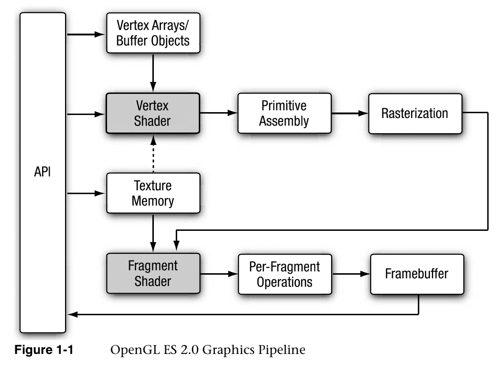
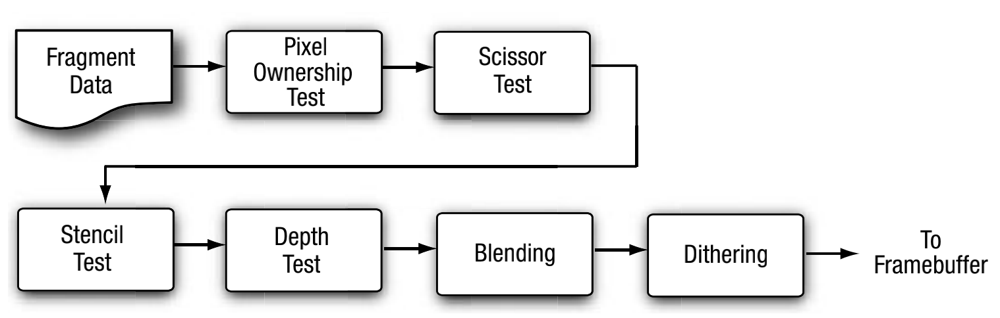

[TOC]
# OpenGLES and EGL

## 概念
### OpenGLES
[官网](https://www.khronos.org/opengles/)
是OpenGL for Embedded Systems设计的一套三维图形API，针对手机，PDA和游戏主机等嵌入式设备使用，由Khornos组织定义并维护，这个组织是图形软硬件行业协会，主要关注图形和多媒体方面的标准制定

### OpenGLES2.0渲染管线

#### VertexShader:
顶点着色器，是一个可编程的处理单元。每个顶点执行一次，主要根据原始的顶点信息和其他属性信息传入顶点着色器，对顶点进行变换(平移，旋转，缩放)操作，光照计算，产生纹理坐标，颜色，点位置信息，传入下一阶段进行处理

##### 顶点着色器中变量类型attribute，uniform，varying
- attribute
指3D物体中每个顶点各自不同的信息所属的变量，一般顶点的位置，颜色，法向量都是以这种类型传入顶点着色器的
- uniform
对于同一组顶点组成的3D物体中所有顶点都相同的量，比如当前光源位置，摄像机的位置，投影变化矩阵
- varying
从顶点着色其中生产出的并传递到片元着色器中的数据变量，比如顶点坐标，纹理坐标，片元颜色
**注意: 这个易变变量在片元着色器中也需要声明**
#### PrimitiveAssembly:
图元装配，对一个个顶点按照绘制方式组装起来，比如简单的三角形，需要3个顶点按照绘制的顺序组合成一个图元
#### Rasterization:
将三维空间中的图元，进行转换投影到二维的屏幕空间中，得到一个个片元(每个片元可以理解为候选像素，不能称为像素是因为最终三维空间中可能存在遮挡的情况，这样很多个片元可能对应到frameBuffer中同一个像素),每个片元包含对应的顶点坐标，顶点颜色，顶点纹理坐标，以及顶点的深度信息
#### FragmentShader:
片元着色器，也是一个可编程的处理单元，每个片元(候选像素)执行一次，在这过程中进行特殊的处理得到当前片元的颜色值，通过gl_FragColor接收最终的处理结果
#### Per-FragmentOperations:
在片元着色器处理完成之后，接下来是对每一个片元进行一系列操作，经过光栅化之后得到的(x,y)对应屏幕上的坐标只能操作frameBuffer中(x,y)位置的像素
这一系列操作流程如下

##### Pixel Ownership Test
决定当前frameBuffer中的(x,y)位置的像素是否属于当前opengl es context，不属于就被丢弃
##### scissor Test
剪裁测试，如果成行启用了剪裁测试，opengl ES会检查每个片元在frameBuffer中的位置，在剪裁窗口之外的，则丢弃
##### Stencil Test
模板测试，将绘制区域限定在一定范围内，一般用在湖面倒影，镜像等场合
##### Depth Test
将输入片元的深度值与frameBuffer中当前位置存储的深度值作比较，若输入的深度值大于当前存储的深度值，则丢弃
##### Blending Test
混合测试，若程序开启了alpha混合，则根据混合因子将新输入的片元与frameBuffer中当前位置片元进行混合，否则直接覆盖
##### Dithering Test
抖动测试，允许只用少量的颜色模拟出更宽的颜色范围，使得颜色视觉效果更加丰富，比如使用白色和黑色模拟出一种过渡的灰色
缺点: 会损失一部分分辨率，现在原生颜色都很丰富的显示设备时代，一般都不需要启动抖动
#### Framebuffer:
一个用于存储片元信息的buffer

### EGL
EGL是一套介于opengl和本地平台窗口系统之间的接口，opengl通过egl将图形绘制到本地窗口中；egl处理图形上下文管理，surface/Buffer的绑定和渲染同步，并使用其他Khronos API启用高性能，加速的混合模式2D和3D渲染

EGL中的概念
Surface
Display
Context

## android OpenGL坐标系
android屏幕坐标: 左上角(0,0),右下角(width, height)
顶点坐标系: 左下角(-1,-1),右上角(1, 1)
纹理坐标系: 左下角(0，0),右上角(1, 1)，表示的坐标是映射到纹理图片的坐标，即图片左下角为0，0，右上角为1，1
viewport坐标系: 是针对屏幕的，与屏幕坐标系一样，viewport是表示观察3d空间的窗口大小，与屏幕一样就能观察整个(-1,-1)到(1,1)的内容

