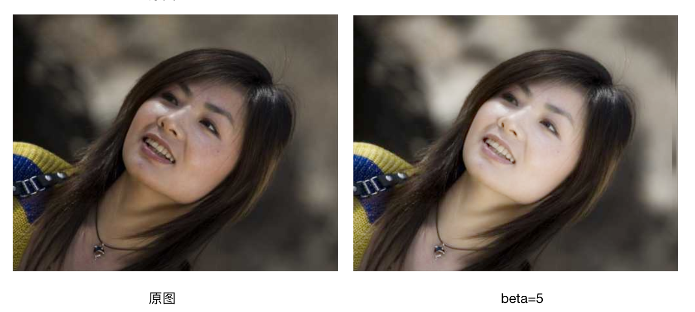

换脸技术、美颜算法及实现，调优——兴仪、旭智
# 智能相机原理
现在新的手机几乎都在主打AI 拍照，各种智能相机app也加入了AI这个潮流中，本文将介绍一下AI拍照的原理

## [图像基本属性](http://b2museum.cdstm.cn/identification/sztxcl-relative.htm):

### RGB
即红绿蓝三原色；其他各种颜色都是通过rgb混合而成

### HSV(HSB)
H色相——表示色的具体色彩特征——颜色本质

S纯度(饱和度)——表示色的鲜艳或鲜明的程度——颜色浓淡

V明度——表示色所具有的亮度和暗度——颜色明暗

### HSL
H色相——表示色的具体色彩特征——颜色本质

S纯度(饱和度)——表示色的鲜艳或鲜明的程度——颜色浓淡

L亮度——表示色所具有的亮度和暗度——颜色明暗


### HSL和HSB区别
HSL和HSB中s虽然都叫饱和度，但是实际是不一样的，同样L和B也是不一样的[具体区别看这里,Forrest答复](https://www.zhihu.com/question/22077462#Forrest)


### 完整概念补充理解
#### 亮度：
亮度指照射在景物或图像上光线的明暗程度。图像亮度增加时，就会显得耀眼或刺眼，亮度越小时，图像就会显得灰暗。

#### 饱和度:
饱和度是指色彩的鲜艳程度，也称色彩的纯度。饱和度取决于该色中含色成分和消色成分（黑、白、灰、金和银所反射的光都是消色）的比例。含色成分越大，饱和度越大；消色成分越大，饱和度越小。纯的颜色都是高度饱和的，如鲜红，鲜绿。混杂上白色，灰色或其他色调的颜色，是不饱和的颜色，如绛紫，粉红，黄褐等。完全不饱和的颜色根本没有色调，如黑白之间的各种灰色

#### 色调：
色调是各种图像色彩模式下原色的明暗程度，级别范围从0到255，共256级色调。 
例如对灰度图像，当色调级别为255时，就是白色，当级别为0时，就是黑色，中间是各种程度不同的灰色。 
在RGB模式中，色调代表红、绿、蓝三种原色的明暗程度，对绿色就有淡绿、浅绿、深绿等不同的色调。 
色调是指色彩外观的基本倾向。在明度、纯度、色相这三个要素中，某种因素起主导作有用，可以称之为某种色调


#### 对比度:
对比度是亮度的局部变化，定义为物体亮度的平均值与背景亮度的比值； 人的眼睛对亮度的敏感性成对数关系，意味着对于同样的感知，高亮度需要高的对比度； 
表现上亮度很大程度取决于局部背景的亮度；这种现象被称为条件对比度

### 图像高频信息和低频信息
图像的高低频是对图像各个位置之间强度变化的一种度量方法.总得来说

- 低频分量（低频信号）
  代表着图像中亮度或者灰度值变化缓慢的区域，也就是图像中大片平坦的区域，描述了图像的主要部分。
- 高频分量（高频信号）
  对应着图像变化剧烈的部分，也就是图像的边缘（轮廓）或者噪声以及细节部分。 
- 噪声
  之所以说噪声也对应着高频分量，是因为在一个像素所在的位置,噪点与正常的点颜色不一样了，也就是说该像素点灰度值明显不一样了,即灰度有快速地变化了,所以是高频部分

人眼对高频分量比较敏感

[具体参见这里](http://blog.sina.com.cn/s/blog_a98e39a201012hpp.html#cmt_532CFB31-7F000001-7D764EA9-873-8A0)
[这里](http://blog.sina.com.cn/s/blog_8da31aa3010142x8.html)

#### 高斯滤波
[高斯滤波](https://blog.csdn.net/sunmc1204953974/article/details/50634652)
高斯模糊是 **低通滤波器**
- 理解：
  从高斯滤波的效果来考虑：高频分量一般是图像的边缘细节，高频被滤掉了(所以是低通滤波)，所以图像变模糊了

## 磨皮原理
主要原理就是对人脸进行去噪声(痘印，去皱纹)处理，使得皮肤更加平滑(模糊的效果)

传统磨皮模糊算法:
1. 高斯模糊: 模糊之后边缘信息丢失
2. 双边滤波算法:运行效率较低，低端手机跑不起来
3. [基于局部均方差相关信息的图像去噪及其在实时磨皮美容算法中的应用](https://www.cnblogs.com/Imageshop/p/4679065.html)
  该算法利用图像局部统计特性进行滤波处理，例如 N*M 像素的灰度图，首先 计算点(i,j)所在窗口内（大小为(2n+1)(2m+1))的平均值m(i,j)
  
  以及均方差：
  
  得到加性去噪后的结果为：
  
  其中:
  
  从公式来看，磨皮的效果与sigma 的值成正比:
  当sigma趋近 +♾ 时,k趋近于0，最终结果 为均值Mij;
  当sigma趋近 0 时,k趋近于1，最终结果 即为输入结果;
  [积分图加速计算](https://blog.csdn.net/jaych/article/details/68632671)

* 缺点: 
  对计算要求较高，耗时较长，做不到camera这类的实时美颜

### 美白算法[logarithmic Curve]
美白其实主要使皮肤变白变亮，因此，如果能有个合适的映射表，满足使得原图在色阶上有所增强，并且在亮度两端增强的稍弱，中间稍强，则也是个不错的选择

其中w(x,y) 表示输入图像数据，v(x,y)表示输出结果，beta为调节参数，了Beta分别为[2,3,4,5]时的曲线，如下图：

说明：根据图曲线来看，对每一个像素都做这样的操作，图像中亮度最暗和最亮的增强效果稍弱，亮度中等的增强稍强

下图是几张经过logarithmic处理的效果图





https://blog.csdn.net/oshunz/article/details/50536031

https://www.jianshu.com/p/a76a1201ae53

### 锐化
锐化的主要作用是增强图像中高频的信息，这样可以提高图像边缘部分的清晰度，使图像色彩更加鲜明
[具体原理参考这里](https://www.cnblogs.com/Imageshop/archive/2013/05/19/3086388.html)
具体公式:
  y(n,m)= x(n,m)+ λz(n,m)    （1）
其中，x(n,m)为输入图像，y(n,m)为输出图像，而z(n,m)为校正信号，一般是通过对x进行高通滤波获取。λ是用于控制增强效果的的一个缩放因子

#### USM锐化是photoshop中采用的锐化方式：
USM锐化是先对图像做高通滤波之后，得到高频信息，然后在做锐化处理
- 参数: 
  - 数量(即λ):即锐化强度，越大，对比度越高，和结果成线性关系，这个参数比其他两个参数更敏感，
  - 半径(高斯模糊的半径):半径越大，图像对比度越高，边缘越发明显
  - 阈值:即高频信息值超过 阈值，才做锐化处理，做范围限定
代码:
```c++
Width = Bitmap.Width; Height = Bitmap.Height; Stride = Bitmap.Stride; BytePerPixel = Bitmap.BitCount / 8;
    FastBitmap Clone = Bitmap.Clone();　　　　// 备份图像数据
    BlurEffect.GaussianBlur(Clone, Radius);  // 对备份的数据进行高斯模糊处理
    for (Y = 0; Y < Height; Y++)
    {
        Pointer = Bitmap.Pointer + Y * Stride;
        PointerC = Clone.Pointer + Y * Stride;
        for (X = 0; X < Width; X++)
        {
            Value = Pointer[X] - PointerC[X];
            if (Utility.Abs (Value) > Threshold)
            {
                Value = Pointer[X] + Amount * Value / 100;
                Pointer[X] = (byte)((((ushort)Value | ((short)(255 - Value) >> 15)) & ~Value >> 15));
            }
        }
    }
    Clone.Dispose();
```


### 主流美颜处理流程:

高斯模糊(11x11)--> 高通滤波器做高反差保留 --> 保边预处理(高斯模糊5x5) --> 磨皮处理  --> 锐化处理(USM)


## android端美颜架构


相机数据 --> 人脸检测 --> 拿到检测的结果(人脸关键点坐标，眼睛，人脸，下巴)

磨皮
大眼
廋脸

LUT映射


