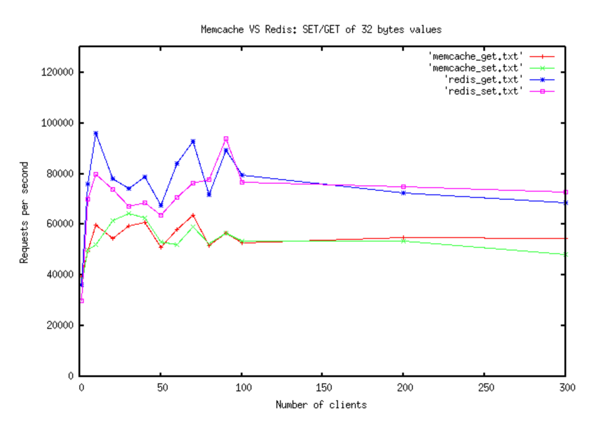

<!-- @import "[TOC]" {cmd="toc" depthFrom=1 depthTo=6 orderedList=false} 
-->
* [概念](#概念)
* [Value-Types](#Value-Types)
  * [Key](#key)
  * [strings](#strings)
  * [hash](#hashes)
  * [list](#lists)
  * [set](#sets)
  * [sorted set](#sorted_sets)
  * [bitmap](#bitmaps)
  * [stream](#streams)
* [环境搭建](#环境搭建)
  * [单机版本](#单机版本)
* [代码使用Redis](#代码使用Redis)
  * [go使用redis](#go使用redis)
  * [java使用redis](#java使用redis)
* [性能测试](#Redis性能测试) 
  * [使用 pipeline](#pipeline)
  * [redis性能优化](#redis性能优化)
* [Redis VS Memcache](#Redis-VS-Memcache) 
* [Redis进阶](#redis进阶) 

[更多markdown语法](https://shd101wyy.github.io/markdown-preview-enhanced/#/zh-cn/markdown-basics)

# Redis
## 概念
Redis是一款开源软件(BSD licensed),是一种在内存中以key，value的数据存储方式做数据存储的，基于 **原子操作**；可以用作数据库，缓存和消息队列;Redis具有主-从数据复制，key过期超时，Lua脚本，LRU驱逐，事务和不同级别的磁盘持久性；Redis哨兵(Sentinel)使得服务可用性很高，支持redis集群自动分区

## Value-Types
Redis不是普通的key-value存储，它实际上是一个数据结构服务器，支持不同类型的值，支持的数据结构有strings,hashes,lists,sets,sorted sets,bitmaps,streams


### Key
Redis的Key是二进制安全的，即可以使用任何二进制序列作为key，比如“foo”这样的字符串，或者JPEG文件的内容，甚至 空字符串 也可以；在设计key时最好遵循以下几点:
- key不要太长 最好不要超过1025字节，这样既可以节省内存，还可以节省key的查找时间，推荐将key哈希之后的值作为key(比如使用SHA1算法)
- key也不要太短 最好找到一个平衡性能的点
- key的最大size为512MB
### strings
value可以是各种字符串（包括二进制数据）,比如说存一个jpeg图像数据；value为string时最大size为512MB
- 相关命令:
  - set [key] [value] 
  //设置数据，每次set都会覆盖上一次的值
  - get [key] 
  //读取key的value
  - exist [key]
  //判断key是否存在
  - del [key]
  //删除某个key，不管其value是什么
  - incr [key]
  //解析key的value为int，然后加1，把加1后的值set到key中
  - mset [key1] [value1] [key2] [value2] [key3] [value3]
  //批量设置key,value
  - mget [key1] [key2] [key3] 
  //批量获取key
  - expire [key] [time]
  //设置key过期时间
 
[更多参考这里](https://redis.io/commands#string) 
### hashes
redis中的hash类型，其实就是一个hashMap，即可以把一个hashMap对象设置为key的value
- 相关命令
  - hset key [map-key] [map-value]
  //将一个key-value键值对设置到key中
  - hget key [map-key]
  //获取key中map-key的value
  - hmset key [map-key1] [map-value1] [map-key2] [map-value2]
  //批量设置
  - hmget key [map-key1] [map-key2]
  //批量获取
  - hgetall key
  //获取key中map所有值
  
```bash
127.0.0.1:6379> hmset dict key1 value1 key2 value2 key3 value3
OK
127.0.0.1:6379> hgetall dict
1) "key1"
2) "value1"
3) "key2"
4) "value2"
5) "key3"
6) "value3"
127.0.0.1:6379>

```
[更多参考这里](https://redis.io/commands#hash)

### lists
list在redis中其实是双向列表，主要目的是为了保证快速的添加新元素到一个很大的列表，这点在redis中是很重要的;双向列表的机制，Redis中LPUSH命令添加一个新元素到10个长度的列表 和 100万个长度的列表 耗费的时间基本是相同的
- 相关命令
  - LPUSH [listName] [val1] [val2] 
  //list头部添加数据
  - RPUSH [listName] [val1] [val2]
  //list尾部添加数据
  - LPOP [listName] 
  //从头部取出一个元素
  - RPOP [listName] 
  //从尾部取出一个元素
  - LRANGE [listName] [start] [end]

- 常用案例
  - 社交网络中，保存用户最新的一些数据；
  - 消息队列；两个进程间的通信，生产--消费 模式下，生产者这边push数据到list，然后消费者从list中读取数据；

[更多参考这里](https://redis.io/commands#list)

### sets
存储的值是无序的string集合

[更多参考这里](https://redis.io/commands#set)

### sorted_sets
存储有序，唯一(不重复)的字符串元素集合

[更多参考这里](https://redis.io/commands#sorted_set)

### bitmaps

[更多参考这里](https://redis.io/commands#list)
### streams

[更多参考这里](https://redis.io/commands#stream)

## 环境搭建
Redis是基于ANSI C编写的，可以工作在大部分POSIX系统，比如Linux，*BSD，OS X,官方推荐在Linux上部署 

### 单机版本
1. 下载代码
```bash
git clone https://github.com/antirez/redis.git
```

1. 进入源码目录，编译 
  ```bash
  # cd redis
  # make
  # make test
  ```

2. 启动Redis
  
  以默认配置方式启动
  ```bash
  # cd src
  //redis server进程启动，运行在前台
  # ./redis-server
  //在另一个shell窗口，用ps可以观察到redis已经启动
  # ps -ef | grep redis
root     19096 17313  0 17:27 pts/13   00:00:00 ./redis-server *:6379
root     20115 19507  0 17:28 pts/14   00:00:00 grep --color=auto redis
  ```
  以特殊配置文件方式启动,在执行命令后面加上参数(即你指定的配置文件路径)
  ```bash
  # cd src
  # ./redis-server /path/to/redis.conf
  ```
  可以通过使用命令行直接将参数作为选项传递来更改Redis配置。例子：
  ````bash
  # ./redis-server --port 9999 --replicaof 127.0.0.1 6379
  # ./redis-server /etc/redis/6379.conf --loglevel debug
  ````

3. 命令行使用redis
编译完成后会在源码工程目录src下生成`redis-cli`可执行文件，这个文件运行后会自动连接redis-server;开起另一个窗口
```bash
# ./redis-cli
127.0.0.1:6379> ping
PONG
127.0.0.1:6379> set cxy helloworld
OK
127.0.0.1:6379> get cxy
"helloworld"
127.0.0.1:6379> INCR mycounter
(integer) 1
127.0.0.1:6379> INCR mycounter
(integer) 2
127.0.0.1:6379> get mycounter
"2"
127.0.0.1:6379>

```
要了解更多的redis command，可以到[官网commands](http://redis.io/commands)

4. 安装redis
将redis可执行文件添加到`/usr/local/bin` 执行以下命令
```bash
# make install
//即把这些redis命令添加到环境变量，这样我们输入redis 然后tab的时候就可以自动补全
# redis-
redis-benchmark  redis-check-aof  redis-check-rdb  redis-cli        redis-sentinel   redis-server
```

## 代码使用Redis
redis支持很多语言，go，java，c/c++等待

### go使用redis
[go语言使用Redis](https://github.com/cxy200927099/Note/blob/master/storage/redis/redis-go.md)

### java使用redis
TODO

## Redis性能测试
Redis官方已经提供了性能测试的工具**redis-benchmark**
默认情况下执行 `redis-benchmark`命令会测试很多命令(set,get,incr,lpush,rpush,lpop,rpop,sadd,hset,spop,lrange,mset);

只测试其中某个命令,使用 -t 参数:
```bash
root@wxtest047:~# redis-benchmark -t set,lpush -q
SET: 116414.43 requests per second
LPUSH: 130718.95 requests per second
```
更多参数可以使用`redis-benchmark -h` 查看

[网络上别测试的效果-测试单实例redis读写list的性能](http://www.voidcn.com/article/p-cbtkplvs-bpq.html)


### pipeline 
默认情况下benchmark模拟了50个client(如果想指定client,使用-c参数),每个client接收到上一次发送的命令结果，才会发送下一个命令，这有点类似网络性能指标(RTT-Round-Trip time,即往返时延),使用pipeline可以一次发送多个命令，这在实际运用中是经常见到的，其能显著提高qps

使用 -P [number of command]
```bash
root@wxtest047:~# redis-benchmark -t set,lpush -q
SET: 112994.35 requests per second
LPUSH: 93896.71 requests per second

root@wxtest047:~#
root@wxtest047:~# redis-benchmark -t set,lpush -q -P 16
SET: 731211.69 requests per second
LPUSH: 787401.56 requests per second

root@wxtest047:~# redis-benchmark -t set,lpush -q -P 32
SET: 813788.62 requests per second
LPUSH: 720345.31 requests per second

root@wxtest047:~# redis-benchmark -t set,lpush -q -P 64
SET: 864551.75 requests per second
LPUSH: 949132.06 requests per second

root@wxtest047:~# redis-benchmark -t set,lpush -q -P 100
SET: 885840.75 requests per second
LPUSH: 987254.94 requests per second

root@wxtest047:~# redis-benchmark -t set,lpush -q -P 200
SET: 919266.06 requests per second
LPUSH: 975471.69 requests per second
```
从上面可以看到使用-P参数之后，qps提高了好几倍


### redis性能优化

- 网络带宽和时延
  - ping查看client与server之间的网络延时
  - 在redis-benchmark实际测试中，写4KB大小的string，qps为10万左右，实际上会消耗3.2 Gbit/s的带宽并且可能适合10Gbit/s链路，所以在排查性能时，网络带宽是否能达到这个Gbit/s也是需要考量的因素

- 检查使用的API和数据结构，尽量避免在大对象上执行算法复杂度超过O(n)的命令，比如hgetall
- 查看cpu是否饱和(使用率是否达到100%),由于redis的单线程处理机制，使得在处理命令时只能使用一个cpu，如果cpu使用率达到100%，redis将无法处理更多的命令，这严重影响吞吐量；如果qps只有几百或几千，cpu就接近饱和了，这就不正常的

- CPU竞争
尽量减少其他使用CPU较多的服务 和 redis服务部署到同一台机器

- 内存交换
内存交换是指操作系统吧内存换到硬盘，由于内存和硬盘的访问速度相差较多，这会极大的影响redis的性能；如何解决？ 确保运行redis的机器有充足的内存可用；


- 使用多实例
由于redis是基于单线程设计的，对于现在多核机器来说，并不能发挥机器的性能，可以起 多个实例平行扩展

- 使用网络访问redis-server时 使用pipeline，且data size控制在1500字节时能有效的提高redis的qps


## Redis-VS-Memcache

[antirez 1 - On Redis, Memcached, Speed, Benchmarks and The Toilet](http://oldblog.antirez.com/post/redis-memcached-benchmark.html)

这个作者测试了get/set的对比，结果如下


[dormando - Redis VS Memcached (slightly better bench)](https://dormando.livejournal.com/525147.html)

[antirez 2 - An update on the Memcached/Redis benchmark](http://oldblog.antirez.com/post/update-on-memcached-redis-benchmark.html)


## redis进阶

- [pipelining](https://redis.io/topics/pipelining) 了解如何一次发送多个命令，节省往返时间
- [Redis Pub/Sub](https://redis.io/topics/pubsub) Redis实现的快速稳定的发布/订阅消息系统
- [Expires](https://redis.io/commands/expire) Redis允许为每个Key设置不同的生存时间，以便Key在到期时自动从服务器中删除
- [Redis as an LRU cache:](https://redis.io/topics/lru-cache) 指导如何配置和使用Redis作为具有固定内存，且可以自动驱逐Key的缓存
- [Redis transactions](https://redis.io/topics/transactions) 将命令组合在一起，以便将它们作为单个事务执行
- [Mass insertion of data](https://redis.io/topics/mass-insert) 如何在短时间内向Redis实例添加大量预先存在或生成的数据
- [Partitioning](https://redis.io/topics/partitioning) 如何在多个Redis实例之间分发数据
- [Distributed locks](https://redis.io/topics/distlock) 使用Redis实现分布式锁
- [Creating secondary indexes with Redis](https://redis.io/topics/indexes) 使用Redis数据结构创建二级索引，组合索引和遍历图


